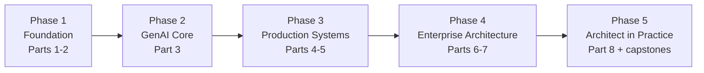

# GSAC Learning Roadmap

From software engineer to enterprise GenAI Solution Architect. Total estimated effort: **10–15 months** at 8–10 hours/week. Adjust to your background — the phases below note what you can skip. The journey runs on two lanes from Phase 3 onward: the GenAI lane (Parts 3–5) and the classical-ML lane (Part 2's 2.9–2.17 track, projects P21–P25, case studies CS51–CS56) — an AI Solution Architect completes both.

## Phase 1 — Foundation (6–8 weeks) · Maturity Level 1→2

**Parts 1 & 2.** The architect mindset and the AI fundamentals everything else stands on.

- Part 1: Professional Foundation (all chapters)
- Part 2: Artificial Intelligence (2.1–2.8; return for the classical track 2.9–2.17 in Phase 3)
- Projects: P01–P02
- *Skip/skim if:* you already hold an architect role (skim Part 1) or have an ML background (skim Part 2, but read 2.5–2.8).

**Exit criteria:** you can explain transformers, embeddings, and fine-tuning to a non-technical stakeholder; you can write a one-page trade-off analysis.

## Phase 2 — GenAI Core (6–8 weeks) · Level 2

**Part 3.** The building blocks: LLMs, prompting, embeddings, RAG, tool use, agents.

- Part 3: all chapters, in order
- Projects: P03–P05
- Case studies: start the habit — 1/week from any industry you know well

**Exit criteria:** you can build a working RAG system and a tool-using agent from scratch, and explain every component's failure modes.

## Phase 3 — Production Systems, Both Lanes (12–14 weeks) · Level 3

**Parts 4 & 5 + the Part 2 classical track.** Where prototypes become systems on both lanes: evaluation, security, observability, cost, and the infrastructure underneath — GenAI and classical, deliberately interleaved so the shared discipline (version, gate, monitor, roll back) is learned once.
- Part 2 classical track: 2.9–2.17 (2.9 → 2.10 → 2.11 first; 2.12–2.17 alongside the projects)
- Part 4: Enterprise GenAI Systems (all chapters)
- Part 5: Cloud, Infrastructure & Platform Engineering (all chapters)
- Projects: at least four of P06–P12 (GenAI lane) **plus P21 and P23** (classical lane; both require 2.9–2.13)
- Case studies: include CS51–CS53 this phase — the classical designs, read against your own P21/P23 builds
- Checklists: [RAG design](checklists/rag-design-checklist.md), [security](checklists/security-checklist.md), and [evaluation](checklists/evaluation-checklist.md) on every GenAI project; the classical family — [model validation](checklists/ml-model-validation-checklist.md), [data quality & labeling](checklists/data-quality-labeling-checklist.md), [drift & monitoring](checklists/drift-model-monitoring-checklist.md) — on P21/P23

**Exit criteria:** you can take a demo to production *on either lane*: evals in CI, monitoring dashboards, threat model, cost model, and an on-call runbook — and for the classical lane, a gated promotion that rejects a corrupted-batch challenger and a drift alert that fires on a test.

## Phase 4 — Enterprise Architecture (8–10 weeks) · Level 4

**Parts 6 & 7.** Zoom out from systems to portfolios: governance, integration, patterns.

- Part 6: Enterprise Architecture (all chapters, including 6.11's model risk management)
- Part 7: Enterprise AI Architecture Patterns (all chapters, including 7.11's predictive & scoring family)
- Projects: at least two of P13–P16 (GenAI lane), plus P22 (hybrid) and at least one of P24/P25 (classical lane)
- Case studies: 2/week, across industries you *don't* know; include CS54–CS56 and the repaired classical designs (CS24, CS30, CS45)

**Exit criteria:** you can run an architecture review, write ADRs stakeholders sign off on, and design a multi-tenant GenAI platform on a whiteboard.

## Phase 5 — Architect in Practice (6–8 weeks) · Level 4→5

**Part 8 + capstones.** Turn competence into a career.

- Part 8: Professional Excellence & Career Development (all chapters)
- Projects: P17–P20 (pick two as capstones; document them portfolio-grade)
- Deliverables: public portfolio, 3 written case-study analyses, 1 conference-style talk or long-form article

**Exit criteria:** you can pass an architecture interview loop, scope and price a GenAI engagement, and mentor an engineer through Phases 1–3.

---

## Suggested weekly rhythm

| Day | Activity |
|-----|----------|
| 2 × weekday evenings | One chapter (read + exercise) |
| 1 × weekday evening | Case study analysis |
| Weekend block | Project work |

## Milestone map

| Milestone | Proof |
|-----------|-------|
| Level 1 → 2 | P01–P05 complete and pushed to your own repos |
| Level 2 → 3 | Two projects — one GenAI, one classical — with CI evals/gates, dashboards, and a threat model |
| Level 3 → 4 | An architecture document + ADR set another engineer built from |
| Level 4 → 5 | You've reviewed someone else's architecture and made it better |
