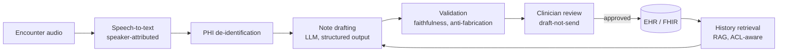
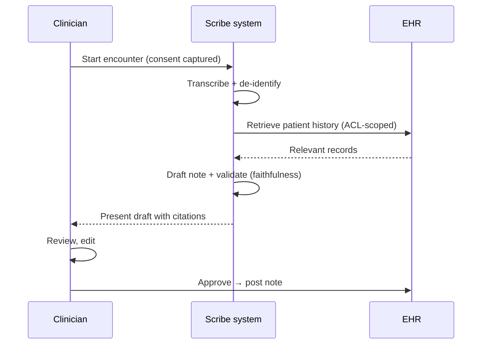
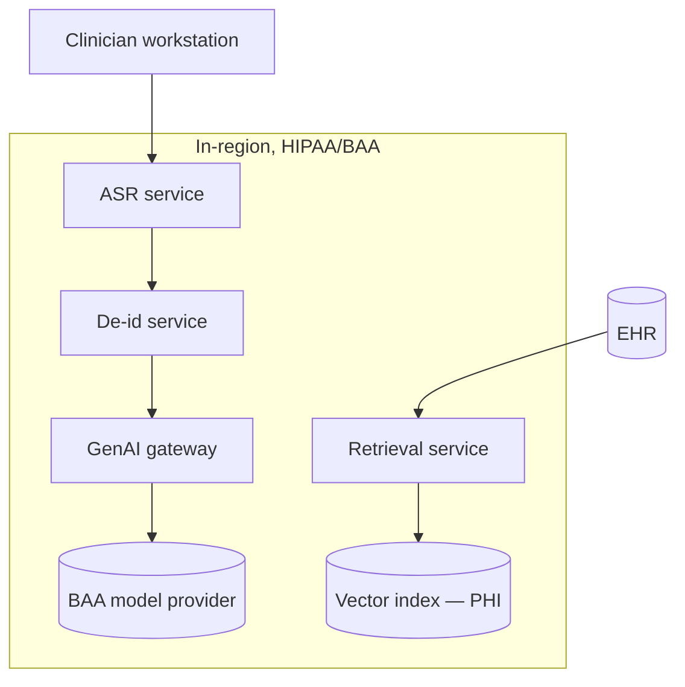

# Case Study CS01 — Clinical Documentation Assistant

| | |
|---|---|
| **Industry** | Healthcare |
| **Company profile** | Meridian Health Partners — fictional US hospital network, 12 hospitals, ~4,000 clinicians, HIPAA-regulated |
| **System type** | Ambient clinical scribe + summarization (RAG-grounded) |
| **Maturity level exercised** | 3 Engineer → 4 Architect |

## Business Problem

Clinicians spend 1.5–2 hours on documentation for every hour of patient care — the dominant driver of burnout and a direct cap on patient throughput. Meridian's clinicians were completing notes after hours ("pajama time"), and documentation quality was inconsistent, creating downstream billing and continuity-of-care problems. The goal: an ambient assistant that drafts clinical notes from the patient encounter (audio) and summarizes relevant history, with the clinician reviewing and owning the final note. Target: cut documentation time 40%, hold note quality at or above baseline, zero unreviewed notes reaching the record.

## Stakeholders

| Stakeholder | Role | What they care about | Success measure |
|-------------|------|----------------------|-----------------|
| Clinicians | End users | Time saved, note quality, workflow fit | Documentation time −40%, adoption ≥70% |
| Chief Medical Officer | Sponsor | Burnout, throughput, care quality | Burnout metrics, throughput |
| Compliance/Privacy officer | Gatekeeper | PHI handling, HIPAA, auditability | Zero PHI incidents, audit pass |
| Health IT | Operator | Integration (EHR), reliability | Uptime, EHR integration |
| Billing | Downstream | Note completeness for coding | Coding accuracy |

## Requirements

### Functional
- FR-1: Transcribe the patient encounter (audio → text), speaker-attributed.
- FR-2: Draft the clinical note (structured: subjective, objective, assessment, plan) from the transcript.
- FR-3: Summarize relevant patient history (RAG over the EHR record), cited.
- FR-4: Present the draft for clinician review/edit; only clinician-approved notes reach the record (draft-not-send).

### Non-functional
- NFR-1 (Quality): Note faithfulness ≥95% on the golden set; zero fabricated clinical facts (98%+ decline on unsupported).
- NFR-2 (Latency): Draft ready within 30s of encounter end.
- NFR-3 (Privacy): PHI de-identified before any external model call; BAA-covered provider, in-region.
- NFR-4 (Availability): 99.9%, degraded-mode (manual) fallback.

### Constraints
- HIPAA; EHR integration (HL7/FHIR); clinician review mandatory (no autonomous note posting); audio consent.

## Architecture

The system is a chain (7.3 workflow patterns): ASR → de-id → RAG-grounded drafting (7.2 citation-first) → validation → clinician review (7.5 draft-not-send). Every stage deterministic-shelled (3.1); the clinician owns the final note.

## Sequence Diagram

## Deployment Diagram

## Threat Model

| Threat | Vector | Impact | Likelihood | Mitigation |
|--------|--------|--------|------------|------------|
| PHI leak to provider | Un-de-identified prompt | Breach, HIPAA fine | Med | De-id before model; BAA; in-region |
| Fabricated clinical fact | Hallucination | Patient harm, liability | Med | Anti-fabrication validation; clinician review |
| Unauthorized history access | ACL failure | PHI exposure | Med | ACL-aware retrieval (4.1), identity propagation (6.6) |
| Note posted unreviewed | Workflow bypass | Unverified record | Low | Hard draft-not-send gate (7.5) |

## Cost Estimation

| Item | Assumption | Monthly |
|------|-----------|---------|
| ASR | 4,000 clinicians × 20 encounters/day × avg 15 min | ~$180K |
| Drafting inference | ~6K input + 500 output tokens/encounter, tiered | ~$95K |
| Retrieval + vector | PHI index, replicas | ~$25K |
| **Total** | | **~$300K** |

Dominant driver: ASR (audio volume). First optimization: model tiering on drafting (7.8), ASR batching where non-real-time.

## Scaling Strategy

Load is diurnal (clinic hours). ASR and drafting scale horizontally (stateless); vector index scales with read replicas (5.6). Provider capacity pooled at the gateway with the interactive lane protected (5.8). Peak = morning rounds; provisioned throughput for the interactive lane (5.4).

## Monitoring Strategy

Three planes (4.10): health (ASR/draft latency, availability), quality (faithfulness on sampled notes via judge — 4.7, clinician edit distance, decline rate on unsupported), cost (per-encounter, per-tier). Alerts on faithfulness regression, cost anomaly, PHI-de-id failure. Clinician edits feed the golden set (feedback-to-dataset — 7.7).

## Lessons Learned

1. **De-identification is the trust foundation** — the compliance review signed only because PHI never reached the provider un-de-identified; design it in from day one (4.14).
2. **Draft-not-send is non-negotiable in clinical settings** — the hard gate (clinician owns the note) is what made it deployable; the assistant that guessed beautifully but posted autonomously would never have passed.
3. **The quality plane catches what uptime can't** — a model upgrade subtly degraded note faithfulness while health stayed green; the faithfulness SLO (5.9) caught it.

---

**Related chapters:** [3.6 RAG](../curriculum/part-3-core-building-blocks-of-genai/chapter-06-rag-fundamentals.md), [4.14 Privacy/Compliance](../curriculum/part-4-enterprise-genai-systems/chapter-14-privacy-compliance-governance.md), [7.5 Human-in-the-Loop](../curriculum/part-7-enterprise-ai-architecture-patterns/chapter-05-human-in-the-loop-patterns.md) · **Related patterns:** Citation-First (7.2), Draft-Not-Send (7.5), ACL-Propagated Index (7.7) · **Similar case studies:** [CS02](cs02-patient-portal-triage-chatbot.md), [CS04](cs04-radiology-report-drafting.md)
