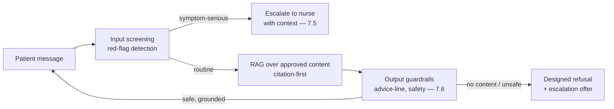
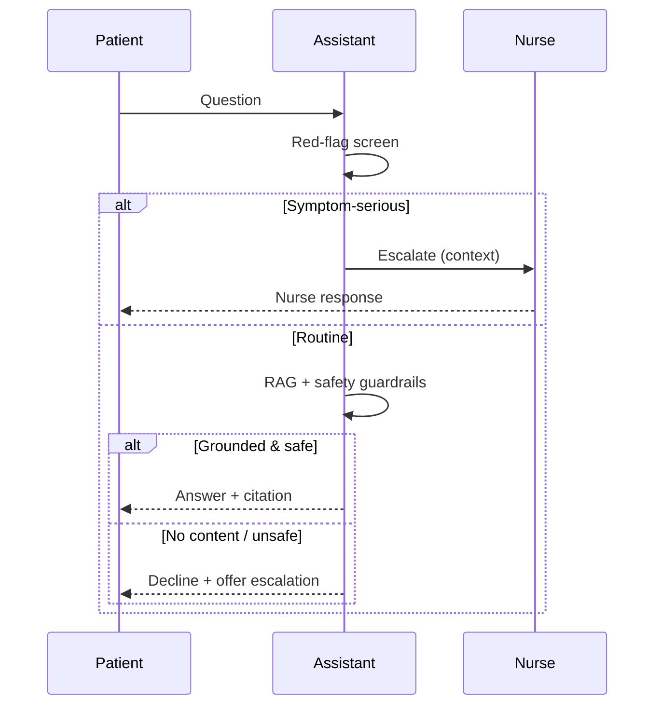
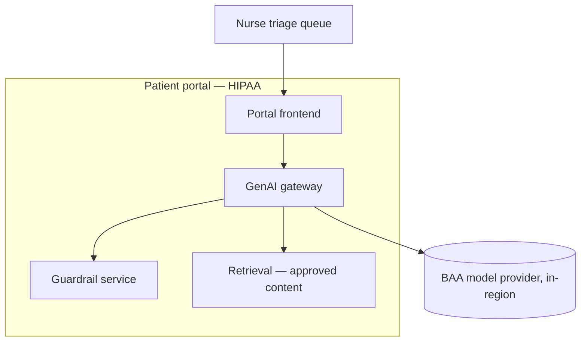

# Case Study CS02 — Patient Portal Triage Chatbot

| | |
|---|---|
| **Industry** | Healthcare |
| **Company profile** | Meridian Health Partners — fictional hospital network, patient-facing portal, HIPAA-regulated |
| **System type** | Guarded RAG assistant with safety-critical escalation |
| **Maturity level exercised** | 3 Engineer → 4 Architect |

## Business Problem

Meridian's nurse triage line was overwhelmed — patients waited 20+ minutes, and many portal messages ("is this rash serious?", "can I take X with Y?") could be answered or safely routed by an assistant, reserving nurses for the cases that need them. The goal: a patient-facing triage assistant that answers routine questions from approved patient-education content, and — critically — recognizes when to escalate to a human (the safety-critical refusal). Target: 30% deflection of routine questions, zero unsafe advice, nurse escalation for anything symptom-serious.

## Stakeholders

| Stakeholder | Role | What they care about | Success measure |
|-------------|------|----------------------|-----------------|
| Patients | End users | Fast, safe, helpful answers | CSAT, wait time |
| Triage nurses | Escalation target | Deflection of routine, quality escalations | Nurse load, escalation quality |
| Chief Nursing Officer | Sponsor | Nurse capacity, patient safety | Deflection, safety incidents |
| Legal/Risk | Gatekeeper | Liability (no unsafe advice) | Zero unsafe-advice incidents |
| Compliance | Gatekeeper | PHI, HIPAA | Zero PHI incidents |

## Requirements

### Functional
- FR-1: Answer routine questions from approved patient-education corpus (RAG, cited).
- FR-2: Detect symptom-serious / out-of-scope questions and escalate to a nurse with context.
- FR-3: Decline medical advice beyond the approved content (designed refusal).
- FR-4: Multilingual (English + top 3 patient languages).

### Non-functional
- NFR-1 (Safety): Zero unsafe-advice outputs across the adversarial + red-flag suite; escalation recall ≥98% on symptom-serious cases.
- NFR-2 (Grounding): Answers cite the approved content; decline when no relevant content.
- NFR-3 (Privacy): PHI handling per HIPAA; patient identity ACL-scoped.
- NFR-4 (Latency): p95 < 3s.

### Constraints
- HIPAA; safety-critical (unsafe advice is the primary risk); approved-content-only; escalation to licensed nurses.

## Architecture

Layered filters (7.6) + RAG (7.2 citation-first) + confidence/red-flag routing to escalation (7.5). Safety-first: the escalation and refusal paths are the primary design surface, not afterthoughts.

## Sequence Diagram

## Deployment Diagram

## Threat Model

| Threat | Vector | Impact | Likelihood | Mitigation |
|--------|--------|--------|------------|------------|
| Unsafe medical advice | Hallucination / off-content | Patient harm, liability | Med-High | Approved-content-only RAG, advice-line guardrails (7.6), escalation |
| Missed red-flag symptom | Screening failure | Delayed care, harm | Med | Recall-tuned red-flag screening; escalation-biased |
| Jailbreak to unsafe advice | Prompt injection | Harm, reputational | Med | Layered filters (7.6), bypass monitoring (4.8) |
| PHI exposure | ACL / logging | Breach | Low-Med | ACL scoping, redacted traces (4.10) |

## Cost Estimation

| Item | Assumption | Monthly |
|------|-----------|---------|
| Inference | 50K conversations/mo, guarded, tiered | ~$18K |
| Guardrail checks | Layered funnel per message | ~$6K |
| Retrieval | Approved-content index | ~$3K |
| **Total** | | **~$27K** |

Dominant driver: guardrail checks (safety-critical funnel). Optimization: funnel tiering (cheap screens first — 4.8/7.8).

## Scaling Strategy

Patient-facing, spiky (post-appointment surges). Stateless assistant scales horizontally; escalation queue is nurse-capacity-bounded (the human bottleneck — 7.5). Backpressure defers non-urgent while protecting escalations (4.6/5.8).

## Monitoring Strategy

Quality plane emphasizes safety (4.7/4.10): escalation recall on red-flag cases (sampled + red-team), unsafe-advice rate (target zero, bypass-sampled — 4.8), decline calibration, deflection rate paired with escalation quality (1.2's paired metrics). Alerts on any unsafe-advice detection, escalation-recall drop, guardrail trigger anomaly.

## Lessons Learned

1. **Safety-critical means escalation-biased** — tuning the red-flag screen for recall (over-escalate rather than miss) is the correct safety trade; the false-escalation cost is far below the missed-symptom cost.
2. **The refusal is a feature** — "I can't advise on that — let me connect you to a nurse" was the assistant's most trusted behavior; designed refusal (3.6/7.5) earned patient trust.
3. **Deflection paired with escalation quality** — measuring deflection alone would have rewarded unsafe over-answering; the paired guardrail metric (1.2) kept it honest.

---

**Related chapters:** [4.8 Guardrails](../curriculum/part-4-enterprise-genai-systems/chapter-08-guardrails-content-safety.md), [7.5 Human-in-the-Loop](../curriculum/part-7-enterprise-ai-architecture-patterns/chapter-05-human-in-the-loop-patterns.md), [7.6 Safety Patterns](../curriculum/part-7-enterprise-ai-architecture-patterns/chapter-06-safety-guardrail-patterns.md) · **Related patterns:** Layered Filters (7.6), Escalation (7.5), Citation-First (7.2) · **Similar case studies:** [CS01](cs01-clinical-documentation-assistant.md), [CS32](cs32-customer-care-deflection.md)
