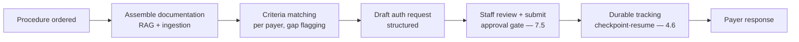
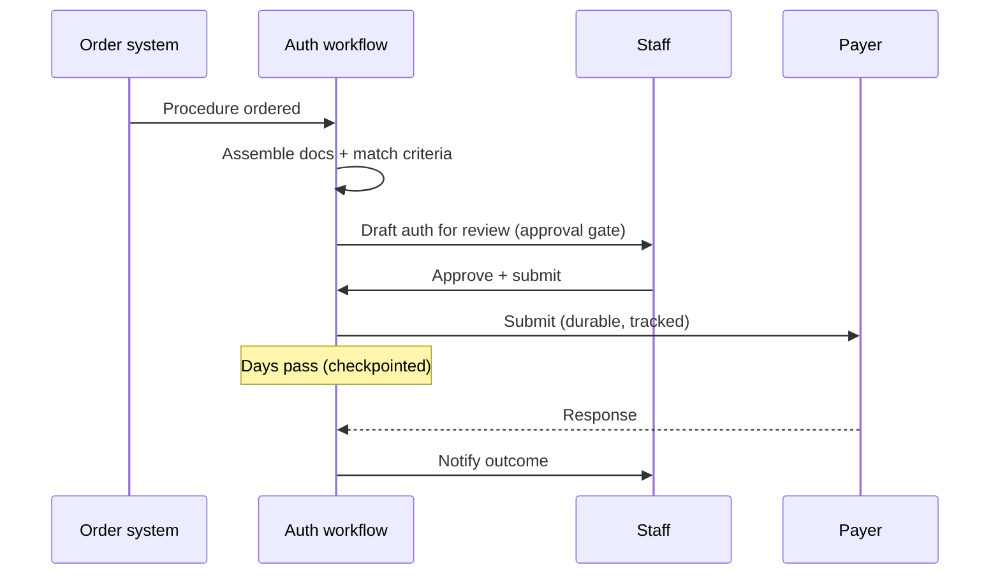
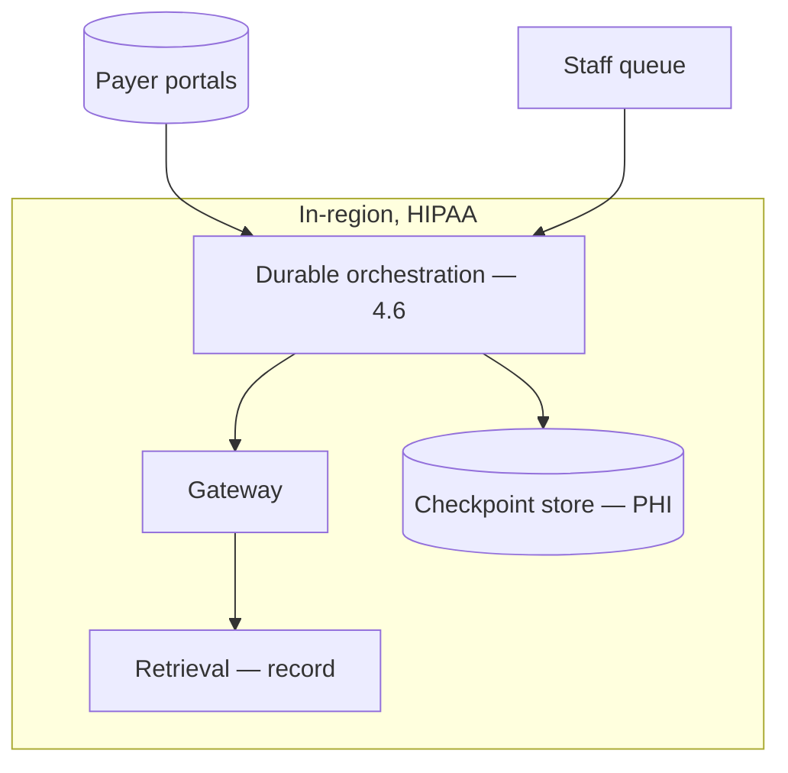

# Case Study CS03 — Prior-Authorization Automation

| | |
|---|---|
| **Industry** | Healthcare |
| **Company profile** | Meridian Health Partners — fictional hospital network, revenue-cycle operations, HIPAA-regulated |
| **System type** | Document workflow + extraction with human sign-off (durable orchestration) |
| **Maturity level exercised** | 3 Engineer → 4 Architect |

## Business Problem

Prior authorization (getting payer approval before a procedure) is a manual, multi-day, error-prone workflow: staff gather clinical documentation, match it to the payer's coverage criteria, submit, and chase. Delays postpone care and cost revenue; errors cause denials. The goal: automate the document assembly and criteria-matching, drafting the authorization request for a human to review and submit, with a full audit trail. Target: cut prior-auth cycle time 50%, reduce denials from incomplete documentation, maintain auditability.

## Stakeholders

| Stakeholder | Role | What they care about | Success measure |
|-------------|------|----------------------|-----------------|
| Prior-auth staff | Users | Time saved, accuracy | Cycle time −50% |
| Revenue-cycle director | Sponsor | Cycle time, denial rate | Denials down, revenue |
| Clinicians | Upstream | Faster approvals, less burden | Approval speed |
| Payers | External | Complete, correct submissions | Denial rate |
| Compliance | Gatekeeper | PHI, audit trail | Audit pass |

## Requirements

### Functional
- FR-1: Assemble clinical documentation for the procedure (RAG over the record + ingestion — 4.3).
- FR-2: Match against the payer's coverage criteria; flag gaps.
- FR-3: Draft the authorization request; route for staff review/submission (approval gate — 7.5).
- FR-4: Track the request through submission and payer response (durable workflow — 4.6).

### Non-functional
- NFR-1 (Accuracy): Criteria-match precision high; gaps flagged, not guessed.
- NFR-2 (Durability): Multi-day workflow survives failures/pauses (checkpoint-and-resume — 7.4/4.6).
- NFR-3 (Privacy): PHI per HIPAA; audit trail complete.
- NFR-4 (Auditability): Every decision traceable (why this documentation, this criteria match).

### Constraints
- HIPAA; payer-specific criteria (varying); human submission (no autonomous payer submission); multi-day durable process.

## Architecture

Durable workflow (4.6/7.4): a multi-day orchestrated process with human steps (7.5 approval), checkpointed state (survives the days-long wait for payer response), and the anti-corruption layer (6.4) to the payer-submission systems.

## Sequence Diagram

## Deployment Diagram

## Threat Model

| Threat | Vector | Impact | Likelihood | Mitigation |
|--------|--------|--------|------------|------------|
| Incorrect criteria match | Extraction/match error | Denial, delayed care | Med | Gap-flagging (not guessing), staff review |
| Autonomous payer submission | Workflow bypass | Unreviewed submission | Low | Hard approval gate (7.5) |
| Lost in-flight request | Non-durable state | Missed deadline, revenue loss | Med | Durable checkpoints (4.6) |
| PHI in checkpoint store | Retention | Breach | Low-Med | Classified, retention-governed (4.14/4.6) |

## Cost Estimation

| Item | Assumption | Monthly |
|------|-----------|---------|
| Inference (assembly + match) | 10K auths/mo, document-heavy, tiered | ~$40K |
| Ingestion + retrieval | Clinical docs | ~$12K |
| Orchestration + state | Durable, PHI checkpoints | ~$8K |
| **Total** | | **~$60K** |

Dominant: document-heavy inference. Optimization: tiering + batch lanes for non-urgent assembly (7.8).

## Scaling Strategy

Volume steady with procedure volume. Orchestration scales with worker pools (4.6); the human review is staff-capacity-bounded. In-flight instances (multi-day) accumulate as durable state — sized for the suspension estate (4.6).

## Monitoring Strategy

Workflow-state monitoring (4.6): instances per state, age percentiles (the days-long payer wait vs. the stuck request), stuck-workflow alerts. Quality: criteria-match precision (sampled), gap-flagging accuracy. Cost per auth. The checkpoint store is the audit trail (4.14).

## Lessons Learned

1. **Durable orchestration is the enabler** — the multi-day, human-gated, payer-dependent process is only automatable with durable checkpointing (4.6); the in-memory version lost requests across deploys.
2. **Flag gaps, don't guess** — the criteria-match must flag missing documentation for staff, not fabricate a match; the confidence-gating (7.5) is what kept denials from incomplete submissions down.
3. **The workflow is the audit trail** — the checkpoint history answered the compliance "why was this submitted?" for every request (4.14).

---

**Related chapters:** [4.6 Orchestration](../curriculum/part-4-enterprise-genai-systems/chapter-06-orchestration-workflows.md), [4.3 Ingestion](../curriculum/part-4-enterprise-genai-systems/chapter-03-document-ingestion.md), [7.5 Human-in-the-Loop](../curriculum/part-7-enterprise-ai-architecture-patterns/chapter-05-human-in-the-loop-patterns.md) · **Related patterns:** Checkpoint-and-Resume (7.4), Approval Gate (7.5), Anti-corruption layer (6.4) · **Similar case studies:** [CS27](cs27-claims-intake-summarization.md), [CS47](cs47-financial-close-acceleration.md)
