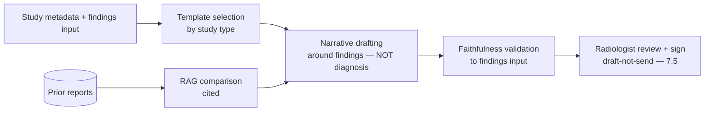
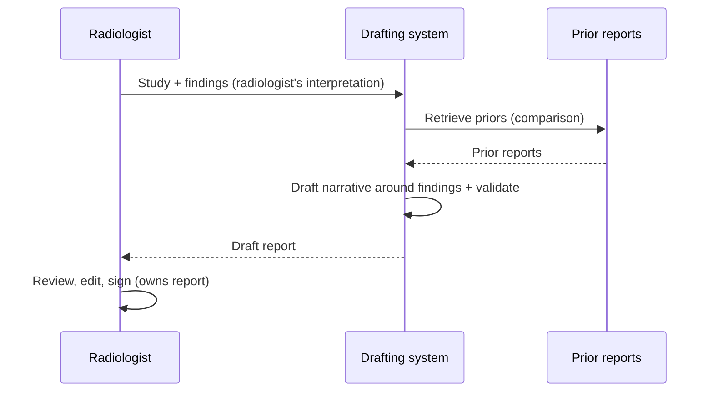
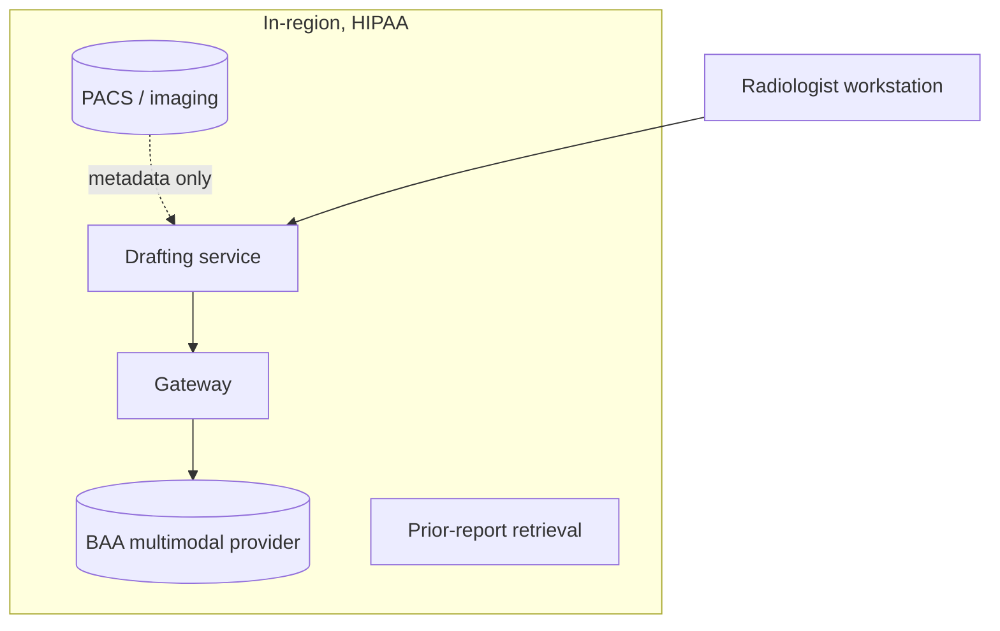

# Case Study CS04 — Radiology Report Drafting

| | |
|---|---|
| **Industry** | Healthcare |
| **Company profile** | Meridian Health Partners — fictional hospital network, radiology department, HIPAA / FDA-adjacent |
| **System type** | Multimodal (imaging + prior reports) + templated generation |
| **Maturity level exercised** | 3 Engineer → 4 Architect |

## Business Problem

Radiologists draft structured reports for every study — high-volume, repetitive prose around the findings. The goal is a drafting assistant that generates the report's templated structure and boilerplate from the study metadata and prior reports (RAG), and drafts the narrative around the radiologist's dictated/entered findings — the radiologist reviewing and owning every report. Critically: the system does **not** interpret the image diagnostically (that would cross into FDA-regulated medical-device territory); it assists the *documentation*, not the *diagnosis*. Target: cut report drafting time 30%, hold report quality, stay firmly on the documentation side of the diagnosis boundary.

## Stakeholders

| Stakeholder | Role | What they care about | Success measure |
|-------------|------|----------------------|-----------------|
| Radiologists | Users | Time, quality, boundary respected | Drafting time −30% |
| Radiology chief | Sponsor | Throughput, quality | Throughput |
| Regulatory/Legal | Gatekeeper | FDA boundary (no diagnosis) | No diagnostic-claim incidents |
| Referring physicians | Downstream | Report clarity, timeliness | Turnaround |
| Compliance | Gatekeeper | PHI | Audit pass |

## Requirements

### Functional
- FR-1: Generate the report structure/template for the study type.
- FR-2: RAG over prior reports for the patient (history, comparison), cited.
- FR-3: Draft the narrative around the radiologist's findings input (not the image interpretation).
- FR-4: Radiologist review/edit; radiologist owns and signs every report (draft-not-send).

### Non-functional
- NFR-1 (Boundary): The system never asserts a diagnostic finding from the image; the radiologist's findings are the input.
- NFR-2 (Quality): Report faithfulness to the radiologist's findings ≥98%; zero fabricated findings.
- NFR-3 (Latency): Draft within 15s.
- NFR-4 (Privacy): PHI per HIPAA; imaging data governed.

### Constraints
- HIPAA; FDA boundary (documentation not diagnosis — the defining constraint); imaging-data sensitivity; radiologist sign-off mandatory.

## Architecture

Routing (template by study type — 7.3) + RAG (prior reports — 7.2) + templated generation, with the **findings as input** (the radiologist interprets the image; the system documents) — the boundary design that keeps it off the FDA-device side.

## Sequence Diagram

## Deployment Diagram

## Threat Model

| Threat | Vector | Impact | Likelihood | Mitigation |
|--------|--------|--------|------------|------------|
| Diagnostic claim from image | Model interprets image | FDA violation, patient harm | Med | Findings-as-input design; no autonomous image diagnosis; boundary evals |
| Fabricated finding | Hallucination | Wrong report, harm | Med | Faithfulness validation to input; radiologist sign-off |
| Imaging-data exposure | PHI/imaging leak | Breach | Low-Med | Metadata-only to model where possible; governed imaging store |
| Report signed unreviewed | Bypass | Unverified report | Low | Hard sign-off gate (7.5) |

## Cost Estimation

| Item | Assumption | Monthly |
|------|-----------|---------|
| Inference | 100K studies/mo, multimodal metadata, tiered | ~$55K |
| Retrieval (priors) | Report corpus | ~$8K |
| Imaging governance | Storage, access | ~$5K |
| **Total** | | **~$68K** |

Dominant: study volume. Optimization: tiering by study complexity (7.8).

## Scaling Strategy

High steady volume. Stateless drafting scales horizontally; retrieval on read replicas. Study-type routing enables tiering (simple studies → cheap models). Peak with imaging-shift patterns.

## Monitoring Strategy

Quality: faithfulness-to-findings (sampled), boundary compliance (any diagnostic-claim detection — a specific eval class), radiologist edit distance. The boundary eval (no image-diagnosis) is the regulatory-critical monitor (4.7/2.8). Cost per study by type.

## Lessons Learned

1. **The boundary is the architecture** — designing findings-as-input (radiologist interprets, system documents) is what keeps the system off the FDA-regulated-device side; the boundary is an architecture decision, not a disclaimer.
2. **Boundary evals are regulatory-critical** — a specific eval class for "did the system assert a diagnostic finding?" is the monitor that keeps the boundary enforced (2.8/4.7).
3. **Radiologist ownership is the safety anchor** — every report signed by the radiologist (draft-not-send — 7.5); the system never owns a clinical statement.

---

**Related chapters:** [3.9 Multimodal](../curriculum/part-3-core-building-blocks-of-genai/chapter-09-multimodal-models.md), [2.8 Responsible AI](../curriculum/part-2-artificial-intelligence/chapter-08-responsible-ai.md), [7.5 Human-in-the-Loop](../curriculum/part-7-enterprise-ai-architecture-patterns/chapter-05-human-in-the-loop-patterns.md) · **Related patterns:** Draft-Not-Send (7.5), Citation-First (7.2), Routing (7.3) · **Similar case studies:** [CS01](cs01-clinical-documentation-assistant.md), [CS27](cs27-claims-intake-summarization.md)
