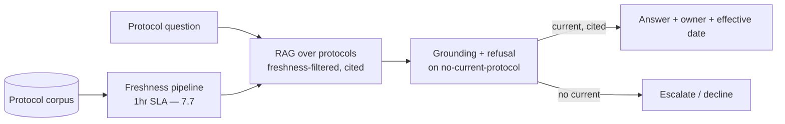
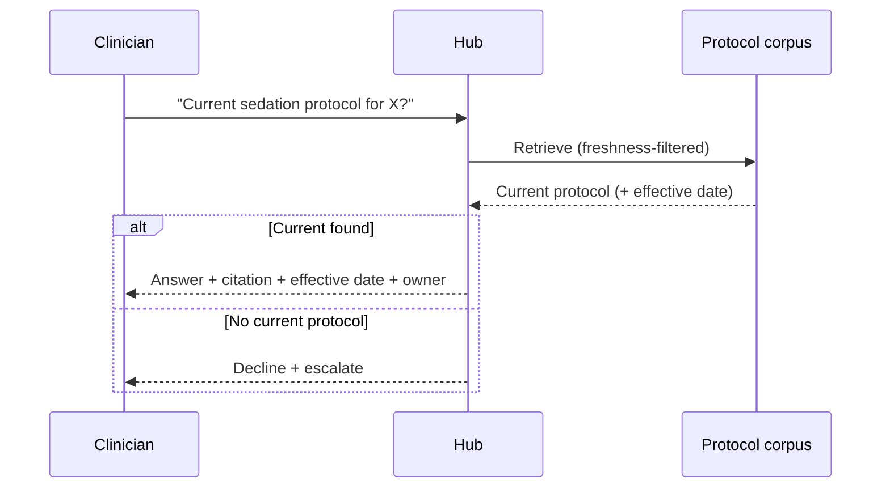
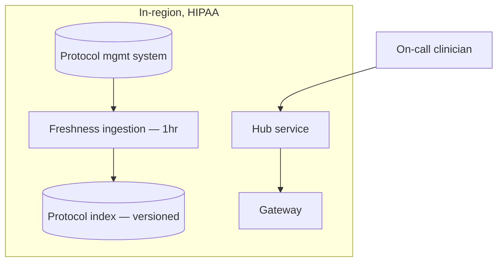

# Case Study CS05 — Hospital Knowledge Hub for Protocols

| | |
|---|---|
| **Industry** | Healthcare |
| **Company profile** | Meridian Health Partners — fictional hospital network, clinical operations, HIPAA-regulated |
| **System type** | ACL-aware RAG with strict freshness |
| **Maturity level exercised** | 3 Engineer |

## Business Problem

Clinical protocols (medication dosing, sedation, infection control) change frequently, and clinicians on-call need the *current* protocol fast — a stale protocol is a patient-safety event. The old intranet search was slow and returned outdated documents. The goal: a protocol knowledge hub answering "what's the current protocol for X?" with the authoritative, current, cited protocol — and refusing/escalating when uncertain. This is the internal counterpart to CS02 (staff-facing, not patient-facing). Target: sub-second-feeling answers, always-current protocols, high on-call adoption.

## Stakeholders

| Stakeholder | Role | What they care about | Success measure |
|-------------|------|----------------------|-----------------|
| On-call clinicians | Users | Fast, current, correct protocols | Adoption, latency |
| Protocol owners | Content owners | Current protocol surfaced | Freshness |
| Patient-safety officer | Sponsor | No stale-protocol events | Zero stale-protocol incidents |
| Health IT | Operator | Reliability | Uptime |

## Requirements

### Functional
- FR-1: Answer protocol questions with the current, authoritative protocol (RAG, cited with effective date).
- FR-2: Surface the protocol owner and last-review date (freshness transparency).
- FR-3: Refuse/escalate when no current protocol is found or confidence is low.

### Non-functional
- NFR-1 (Freshness): Protocol updates reflected within 1 hour (freshness SLA — 4.1); stale-protocol answers = zero tolerance.
- NFR-2 (Latency): p95 TTFT < 800ms (on-call urgency — 4.12).
- NFR-3 (Grounding): Every answer cites the protocol + effective date; refuse on no-current-protocol.

### Constraints
- HIPAA (protocols are internal, generally low-PHI); patient-safety-critical (stale = harm); on-call latency.

## Architecture

RAG (7.2 citation-first) + freshness pipeline (7.7) + designed refusal (3.6). The freshness pipeline is the safety-critical component — a stale protocol answered confidently is the failure mode.

## Sequence Diagram

## Deployment Diagram

## Threat Model

| Threat | Vector | Impact | Likelihood | Mitigation |
|--------|--------|--------|------------|------------|
| Stale protocol answered | Freshness lag / superseded | Patient harm | Med | 1hr freshness SLA, superseded-filtering, effective-date in citation (4.1/7.7) |
| Confident wrong answer | Hallucination | Harm | Low-Med | Citation-first, refuse-on-no-current |
| Deletion not propagated | Retired protocol answered | Harm | Low | Deletion propagation (7.7) |

## Cost Estimation

| Item | Assumption | Monthly |
|------|-----------|---------|
| Inference | 30K queries/mo, tiered | ~$9K |
| Retrieval + freshness pipeline | Protocol corpus, 1hr re-index | ~$5K |
| **Total** | | **~$14K** |

Low cost (internal, low volume). Dominant: freshness pipeline operation.

## Scaling Strategy

Low query volume, but latency-critical (on-call). Freshness pipeline is event-driven (protocol updates trigger re-index). Retrieval optimized for TTFT (cached, thresholded — 4.12). Corpus small (protocols), so index is memory-cheap.

## Monitoring Strategy

Freshness-lag monitoring is the primary safety metric (4.1/7.7): indexed-version age per protocol source, staleness alerts. Quality: citation-with-effective-date validity, refusal calibration. Latency (TTFT) SLO. The stale-protocol case is specifically evaluated (planted superseded protocols in the golden set — 4.1).

## Lessons Learned

1. **Freshness is the safety property** — for protocols, the freshness pipeline (7.7) and effective-dates-in-citations are the patient-safety controls; a stale protocol confidently answered is the exact failure mode to prevent.
2. **Effective dates in citations recruit the clinician** — showing "effective 2025-03" lets the on-call clinician judge currency; the human in the loop as the freshness backstop (4.1).
3. **Refuse rather than answer stale** — refusing on no-current-protocol (and escalating) is safer than answering from a possibly-stale document (3.6/7.5).

---

**Related chapters:** [4.1 Production RAG](../curriculum/part-4-enterprise-genai-systems/chapter-01-production-rag.md), [7.7 Knowledge & Data Patterns](../curriculum/part-7-enterprise-ai-architecture-patterns/chapter-07-knowledge-data-patterns.md), [4.12 Latency](../curriculum/part-4-enterprise-genai-systems/chapter-12-latency-performance.md) · **Related patterns:** Freshness Pipeline (7.7), Citation-First (7.2), ACL-Propagated Index (7.7) · **Similar case studies:** [CS31](cs31-network-operations-copilot.md), [CS43](cs43-employee-policy-assistant.md)
