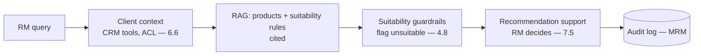
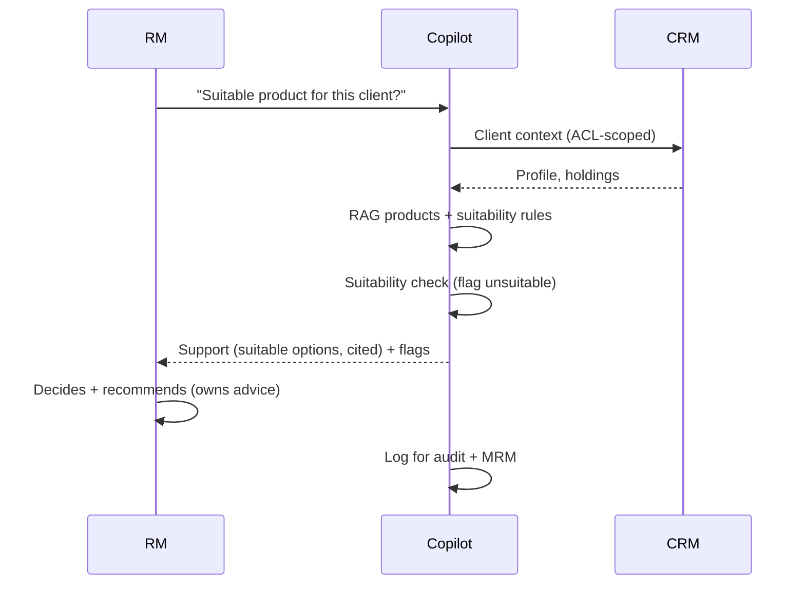
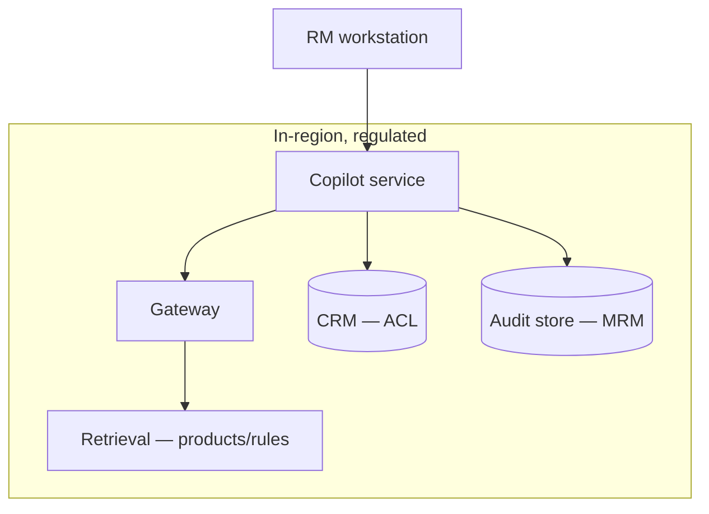

# Case Study CS06 — Relationship Manager Copilot

| | |
|---|---|
| **Industry** | Banking |
| **Company profile** | Nordhaven Bank — fictional retail/wealth bank, ~2,000 relationship managers, heavily regulated |
| **System type** | RAG + CRM tools, suitability-governed |
| **Maturity level exercised** | 4 Architect |

## Business Problem

Relationship managers (RMs) juggle many clients and products; answering a client's question ("what's the right product for X?") requires synthesizing the client's profile, the product catalog, and the suitability rules — slow and error-prone, with suitability violations (recommending unsuitable products) a serious regulatory and reputational risk. The goal: a copilot that surfaces client context and product information, and *supports* (never autonomously makes) suitability-compliant recommendations, with full auditability and model-risk-management. Target: faster client interactions, zero suitability violations, auditable advice support.

## Stakeholders

| Stakeholder | Role | What they care about | Success measure |
|-------------|------|----------------------|-----------------|
| Relationship managers | Users | Speed, accuracy, suitability safety | Interaction time, adoption |
| Wealth management head | Sponsor | RM productivity, revenue | Revenue, productivity |
| Compliance/Suitability | Gatekeeper | Suitability, auditability | Zero suitability violations |
| Model risk management | Gatekeeper | Model governance (SR 11-7-style) | MRM validation pass |
| Clients | Beneficiaries | Suitable advice | Suitability |

## Requirements

### Functional
- FR-1: Surface client context (profile, holdings, history) via CRM tools (ACL-scoped — 6.6).
- FR-2: RAG over product catalog + suitability rules, cited.
- FR-3: Support suitability-compliant recommendations (flag unsuitable; the RM decides — 7.5).
- FR-4: Log every interaction for audit + MRM.

### Non-functional
- NFR-1 (Suitability): Zero unsuitable-product recommendations reaching the client; suitability rules enforced (guardrails — 4.8).
- NFR-2 (Auditability): Every recommendation-support traceable (client context, rules applied — 4.14).
- NFR-3 (MRM): Model governance — validation independence, monitoring, documentation (4.14).
- NFR-4 (Privacy): Client data ACL-scoped, information barriers respected.

### Constraints
- Financial regulation; suitability rules (the defining constraint); model-risk-management; information barriers; RM makes the recommendation (advice-support, not autonomous advice).

## Architecture

RAG (7.2) + CRM tools (3.7, user-scoped — 6.6) + suitability guardrails (7.6) + human-in-the-loop (7.5, the RM decides). The suitability guardrail is the regulatory-critical layer; MRM governs the whole (4.14).

## Sequence Diagram

## Deployment Diagram

## Threat Model

| Threat | Vector | Impact | Likelihood | Mitigation |
|--------|--------|--------|------------|------------|
| Unsuitable recommendation | Model / rule gap | Regulatory violation, harm | Med | Suitability guardrails (7.6), RM decides (7.5), flags |
| Information-barrier breach | Cross-client / cross-desk data | Regulatory violation | Med | ACL scoping, information barriers (6.5/6.6) |
| Unauditable advice | Missing logs | MRM/audit failure | Med | Full interaction logging (4.14) |
| Model drift undetected | Silent model change | Suitability degradation | Med | MRM monitoring, eval gates (4.7/5.9) |

## Cost Estimation

| Item | Assumption | Monthly |
|------|-----------|---------|
| Inference | 2,000 RMs × 30 queries/day, tiered | ~$110K |
| Guardrails (suitability) | Per-query checks | ~$20K |
| Retrieval + audit | Products/rules, MRM logs | ~$25K |
| **Total** | | **~$155K** |

Dominant: query volume. Optimization: tiering + caching (7.8).

## Scaling Strategy

Business-hours load. Stateless copilot scales horizontally; CRM/retrieval on replicas. Suitability guardrail funnel tiered (4.8/7.8). Provider capacity pooled, interactive lane protected (5.4).

## Monitoring Strategy

Quality with regulatory emphasis: suitability-violation rate (target zero, bypass-sampled — 4.8), citation validity, RM edit/override rates (rubber-stamp monitoring — 7.5). MRM monitoring: model drift, eval gates, validation independence (4.14). The audit log is the compliance evidence.

## Lessons Learned

1. **Advice-support, not autonomous advice** — the RM owns the recommendation (7.5); the copilot supports and flags. This boundary is what makes it deployable under suitability regulation.
2. **Suitability is a guardrail, not a hope** — the suitability rules are enforced as guardrails (7.6), not requested in a prompt; the hard flag on unsuitable products is the regulatory control.
3. **MRM is the governance overlay** — the model-risk-management (validation independence, monitoring, documentation — 4.14) treats the copilot like any regulated model; the audit log is the evidence.

---

**Related chapters:** [4.14 Privacy/Compliance](../curriculum/part-4-enterprise-genai-systems/chapter-14-privacy-compliance-governance.md), [6.6 IAM](../curriculum/part-6-enterprise-architecture/chapter-06-iam-for-ai.md), [7.6 Safety Patterns](../curriculum/part-7-enterprise-ai-architecture-patterns/chapter-06-safety-guardrail-patterns.md) · **Related patterns:** Layered Filters (7.6), Human-in-the-Loop (7.5), ACL-Propagated Index (7.7) · **Similar case studies:** [CS28](cs28-underwriting-copilot.md), [CS08](cs08-credit-memo-drafting.md)
