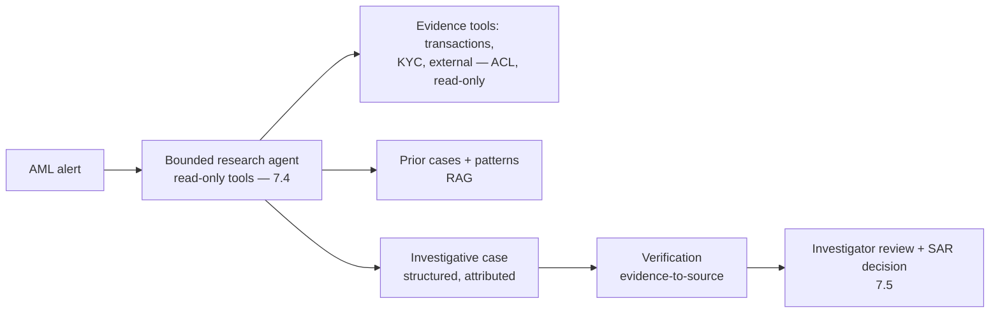
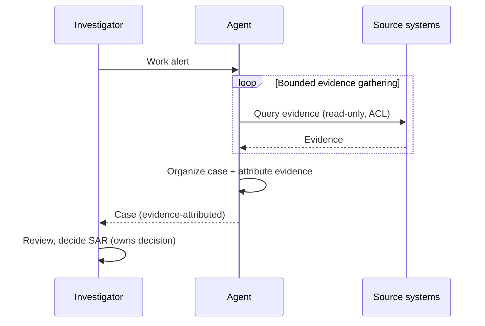
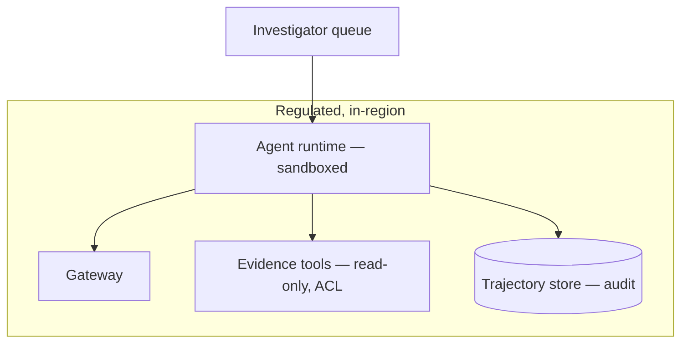

# Case Study CS07 — AML Investigation Assistant

| | |
|---|---|
| **Industry** | Banking |
| **Company profile** | Nordhaven Bank — fictional bank, financial crime / AML unit, heavily regulated |
| **System type** | Agentic case research with explainability |
| **Maturity level exercised** | 4 Architect |

## Business Problem

Anti-money-laundering (AML) investigators work alerts (suspicious transaction patterns) by gathering evidence across systems (transactions, KYC, external data), building a case, and deciding whether to file a Suspicious Activity Report (SAR). It's slow, and the false-negative cost (missing real laundering) is severe (regulatory penalties, enabling crime). The goal: an agentic assistant that gathers and organizes the evidence for an alert, building the investigative case for the investigator to review and decide — with full explainability (regulators must see *why*). Target: faster investigations, higher-quality cases, no reduction in detection, regulator-defensible explainability.

## Stakeholders

| Stakeholder | Role | What they care about | Success measure |
|-------------|------|----------------------|-----------------|
| AML investigators | Users | Evidence gathering, case quality | Investigation time, case quality |
| Financial crime head | Sponsor | Throughput, detection quality | Cases/investigator, detection |
| Regulators | External | Explainability, defensibility | Regulator review |
| Model risk / Compliance | Gatekeeper | Governance, auditability | MRM pass |

## Requirements

### Functional
- FR-1: Gather evidence for an alert across systems (transactions, KYC, external — read-only tools, ACL — 3.7/6.6).
- FR-2: Organize the evidence into an investigative case (structured, cited).
- FR-3: Surface patterns and prior related cases (RAG).
- FR-4: Investigator reviews the case and decides on SAR filing (7.5 — the investigator decides).

### Non-functional
- NFR-1 (Explainability): Every element of the case traces to its evidence source (regulator-defensible — the false-negative-cost domain).
- NFR-2 (Detection): No reduction in detection vs. manual; the assistant gathers, the investigator judges.
- NFR-3 (Auditability): Full trajectory (what the agent gathered, why) auditable (4.4/4.14).
- NFR-4 (Governance): MRM; the agent is bounded and governed (3.8/4.4).

### Constraints
- AML regulation; explainability (regulator-facing); false-negative cost; read-only agent (gathers evidence, doesn't act); investigator decides SAR.

## Architecture

Bounded agent (7.4 — read-only, the top-left autonomy-grid quadrant: evidence-gathering is verify-cheap, errors recoverable) + RAG (7.2) + human-in-the-loop (7.5). The explainability (evidence-to-source attribution) is the regulatory keystone.

## Sequence Diagram

## Deployment Diagram

## Threat Model

| Threat | Vector | Impact | Likelihood | Mitigation |
|--------|--------|--------|------------|------------|
| Hallucinated evidence | Fabrication | Wrong case, missed/false SAR | Med | Evidence-to-source verification (3.8), investigator review |
| Missed evidence (false neg) | Incomplete gathering | Undetected laundering | Med | Bounded-but-thorough gathering; investigator judges completeness |
| Un-explainable case | Missing attribution | Regulator failure | Med | Evidence attribution, trajectory audit (4.4/4.14) |
| Over-broad data access | ACL failure | Privacy/regulatory | Med | Read-only, ACL-scoped tools (3.7/6.6) |

## Cost Estimation

| Item | Assumption | Monthly |
|------|-----------|---------|
| Agent inference | 20K alerts/mo, multi-step gathering | ~$70K |
| Tools + retrieval | Evidence systems, prior cases | ~$15K |
| Trajectory audit store | Full audit | ~$8K |
| **Total** | | **~$93K** |

Dominant: multi-step agent gathering (call-graph — 4.4). Optimization: bounded loops, tiering within-agent (7.8).

## Scaling Strategy

Alert-volume-driven. Agent fleet (4.4) scales with worker pools; budget hierarchies bound the multi-step cost. Investigator review is the human bottleneck. Trajectory store scales with audit retention (4.14).

## Monitoring Strategy

Fleet observability (4.4): trajectory review (did the agent gather correctly), verification-disagreement (hallucinated evidence caught), exit distributions. Detection quality tracked against manual baseline (no reduction). Explainability audit sampling. Cost per alert.

## Lessons Learned

1. **Read-only agents are the safe agentic case** — evidence-gathering is the autonomy-grid top-left (verify-cheap, recoverable); the agent gathers, the investigator decides — no consequential action (SAR filing stays human).
2. **Explainability is the regulatory keystone** — every case element attributed to its evidence source; the false-negative-cost domain demands regulator-defensible explainability (4.4/4.14).
3. **Verification catches hallucinated evidence** — the evidence-to-source verification (3.8) is what makes the agent's gathering trustworthy; the agent's claims are checked against the actual sources.

---

**Related chapters:** [3.8 Agents](../curriculum/part-3-core-building-blocks-of-genai/chapter-08-agents-concepts.md), [4.4 Agent Architectures](../curriculum/part-4-enterprise-genai-systems/chapter-04-agent-architectures-production.md), [7.4 Agentic Patterns](../curriculum/part-7-enterprise-ai-architecture-patterns/chapter-04-agentic-patterns.md) · **Related patterns:** Bounded Agent Loop (7.4), Tool Sandbox (7.4), Human-in-the-Loop (7.5) · **Similar case studies:** [CS17](cs17-quality-incident-analysis.md), [CS50](cs50-audit-evidence-assistant.md)
