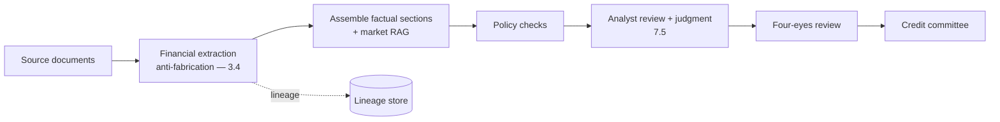
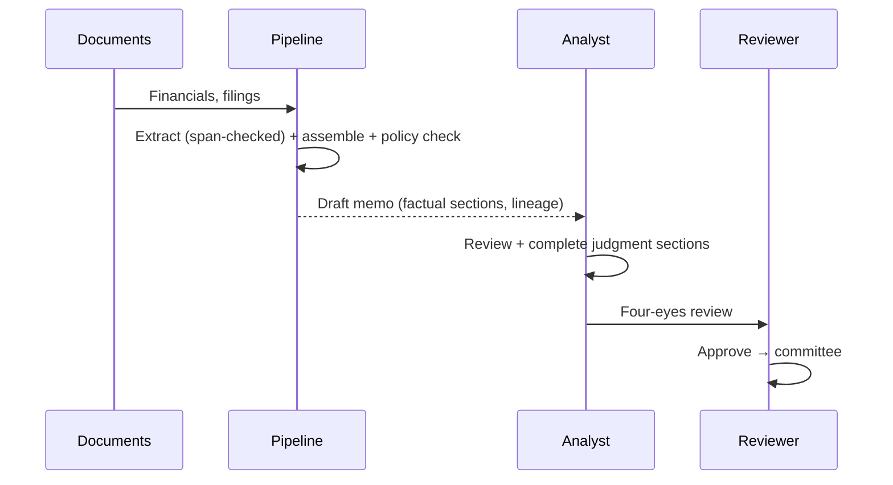
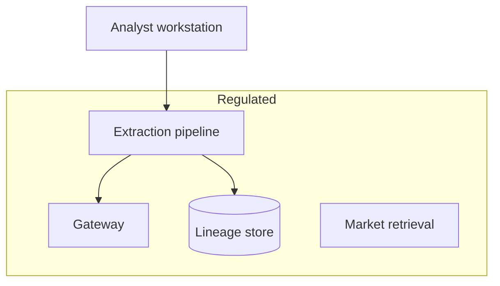

# Case Study CS08 — Credit Memo Drafting

| | |
|---|---|
| **Industry** | Banking |
| **Company profile** | Nordhaven Bank — fictional bank, commercial lending, heavily regulated |
| **System type** | Document pipeline with four-eyes review and model governance |
| **Maturity level exercised** | 4 Architect |

## Business Problem

Commercial credit memos (the analysis underpinning a lending decision) are labor-intensive: analysts synthesize financials, market data, and policy into a structured memo. The goal: a drafting pipeline that assembles the memo's factual sections (financials extracted, market context, policy checks) for the analyst to review and complete the judgment sections — with data lineage, four-eyes review, and model governance. Target: cut memo drafting time 40%, hold analysis quality, maintain lineage and governance for the regulated lending decision.

## Stakeholders

| Stakeholder | Role | What they care about | Success measure |
|-------------|------|----------------------|-----------------|
| Credit analysts | Users | Time, accuracy | Drafting time −40% |
| Credit committee | Decision | Memo quality, defensibility | Decision quality |
| Chief credit officer | Sponsor | Throughput, quality | Throughput |
| Model risk / Compliance | Gatekeeper | Lineage, governance, four-eyes | MRM pass, lineage |

## Requirements

### Functional
- FR-1: Extract financials from source documents (ingestion + extraction — 4.3/3.4).
- FR-2: Assemble factual memo sections (financials, market context via RAG).
- FR-3: Run policy checks (lending policy compliance).
- FR-4: Analyst reviews/completes; four-eyes review before committee (7.5).

### Non-functional
- NFR-1 (Lineage): Every figure traces to its source document (data lineage — 5.5/4.14).
- NFR-2 (Accuracy): Extracted figures verified (anti-fabrication — 3.4); analyst reviews.
- NFR-3 (Governance): MRM; four-eyes review; the lending judgment stays human.
- NFR-4 (Auditability): The memo's factual basis is auditable.

### Constraints
- Lending regulation; data lineage (the figures must trace to source); four-eyes review; lending decision stays human; MRM.

## Architecture

Ingestion + extraction (4.3/3.4, anti-fabrication + span-checks for the figures) + RAG (market context) + policy checks (guardrails) + human-in-the-loop (7.5, analyst + four-eyes). Lineage (5.5) is the governance keystone.

## Sequence Diagram

## Deployment Diagram

## Threat Model

| Threat | Vector | Impact | Likelihood | Mitigation |
|--------|--------|--------|------------|------------|
| Fabricated financial figure | Hallucination | Wrong lending decision | Med | Span-check to source (3.4), analyst review, lineage |
| Broken lineage | Missing provenance | Un-auditable memo | Med | Lineage capture at extraction (5.5) |
| Autonomous lending judgment | Bypass | Unreviewed decision | Low | Analyst + four-eyes (7.5) |
| Policy check gap | Rule miss | Non-compliant memo | Med | Policy guardrails, analyst verification |

## Cost Estimation

| Item | Assumption | Monthly |
|------|-----------|---------|
| Extraction + assembly | 5K memos/mo, document-heavy | ~$45K |
| Ingestion + retrieval | Financials, market | ~$12K |
| Lineage + governance | Lineage store, MRM | ~$6K |
| **Total** | | **~$63K** |

Dominant: document-heavy extraction. Optimization: tiering, batch for non-urgent (7.8).

## Scaling Strategy

Steady with lending volume. Extraction pipeline scales with worker pools (4.3); the analyst + four-eyes review is capacity-bounded. Lineage store scales with memo volume.

## Monitoring Strategy

Quality: extraction accuracy (span-check pass rate — 3.4), figure-fabrication rate (target zero), policy-check accuracy. Lineage completeness (every figure traceable). MRM monitoring (drift, eval gates). Cost per memo. Analyst edit rates.

## Lessons Learned

1. **Span-checks make figures trustworthy** — every extracted financial figure verified to exist in the source (3.4's anti-fabrication); a fabricated figure in a credit memo is a wrong lending decision.
2. **Lineage is the governance keystone** — every figure traces to its source document (5.5); the regulated lending decision's factual basis must be auditable.
3. **Four-eyes stays human** — the analyst completes the judgment, the four-eyes reviewer confirms; the lending judgment is never autonomous (7.5).

---

**Related chapters:** [3.4 Structured Outputs](../curriculum/part-3-core-building-blocks-of-genai/chapter-04-structured-outputs.md), [4.3 Ingestion](../curriculum/part-4-enterprise-genai-systems/chapter-03-document-ingestion.md), [5.5 Data Architecture](../curriculum/part-5-cloud-infrastructure-platform/chapter-05-data-architecture.md) · **Related patterns:** Human-in-the-Loop (7.5), Freshness Pipeline (7.7), Citation-First (7.2) · **Similar case studies:** [CS06](cs06-relationship-manager-copilot.md), [CS49](cs49-procurement-contract-intelligence.md)
