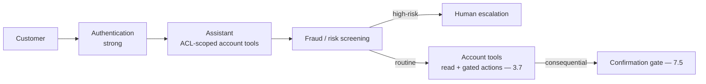
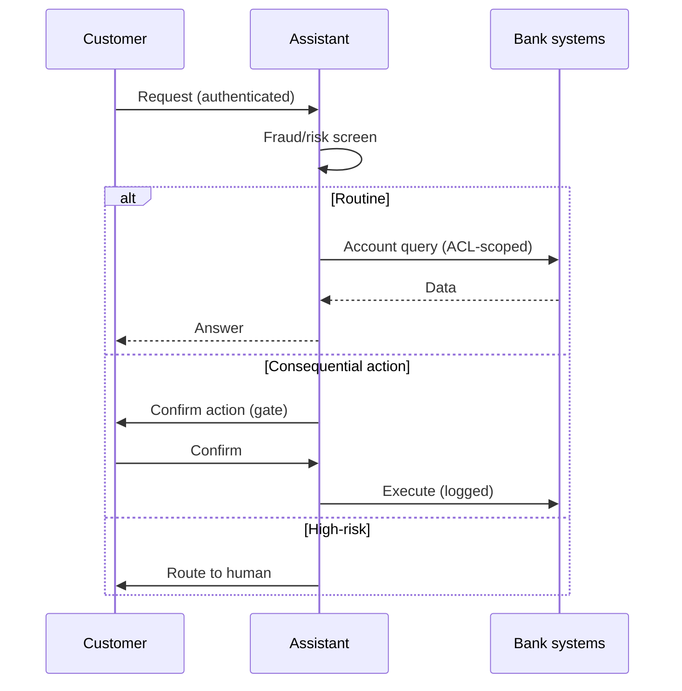
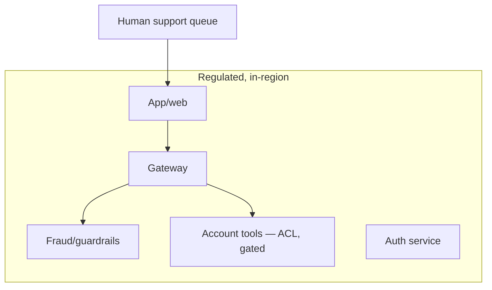

# Case Study CS09 — Retail Bank Support Assistant

| | |
|---|---|
| **Industry** | Banking |
| **Company profile** | Nordhaven Bank — fictional retail bank, customer-facing support, regulated |
| **System type** | Customer-facing bot with fraud-surface and authentication controls |
| **Maturity level exercised** | 3 Engineer → 4 Architect |

## Business Problem

Retail-bank support handles high volumes of routine queries (balance, transactions, card issues) — expensive to staff and slow for customers. The goal: a customer-facing assistant that handles routine queries and safely routes the rest, with strong authentication (banking fraud surface) and multilingual support. The fraud dimension is the defining challenge: an assistant that can act on account information is a social-engineering and account-takeover target. Target: 40% query deflection, zero fraud-enabling actions, multilingual coverage, CSAT hold.

## Stakeholders

| Stakeholder | Role | What they care about | Success measure |
|-------------|------|----------------------|-----------------|
| Customers | Users | Fast, safe, multilingual help | CSAT, deflection |
| Support ops | Beneficiary | Deflection, escalation quality | Cost per contact |
| Fraud/Security | Gatekeeper | No fraud-enabling, authentication | Zero fraud incidents |
| Compliance | Gatekeeper | Data protection, regulation | Audit pass |

## Requirements

### Functional
- FR-1: Answer routine account queries (post-authentication, ACL-scoped tools — 3.7/6.6).
- FR-2: Handle card actions (freeze, replace) with confirmation gates (7.5).
- FR-3: Detect and route fraud-suspicious / high-risk requests to humans.
- FR-4: Multilingual (top customer languages).

### Non-functional
- NFR-1 (Security): Strong authentication; no fraud-enabling actions; injection-resistant (4.9).
- NFR-2 (Deflection): 40% of routine queries deflected safely, paired with escalation quality.
- NFR-3 (Multilingual): Per-language quality floors (2.4).
- NFR-4 (Privacy): Account data ACL-scoped; PII protected.

### Constraints
- Banking regulation; fraud surface (the defining constraint); strong authentication; consequential actions (card ops) gated; multilingual.

## Architecture

Authentication + ACL-scoped tools (3.7/6.6) + fraud screening (guardrails — 7.6) + consequence gates (7.5) + multilingual. The fraud surface makes the security design (authentication, gating, injection-resistance — 4.9) central.

## Sequence Diagram

## Deployment Diagram

## Threat Model

| Threat | Vector | Impact | Likelihood | Mitigation |
|--------|--------|--------|------------|------------|
| Account takeover via social engineering | Injection / manipulation | Fraud, loss | Med-High | Strong auth, injection-resistance (4.9), gated actions (7.5) |
| Unauthorized account action | Tool abuse | Fraud | Med | ACL-scoped, user-identity, confirmation gates (3.7/6.6) |
| PII exposure | ACL / logging | Breach | Med | ACL scoping, redacted traces (4.10) |
| Prompt injection to action | Untrusted input | Fraud | Med | Fenced input, blast-radius bounding (4.9) |

## Cost Estimation

| Item | Assumption | Monthly |
|------|-----------|---------|
| Inference | 500K conversations/mo, tiered | ~$60K |
| Fraud/guardrails | Per-message | ~$25K |
| Tools + retrieval | Account systems | ~$10K |
| **Total** | | **~$95K** |

Dominant: high conversation volume. Optimization: tiering, semantic caching for FAQ (7.8).

## Scaling Strategy

Very high, spiky volume (customer-facing). Stateless assistant scales horizontally; strong authentication and fraud screening on the hot path (budget latency — 4.12). Provider capacity pooled; interactive lane protected. Human escalation is capacity-bounded (backpressure — 5.8).

## Monitoring Strategy

Quality + security: deflection paired with escalation quality (1.2), fraud-incident rate (zero), injection-attempt monitoring (4.9's trigger rates), per-language quality (2.4). Consequence-gate override monitoring (7.5). Cost per conversation.

## Lessons Learned

1. **The fraud surface defines the security design** — an assistant that can act on accounts is an account-takeover target; strong authentication, gated consequential actions (7.5), and injection-resistance (4.9) are the central design, not add-ons.
2. **Gate every consequential action** — card freezes/replacements require confirmation (7.5); the assistant proposes, the (authenticated) customer confirms — no autonomous account actions.
3. **Multilingual needs per-language floors** — the German and Spanish quality can't be assumed equal to English (2.4); per-language quality floors and monitoring.

---

**Related chapters:** [4.9 GenAI Security](../curriculum/part-4-enterprise-genai-systems/chapter-09-genai-security-threat-modeling.md), [3.7 Tool Use](../curriculum/part-3-core-building-blocks-of-genai/chapter-07-function-calling-tool-use.md), [7.6 Safety Patterns](../curriculum/part-7-enterprise-ai-architecture-patterns/chapter-06-safety-guardrail-patterns.md) · **Related patterns:** Approval Gate (7.5), Layered Filters (7.6), Tool Sandbox (7.4) · **Similar case studies:** [CS32](cs32-customer-care-deflection.md), [CS14](cs14-returns-complaints-automation.md)
