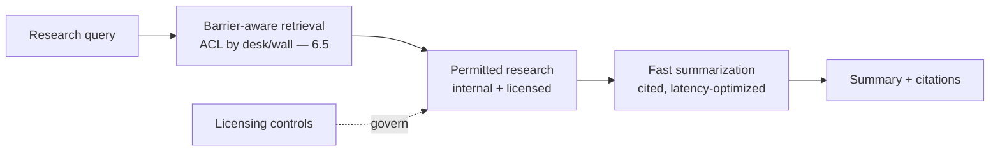
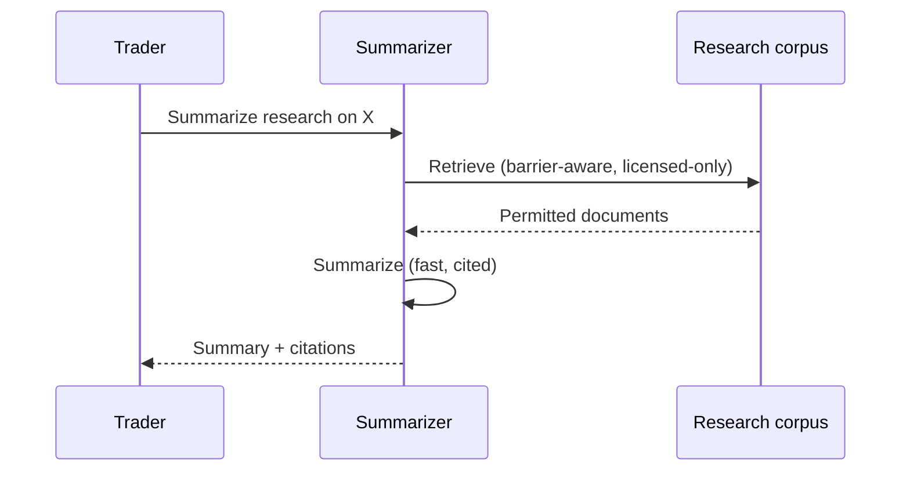
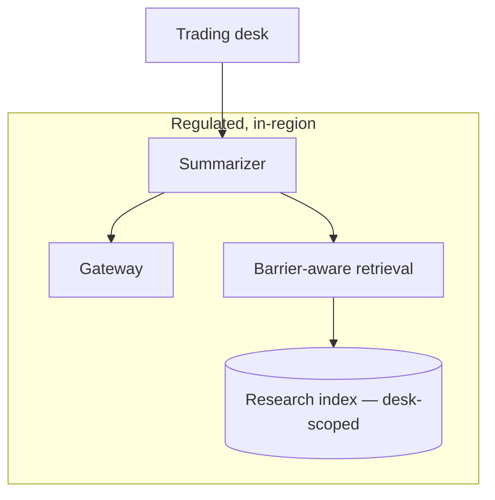

# Case Study CS10 — Trading Floor Research Summarizer

| | |
|---|---|
| **Industry** | Banking |
| **Company profile** | Nordhaven Bank — fictional investment bank, trading/research desk, heavily regulated |
| **System type** | Low-latency summarization with information barriers |
| **Maturity level exercised** | 3 Engineer → 4 Architect |

## Business Problem

Traders and analysts consume large volumes of research (internal notes, licensed external research, market news) and need fast, accurate summaries to inform decisions — where minutes matter. The defining constraints: information barriers (Chinese walls — some research must not cross desks), data licensing (external research usage terms), and low latency. The goal: a summarizer that produces fast, accurate, barrier-respecting summaries with citations. Target: faster research consumption, zero information-barrier breaches, licensing-compliant, low latency.

## Stakeholders

| Stakeholder | Role | What they care about | Success measure |
|-------------|------|----------------------|-----------------|
| Traders/analysts | Users | Fast, accurate summaries | Latency, adoption |
| Desk head | Sponsor | Productivity | Productivity |
| Compliance | Gatekeeper | Information barriers, licensing | Zero breaches |
| Legal | Gatekeeper | Data licensing terms | Licensing compliance |

## Requirements

### Functional
- FR-1: Summarize research documents (internal + licensed external), cited.
- FR-2: Respect information barriers (barrier-aware retrieval — ACL by desk/wall).
- FR-3: Respect data-licensing terms (usage-compliant handling of external research).
- FR-4: Fast synthesis across multiple documents.

### Non-functional
- NFR-1 (Barriers): Zero information-barrier breaches (barrier-aware ACL — 4.1/6.5).
- NFR-2 (Latency): p95 < 2s (trading urgency — 4.12).
- NFR-3 (Licensing): External research handled per licensing terms.
- NFR-4 (Accuracy): Faithful summaries, cited.

### Constraints
- Financial regulation; information barriers (the defining constraint); data licensing; low latency.

## Architecture

Barrier-aware RAG (7.2/4.1 with information-barrier ACLs — 6.5) + low-latency summarization (4.12). The information barrier is the compliance keystone; licensing governs the external corpus.

## Sequence Diagram

## Deployment Diagram

## Threat Model

| Threat | Vector | Impact | Likelihood | Mitigation |
|--------|--------|--------|------------|------------|
| Information-barrier breach | Cross-wall retrieval | Regulatory violation, insider risk | Med | Barrier-aware ACL (6.5/4.1), desk-scoped index |
| Licensing violation | External research misuse | Legal/contract breach | Med | Licensing controls, usage-compliant handling |
| Inaccurate summary | Hallucination | Bad trading decision | Med | Citation-first, faithfulness evals |
| Latency breach | Slow synthesis | Missed opportunity | Med | Latency optimization (streaming, caching — 4.12) |

## Cost Estimation

| Item | Assumption | Monthly |
|------|-----------|---------|
| Inference | 100K summaries/mo, latency-tier | ~$40K |
| Retrieval (barrier-aware) | Research corpus | ~$10K |
| **Total** | | **~$50K** |

Dominant: summary volume. Optimization: caching common research, tiering (7.8).

## Scaling Strategy

Market-hours peaked. Stateless summarizer scales horizontally; barrier-aware retrieval on desk-scoped indexes. Latency-critical — provisioned throughput for the interactive lane (5.4/4.12). Caching for common research.

## Monitoring Strategy

Compliance + quality: information-barrier compliance (zero breaches, ACL-audit), licensing compliance, summary faithfulness (sampled), latency (p95 SLO — 4.12). Barrier-breach detection is the compliance-critical monitor.

## Lessons Learned

1. **Information barriers are ACL-by-wall** — the barrier-aware retrieval (desk/wall-scoped ACLs — 6.5/4.1) is the compliance keystone; a cross-wall summary is a regulatory and insider-risk event.
2. **Licensing governs the corpus** — external research usage terms constrain the corpus and handling (a legal constraint on the data — 4.14); the licensing controls are as important as the technical ones.
3. **Latency is a trading requirement** — for the trading floor, latency (4.12) is a hard requirement (minutes matter); streaming and caching optimize the perceived and actual latency.

---

**Related chapters:** [4.1 Production RAG](../curriculum/part-4-enterprise-genai-systems/chapter-01-production-rag.md), [6.5 Security Architecture](../curriculum/part-6-enterprise-architecture/chapter-05-security-architecture-zero-trust.md), [4.12 Latency](../curriculum/part-4-enterprise-genai-systems/chapter-12-latency-performance.md) · **Related patterns:** ACL-Propagated Index (7.7), Citation-First (7.2), Semantic Caching (7.8) · **Similar case studies:** [CS38](cs38-policy-analysis-assistant.md), [CS26](cs26-regulatory-change-monitoring.md)
