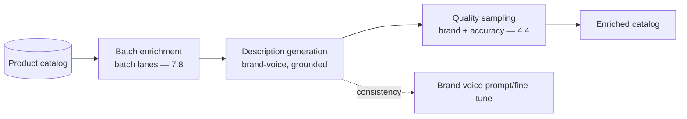
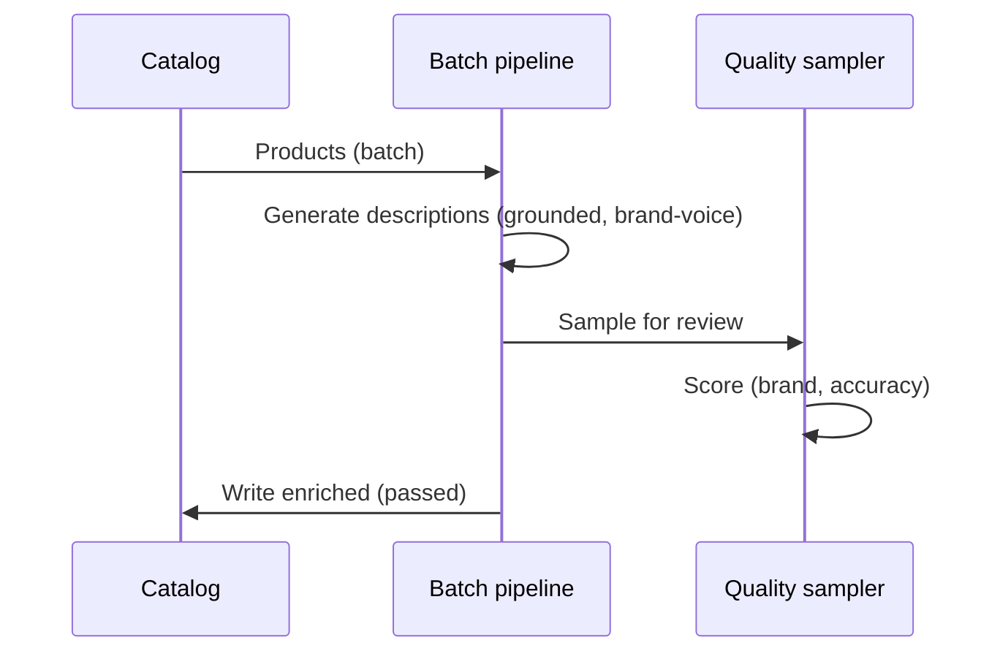
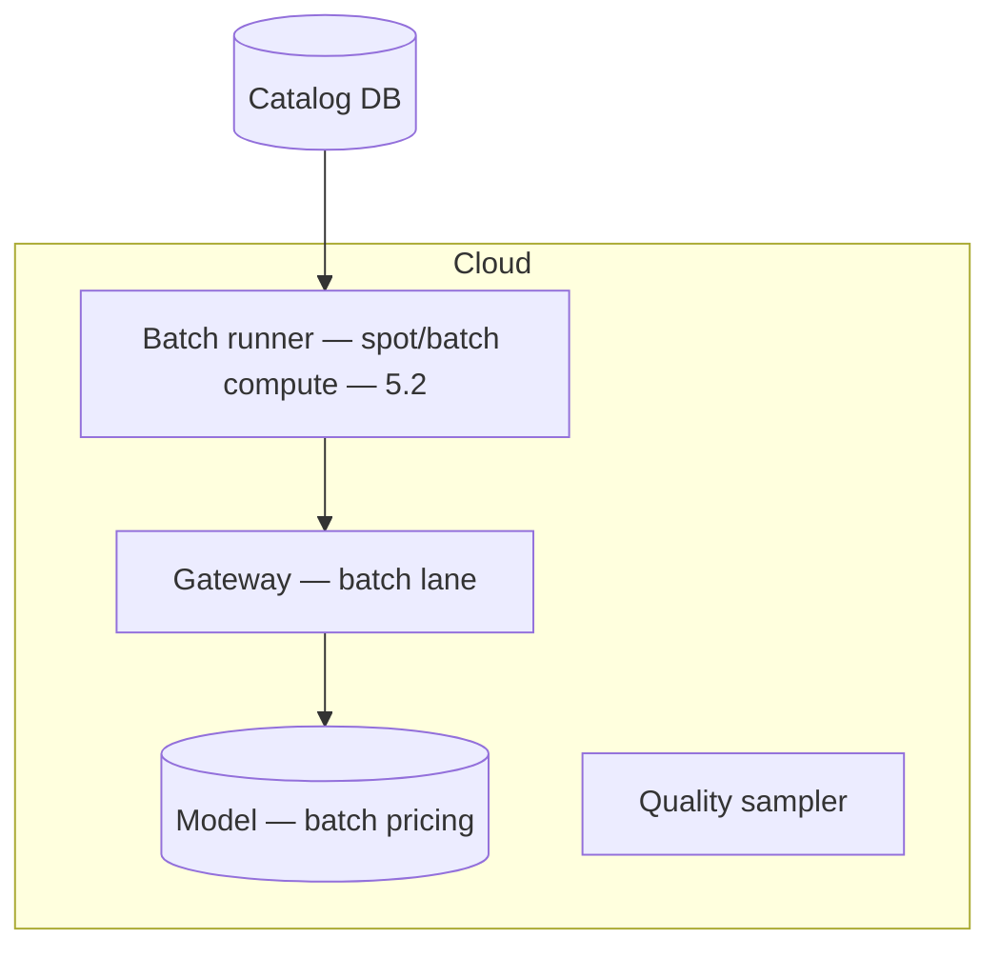

# Case Study CS11 — Product Catalog Enrichment

| | |
|---|---|
| **Industry** | Retail |
| **Company profile** | Averline Retail Group — fictional retailer, 900 stores + e-commerce, large product catalog |
| **System type** | Batch generation at scale with quality sampling |
| **Maturity level exercised** | 3 Engineer |

## Business Problem

Averline's e-commerce catalog has millions of products with inconsistent, incomplete descriptions — hurting search, conversion, and brand consistency. Manually enriching descriptions is infeasible at scale. The goal: a batch pipeline that generates consistent, on-brand, accurate product descriptions from product attributes and source data, with quality sampling and brand-voice consistency. The defining challenge is cost engineering (millions of products) and quality at scale (sampling, not full review). Target: enrich the full catalog economically, consistent brand voice, factually accurate (no invented product claims).

## Stakeholders

| Stakeholder | Role | What they care about | Success measure |
|-------------|------|----------------------|-----------------|
| E-commerce team | Users | Description quality, coverage | Coverage, conversion |
| Brand | Gatekeeper | Brand voice consistency | Brand compliance |
| Merchandising | Content owners | Accuracy (no false claims) | Accuracy |
| Finance | Sponsor | Cost at catalog scale | Cost per product |

## Requirements

### Functional
- FR-1: Generate product descriptions from attributes + source data.
- FR-2: Enforce brand voice consistency.
- FR-3: Prevent invented product claims (grounded in attributes).
- FR-4: Batch process the full catalog; incremental for new products.

### Non-functional
- NFR-1 (Cost): Economical at millions of products (batch economics, tiering — 7.8).
- NFR-2 (Quality): Brand-voice consistency + factual accuracy, quality-sampled (not full review — 4.4).
- NFR-3 (Accuracy): No claims beyond the source attributes (grounding).

### Constraints
- Cost at scale (the defining constraint); brand consistency; factual accuracy; batch + incremental.

## Architecture

Batch generation (7.8 batch lanes for cost) + brand-voice consistency (prompting or fine-tuning — 4.13) + grounding (no invented claims) + quality sampling (7.5 review sampling — sample not full review at catalog scale). Cost engineering (7.8) is central.

## Sequence Diagram

## Deployment Diagram

## Threat Model

| Threat | Vector | Impact | Likelihood | Mitigation |
|--------|--------|--------|------------|------------|
| Invented product claim | Hallucination | False advertising, returns | Med | Grounding in attributes, quality sampling |
| Brand-voice drift | Inconsistent generation | Brand damage | Med | Brand-voice prompt/fine-tune, sampling |
| Cost overrun | Un-tiered generation | Budget | Med | Batch economics, tiering (7.8) |

## Cost Estimation

| Item | Assumption | Monthly |
|------|-----------|---------|
| Batch generation | 2M products (initial), then incremental, batch pricing + compact model | ~$30K (initial), ~$5K ongoing |
| Quality sampling | Sample rate | ~$3K |
| **Total** | | **~$33K initial, ~$8K ongoing** |

Dominant: initial catalog volume. Optimization: compact fine-tuned model + batch pricing (2.6/7.8) — this is the tiering case.

## Scaling Strategy

Massive initial batch, then incremental. Batch/spot compute (5.2), batch-pricing API (7.8), off-peak scheduling. Incremental enrichment on new-product events. Fully latency-tolerant — the batch lane (4.6).

## Monitoring Strategy

Quality sampling dashboards (4.4): brand-voice consistency scores, accuracy (no-invented-claims), coverage. Cost per product (the catalog-scale metric — 7.8). Sampling concentrated on new product categories.

## Lessons Learned

1. **Cost engineering is the architecture at catalog scale** — millions of products makes the batch economics and model tiering (7.8) the central design; a compact fine-tuned model on batch pricing is the difference between viable and not.
2. **Sample, don't full-review** — at catalog scale, quality sampling (7.5/4.4) is the only feasible quality control; the sampling policy concentrates on the risky categories.
3. **Ground to prevent false claims** — descriptions grounded in the product attributes (no invented claims) prevents the false-advertising risk (returns, legal).

---

**Related chapters:** [4.11 Cost Engineering](../curriculum/part-4-enterprise-genai-systems/chapter-11-cost-engineering.md), [4.13 Prompting/RAG/Fine-tuning](../curriculum/part-4-enterprise-genai-systems/chapter-13-prompting-rag-finetuning.md), [7.8 Cost & Performance Patterns](../curriculum/part-7-enterprise-ai-architecture-patterns/chapter-08-cost-performance-patterns.md) · **Related patterns:** Batch Lanes (7.8), Model Tiering (7.8), Review Sampling (7.5) · **Similar case studies:** [CS16](cs16-supplier-document-intelligence.md), [CS42](cs42-api-documentation-automation.md)
