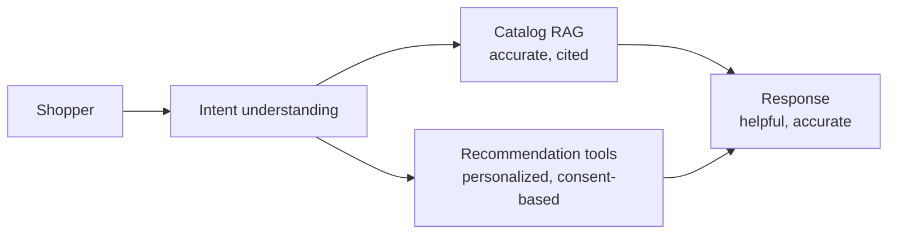
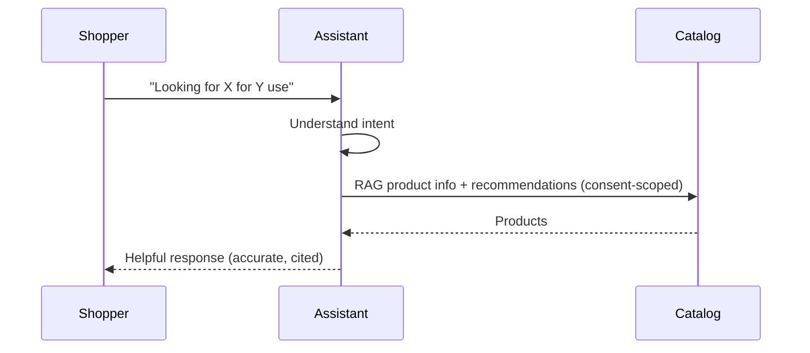
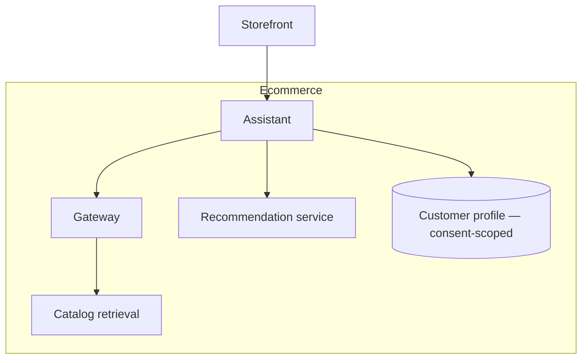

# Case Study CS12 — Conversational Shopping Assistant

| | |
|---|---|
| **Industry** | Retail |
| **Company profile** | Averline Retail Group — fictional retailer, e-commerce, customer-facing |
| **System type** | RAG + recommendation tools, conversion-optimized |
| **Maturity level exercised** | 3 Engineer → 4 Architect |

## Business Problem

Online shoppers struggle to find the right product in large catalogs; a conversational assistant that understands intent, answers product questions, and recommends can lift conversion. The tension: personalization (better recommendations) vs. privacy (customer data), and conversion optimization vs. trust (no pushy/inaccurate recommendations). The goal: a shopping assistant grounded in the catalog (accurate product info) with recommendation tools, optimized for conversion while respecting privacy and maintaining trust. Target: conversion lift, accurate product info, privacy-respecting personalization.

## Stakeholders

| Stakeholder | Role | What they care about | Success measure |
|-------------|------|----------------------|-----------------|
| Shoppers | Users | Helpful, accurate, trustworthy | CSAT, conversion |
| E-commerce | Sponsor | Conversion, AOV | Conversion lift |
| Privacy | Gatekeeper | Customer data, consent | Privacy compliance |
| Merchandising | Content | Accurate product info | Accuracy |

## Requirements

### Functional
- FR-1: Answer product questions (RAG over catalog, cited/accurate).
- FR-2: Recommend products (recommendation tools, personalized).
- FR-3: Understand shopping intent conversationally.
- FR-4: Respect privacy (consent-based personalization).

### Non-functional
- NFR-1 (Accuracy): Accurate product info (grounded, no invented specs).
- NFR-2 (Conversion): Optimized for conversion, paired with trust (not pushy — 1.2's paired metrics).
- NFR-3 (Privacy): Personalization consent-based; customer data governed (4.14).
- NFR-4 (Latency): Conversational, p95 < 2s.

### Constraints
- Consumer privacy; conversion vs. trust; catalog accuracy; conversational latency.

## Architecture

RAG (7.2, catalog accuracy) + recommendation tools (3.7) + conversational intent. Conversion optimized but paired with trust metrics (1.2); privacy governs personalization (4.14).

## Sequence Diagram

## Deployment Diagram

## Threat Model

| Threat | Vector | Impact | Likelihood | Mitigation |
|--------|--------|--------|------------|------------|
| Invented product spec | Hallucination | Wrong purchase, returns, trust | Med | Grounding, catalog RAG |
| Privacy violation | Un-consented personalization | Regulatory, trust | Med | Consent-based, data governance (4.14) |
| Pushy/manipulative recs | Conversion-only optimization | Trust erosion | Med | Trust-paired metrics (1.2) |
| Injection | Untrusted input | Manipulation | Low-Med | Fenced input (4.9) |

## Cost Estimation

| Item | Assumption | Monthly |
|------|-----------|---------|
| Inference | 1M conversations/mo, tiered | ~$70K |
| Retrieval + recommendation | Catalog, rec service | ~$15K |
| **Total** | | **~$85K** |

Dominant: conversation volume. Optimization: caching, tiering (7.8).

## Scaling Strategy

High, spiky (shopping peaks — sales, holidays). Stateless assistant scales horizontally; catalog retrieval on replicas; recommendation service scales independently. Peak provisioning for shopping events (5.8).

## Monitoring Strategy

Quality + business: conversion paired with trust (CSAT, return rate — 1.2's paired metrics), product-info accuracy (sampled), recommendation relevance. Privacy compliance (consent). Latency SLO. A/B testing for conversion changes (4.7).

## Lessons Learned

1. **Conversion paired with trust** — optimizing conversion alone would reward pushy/inaccurate recommendations that erode trust (1.2); the paired trust metric (CSAT, returns) keeps it honest.
2. **Accuracy is the trust foundation** — grounded product info (no invented specs) prevents the wrong-purchase/return/trust-loss cycle; the catalog RAG accuracy is the trust anchor.
3. **Privacy governs personalization** — consent-based personalization (4.14) is both a compliance requirement and a trust factor; the personalization respects the customer's consent.

---

**Related chapters:** [3.6 RAG](../curriculum/part-3-core-building-blocks-of-genai/chapter-06-rag-fundamentals.md), [1.2 Systems Thinking](../curriculum/part-1-professional-foundation/chapter-02-systems-thinking-design-thinking.md), [4.14 Privacy](../curriculum/part-4-enterprise-genai-systems/chapter-14-privacy-compliance-governance.md) · **Related patterns:** Citation-First (7.2), Feedback-to-Dataset (7.7) · **Similar case studies:** [CS13](cs13-store-operations-copilot.md), [CS34](cs34-b2b-proposal-automation.md)
