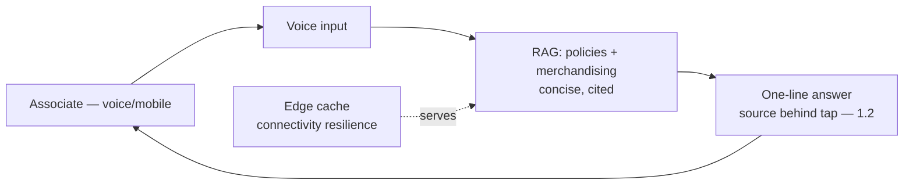
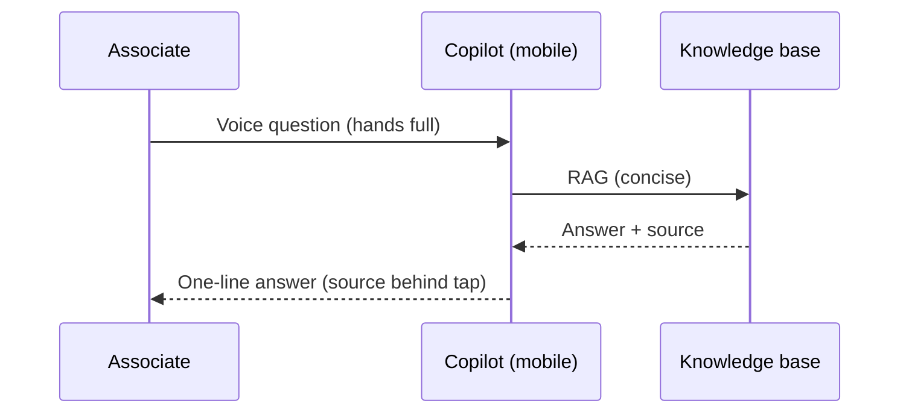
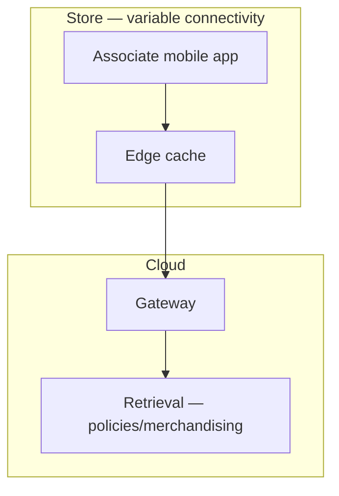

# Case Study CS13 — Store Operations Copilot

| | |
|---|---|
| **Industry** | Retail |
| **Company profile** | Averline Retail Group — fictional retailer, 900 stores, store-associate-facing |
| **System type** | Mobile RAG for associates (edge/connectivity constraints) |
| **Maturity level exercised** | 3 Engineer |

## Business Problem

Store associates need quick answers to operational and product questions (policies, merchandising, inventory) while on the floor — hands mostly full, connectivity variable, and speed critical. Averline's earlier attempt (CS from 1.2 — the store assistant) failed because it was designed from headquarters' framing, not the associates' reality. The redesign (post the 1.2 discovery) leads with a one-line answer, source-behind-a-tap, and voice input. The defining challenges: mobile UX under real constraints (hands full, variable connectivity), speed, and seasonal load. Target: sub-5-second useful answers, high floor adoption, robust under connectivity variability.

## Stakeholders

| Stakeholder | Role | What they care about | Success measure |
|-------------|------|----------------------|-----------------|
| Store associates | Users | Fast, hands-light, works on floor | Adoption, answer speed |
| Store managers | Beneficiary | Associate effectiveness | Productivity |
| Retail ops | Sponsor | Operational consistency | Consistency, adoption |
| IT | Operator | Mobile, connectivity | Reliability |

## Requirements

### Functional
- FR-1: Answer operational/product questions (RAG over policies + merchandising).
- FR-2: One-line answer first, source-behind-a-tap (the mobile-UX redesign — 1.2).
- FR-3: Voice input (hands-full reality).
- FR-4: Robust under variable connectivity.

### Non-functional
- NFR-1 (Speed): Useful answer in <5s (the associate-floor reality — 1.2).
- NFR-2 (Mobile UX): Hands-light (one-line, voice); designed for the floor, not the desk.
- NFR-3 (Connectivity): Graceful under variable/poor connectivity.
- NFR-4 (Seasonal): Handles seasonal load (holidays).

### Constraints
- Mobile/floor reality (the defining constraint — 1.2's lesson); connectivity variability; speed; seasonal load.

## Architecture

RAG (7.2, concise for mobile) + voice + mobile-first UX (the 1.2 redesign: one-line, source-on-tap). Connectivity resilience via caching; seasonal scaling.

## Sequence Diagram

## Deployment Diagram

## Threat Model

| Threat | Vector | Impact | Likelihood | Mitigation |
|--------|--------|--------|------------|------------|
| Stale policy answer | Freshness | Wrong operational action | Med | Freshness pipeline (7.7) |
| Connectivity failure | Poor store network | Unavailable | Med-High | Edge caching, graceful degradation |
| Wrong answer on floor | Hallucination | Operational error | Low-Med | Citation-first, source-on-tap for verification |

## Cost Estimation

| Item | Assumption | Monthly |
|------|-----------|---------|
| Inference (incl. voice) | 900 stores × ~50 queries/day, tiered | ~$25K |
| Retrieval + edge cache | Policies/merchandising | ~$6K |
| **Total** | | **~$31K** |

Dominant: query volume × voice. Optimization: caching (common questions), tiering (7.8).

## Scaling Strategy

Seasonal peaks (holidays multiply floor traffic). Stateless, horizontally scaled; edge caching for common questions (connectivity + latency). Seasonal capacity provisioning; the batch of common answers cached (7.8).

## Monitoring Strategy

Quality + UX: answer speed (the <5s floor SLO), adoption (the 1.2 failure was low adoption), answer accuracy (sampled), freshness. Connectivity-failure handling. Seasonal load. Associate feedback (the acceptance metric — 1.2).

## Lessons Learned

1. **Design for the floor, not the desk** (1.2's lesson) — the redesign led with the one-line answer, source-on-tap, and voice because associates have their hands and eyes on customers; the first version failed by designing from headquarters' framing.
2. **Speed and hands-light are the UX requirements** — a three-paragraph answer on a handheld is worse than shouting to a colleague; the mobile-floor reality dictates the UX (1.2).
3. **Connectivity resilience matters** — variable store connectivity requires edge caching and graceful degradation; the floor is not the datacenter.

---

**Related chapters:** [1.2 Systems Thinking & Design Thinking](../curriculum/part-1-professional-foundation/chapter-02-systems-thinking-design-thinking.md), [3.6 RAG](../curriculum/part-3-core-building-blocks-of-genai/chapter-06-rag-fundamentals.md), [4.12 Latency](../curriculum/part-4-enterprise-genai-systems/chapter-12-latency-performance.md) · **Related patterns:** Freshness Pipeline (7.7), Semantic Caching (7.8), Citation-First (7.2) · **Similar case studies:** [CS33](cs33-field-technician-assistant.md), [CS15](cs15-maintenance-manual-assistant.md)
