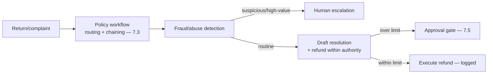
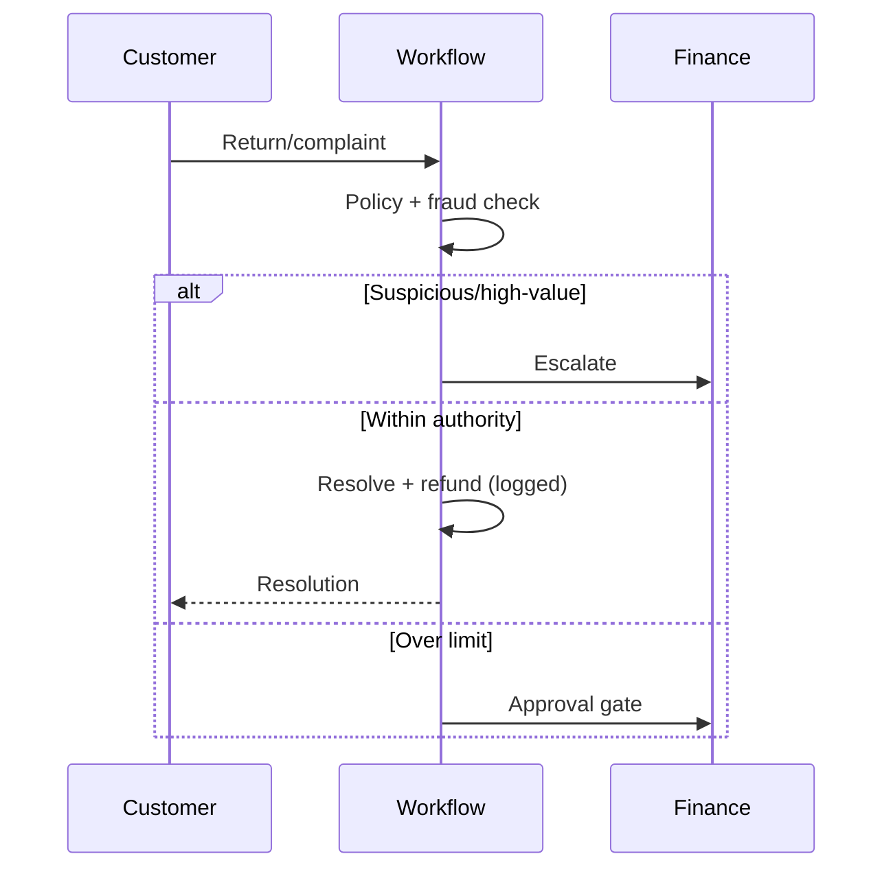
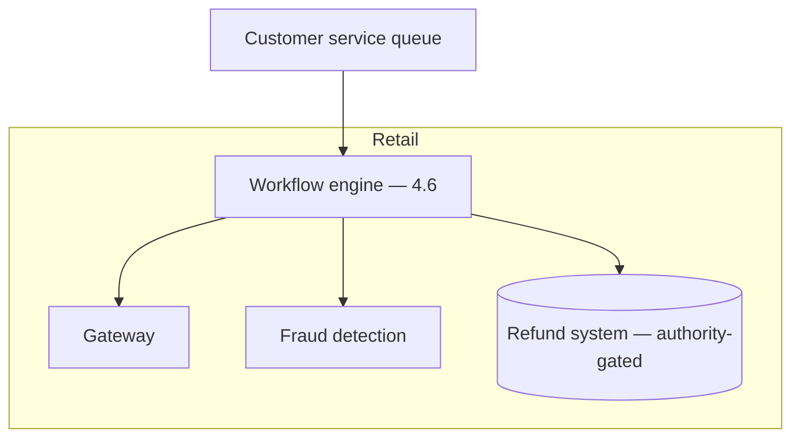

# Case Study CS14 — Returns & Complaints Automation

| | |
|---|---|
| **Industry** | Retail |
| **Company profile** | Averline Retail Group — fictional retailer, customer service, returns operations |
| **System type** | Workflow + guardrails with fraud/abuse controls |
| **Maturity level exercised** | 3 Engineer → 4 Architect |

## Business Problem

Returns and complaints are high-volume, rule-bound (return policy, refund authority), and abuse-prone (return fraud). Manual handling is slow and inconsistent; naive automation risks fraud (unauthorized refunds). The goal: an automated workflow that processes returns/complaints per policy, drafting resolutions and executing within refund-authority limits (with gates above), while detecting abuse. Target: faster resolution, policy-consistent, fraud-controlled (refund authority limits enforced), abuse detected.

## Stakeholders

| Stakeholder | Role | What they care about | Success measure |
|-------------|------|----------------------|-----------------|
| Customers | Users | Fast, fair resolution | CSAT, resolution time |
| Customer service | Beneficiary | Deflection, consistency | Cost per case |
| Fraud/Finance | Gatekeeper | Refund authority, abuse | Fraud loss, unauthorized refunds |
| Ops | Sponsor | Efficiency, consistency | Efficiency |

## Requirements

### Functional
- FR-1: Process return/complaint per policy (workflow — 7.3).
- FR-2: Draft resolutions; execute refunds within authority limits (gated above — 7.5).
- FR-3: Detect return-fraud/abuse patterns.
- FR-4: Escalate high-value/suspicious cases to humans.

### Non-functional
- NFR-1 (Fraud control): Refund authority limits enforced (guardrails); no unauthorized refunds.
- NFR-2 (Consistency): Policy-consistent resolutions.
- NFR-3 (Abuse detection): Return-fraud patterns flagged.

### Constraints
- Refund authority limits (the defining fraud constraint); return policy; abuse surface; consequential actions (refunds) gated.

## Architecture

Workflow (7.3) + fraud detection (guardrails) + consequence gates on refunds (7.5, authority limits — the fraud control) + escalation. The refund-authority gating is the fraud keystone.

## Sequence Diagram

## Deployment Diagram

## Threat Model

| Threat | Vector | Impact | Likelihood | Mitigation |
|--------|--------|--------|------------|------------|
| Unauthorized refund | Authority bypass | Fraud loss | Med | Refund authority limits (gates — 7.5), logging |
| Return fraud | Abuse patterns | Loss | Med-High | Fraud detection, escalation |
| Injection to refund | Untrusted input | Fraud | Med | Fenced input, gated actions (4.9/7.5) |
| Policy inconsistency | Rule gap | Unfair/inconsistent | Med | Policy workflow, guardrails |

## Cost Estimation

| Item | Assumption | Monthly |
|------|-----------|---------|
| Inference | 200K cases/mo, tiered | ~$25K |
| Fraud detection + workflow | Per-case | ~$10K |
| **Total** | | **~$35K** |

Dominant: case volume. Optimization: tiering (7.8).

## Scaling Strategy

Volume peaks post-holiday (returns surge). Workflow scales with worker pools (4.6); human escalation capacity-bounded. Fraud detection scales with case volume. Seasonal provisioning.

## Monitoring Strategy

Fraud + quality: unauthorized-refund rate (zero), fraud-loss rate, authority-limit compliance, resolution consistency, escalation quality. Consequence-gate override monitoring (7.5). Cost per case.

## Lessons Learned

1. **Refund authority limits are the fraud control** — the consequence gates (7.5) enforcing refund-authority limits (auto within limit, human above) is the fraud keystone; no autonomous refund above authority.
2. **Fraud detection is the abuse control** — the return-fraud detection flags abuse patterns for escalation; the abuse surface demands it.
3. **Gate consequential actions, always** — refunds are consequential/irreversible; the gating (7.5) and logging make them controlled and auditable.

---

**Related chapters:** [7.5 Human-in-the-Loop](../curriculum/part-7-enterprise-ai-architecture-patterns/chapter-05-human-in-the-loop-patterns.md), [4.6 Orchestration](../curriculum/part-4-enterprise-genai-systems/chapter-06-orchestration-workflows.md), [4.9 Security](../curriculum/part-4-enterprise-genai-systems/chapter-09-genai-security-threat-modeling.md) · **Related patterns:** Approval Gate (7.5), Routing (7.3), Layered Filters (7.6) · **Similar case studies:** [CS09](cs09-retail-bank-support-assistant.md), [CS30](cs30-subrogation-opportunity-detection.md)
