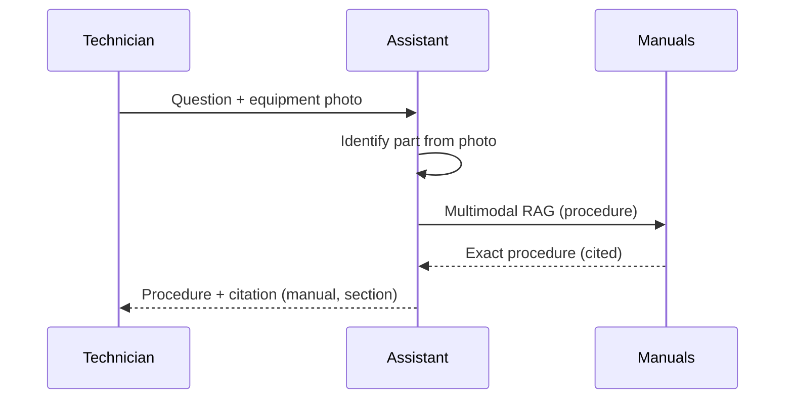
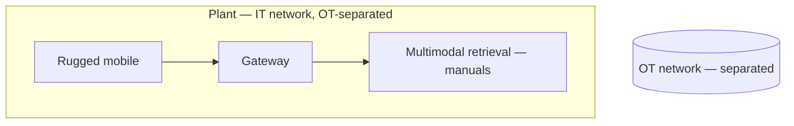

# Case Study CS15 — Maintenance Manual Assistant

| | |
|---|---|
| **Industry** | Manufacturing |
| **Company profile** | Steinmark Industrial — fictional manufacturer, plant maintenance, safety-critical operations |
| **System type** | Multimodal RAG (manuals + equipment photos), shop-floor |
| **Maturity level exercised** | 3 Engineer → 4 Architect |

## Business Problem

Maintenance technicians need fast, accurate procedures from dense equipment manuals (thousands of pages, diagrams, part numbers) while at the machine — where a wrong procedure is a safety event. The goal: a multimodal assistant that answers maintenance questions from the manuals, reads equipment photos (identify the part/panel), and returns the exact procedure, cited — with the OT/IT boundary respected (the assistant informs, doesn't control equipment). The defining challenges: safety-critical accuracy, shop-floor UX, and multimodal (diagrams, photos). Target: faster correct procedures, zero unsafe-procedure incidents, shop-floor usable.

## Stakeholders

| Stakeholder | Role | What they care about | Success measure |
|-------------|------|----------------------|-----------------|
| Maintenance techs | Users | Fast, correct, safe procedures | Procedure speed, adoption |
| Plant safety | Gatekeeper | No unsafe procedures | Zero safety incidents |
| Maintenance manager | Sponsor | Uptime, tech effectiveness | Downtime, effectiveness |
| OT/IT security | Gatekeeper | OT boundary | No OT control incidents |

## Requirements

### Functional
- FR-1: Answer maintenance questions from manuals (multimodal RAG — diagrams, tables).
- FR-2: Read equipment photos (identify part/panel — multimodal).
- FR-3: Return exact procedures, cited (manual + section).
- FR-4: Respect OT/IT boundary (informs, does not control equipment).

### Non-functional
- NFR-1 (Safety): Safety-critical accuracy; zero unsafe-procedure outputs; cite the exact procedure.
- NFR-2 (Multimodal): Read diagrams, tables, photos accurately (3.9).
- NFR-3 (Shop-floor UX): Usable in the plant (rugged, hands-variable).
- NFR-4 (OT boundary): No equipment control (informational only).

### Constraints
- Safety-critical (the defining constraint); OT/IT boundary; multimodal manuals; shop-floor environment.

## Architecture

Multimodal RAG (7.2 + 3.9 for diagrams/tables/photos) + citation-first (exact procedure) + OT-boundary (informational only). Safety-critical accuracy demands strong grounding and citation.

## Sequence Diagram

## Deployment Diagram

## Threat Model

| Threat | Vector | Impact | Likelihood | Mitigation |
|--------|--------|--------|------------|------------|
| Unsafe procedure | Hallucination / wrong retrieval | Safety incident, injury | Med | Citation-first (exact procedure), safety evals, tech verification |
| Misread diagram/photo | Multimodal error | Wrong part/procedure | Med | Multimodal accuracy, confidence, citation to verify (3.9) |
| OT boundary breach | Control attempt | Equipment/safety incident | Low | Informational-only design, OT separation |

## Cost Estimation

| Item | Assumption | Monthly |
|------|-----------|---------|
| Multimodal inference | Plant techs, photo + procedure queries | ~$20K |
| Retrieval (multimodal manuals) | Manual corpus | ~$8K |
| **Total** | | **~$28K** |

Dominant: multimodal (photo) inference. Optimization: tiering (text-only where no photo — 7.8).

## Scaling Strategy

Steady with maintenance activity. Multimodal inference scales horizontally; manual index (with diagrams/tables) sized for the corpus. Peak with maintenance schedules/outages.

## Monitoring Strategy

Safety + quality: unsafe-procedure rate (zero, safety-evaluated), procedure accuracy (cited-exact), multimodal accuracy (photo part-ID). OT-boundary compliance. Tech adoption + speed. The safety eval is the critical monitor (2.8/4.7).

## Lessons Learned

1. **Safety-critical demands exact-procedure citation** — the assistant cites the exact manual procedure (7.2 citation-first) so the tech verifies; a wrong procedure is an injury, so grounding and citation are the safety controls.
2. **Multimodal manuals need real extraction** — diagrams, tables, and part numbers require multimodal handling (3.9); text-only extraction of a manual loses the safety-critical structure.
3. **The OT boundary is respected by design** — the assistant informs, never controls equipment; the OT/IT separation is architectural.

---

**Related chapters:** [3.9 Multimodal](../curriculum/part-3-core-building-blocks-of-genai/chapter-09-multimodal-models.md), [4.2 Advanced Retrieval](../curriculum/part-4-enterprise-genai-systems/chapter-02-advanced-retrieval.md), [7.2 RAG Patterns](../curriculum/part-7-enterprise-ai-architecture-patterns/chapter-02-rag-patterns.md) · **Related patterns:** Citation-First (7.2), Freshness Pipeline (7.7) · **Similar case studies:** [CS13](cs13-store-operations-copilot.md), [CS33](cs33-field-technician-assistant.md)
