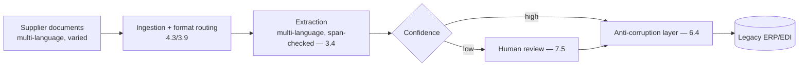
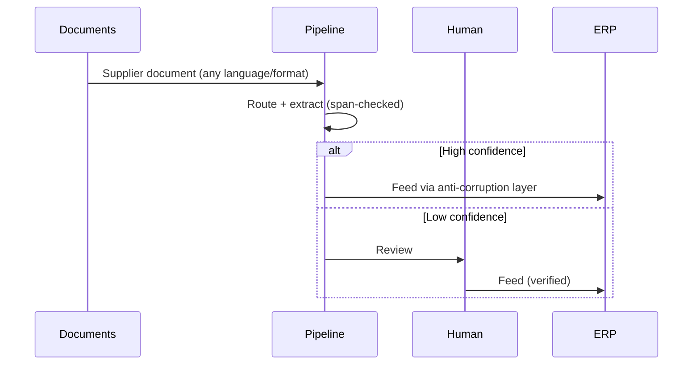
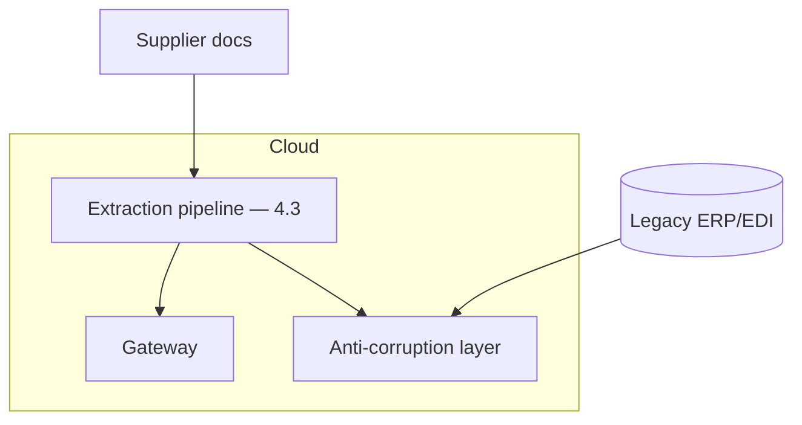

# Case Study CS16 — Supplier Document Intelligence

| | |
|---|---|
| **Industry** | Manufacturing |
| **Company profile** | Steinmark Industrial — fictional manufacturer, procurement/supply chain, multinational |
| **System type** | Extraction pipeline (multi-language, EDI/legacy integration) |
| **Maturity level exercised** | 3 Engineer → 4 Architect |

## Business Problem

Steinmark processes thousands of supplier documents (invoices, delivery notes, certificates, specs) in many languages and formats, feeding legacy ERP/EDI systems. Manual re-keying is slow and error-prone. The goal: an extraction pipeline that reads supplier documents (multi-language, varied formats), extracts structured data, and feeds the legacy systems via the anti-corruption layer. The defining challenges: multi-language, format variety, and legacy integration. Target: automate document intake, multi-language coverage, reliable legacy integration, high extraction accuracy.

## Stakeholders

| Stakeholder | Role | What they care about | Success measure |
|-------------|------|----------------------|-----------------|
| Procurement ops | Users | Speed, accuracy | Processing time, accuracy |
| Supply chain | Beneficiary | Data timeliness | Data availability |
| ERP/IT | Gatekeeper | Legacy integration reliability | Integration reliability |
| Finance | Sponsor | Cost, accuracy | Cost, error rate |

## Requirements

### Functional
- FR-1: Read supplier documents (multi-language, varied formats — ingestion + multimodal — 4.3/3.9).
- FR-2: Extract structured data (anti-fabrication — 3.4).
- FR-3: Feed legacy ERP/EDI via anti-corruption layer (6.4).
- FR-4: Handle format variety and multi-language.

### Non-functional
- NFR-1 (Accuracy): High extraction accuracy (span-checked); confidence-gated to human review.
- NFR-2 (Multi-language): Coverage across supplier languages (2.4).
- NFR-3 (Integration): Reliable legacy ERP/EDI integration (anti-corruption layer — 6.4).

### Constraints
- Multi-language (the defining constraint); format variety; legacy ERP/EDI integration; extraction accuracy.

## Architecture

Ingestion (4.3, format routing + multimodal — 3.9) + multi-language extraction (3.4, span-checked) + confidence gating (7.5) + anti-corruption layer (6.4) to legacy. The anti-corruption layer protects the deterministic ERP from the probabilistic extraction.

## Sequence Diagram

## Deployment Diagram

## Threat Model

| Threat | Vector | Impact | Likelihood | Mitigation |
|--------|--------|--------|------------|------------|
| Fabricated extraction | Hallucination | Wrong ERP data | Med | Span-check (3.4), confidence gate, human review |
| Legacy corruption | Bad data to ERP | Data quality incident | Med | Anti-corruption layer (6.4), validation |
| Multi-language error | Poor language coverage | Wrong extraction | Med | Multi-language models, per-language accuracy (2.4) |
| Format-change break | Silent pipeline failure | Missed documents | Med | Ingestion monitoring, DLQ (4.3) |

## Cost Estimation

| Item | Assumption | Monthly |
|------|-----------|---------|
| Extraction inference | 100K docs/mo, multimodal, tiered | ~$40K |
| Ingestion + integration | Format handling, ACL | ~$12K |
| **Total** | | **~$52K** |

Dominant: multimodal extraction. Optimization: routing (text vs. vision per doc — 3.9), tiering (7.8).

## Scaling Strategy

Steady with supplier volume, batch-heavy. Ingestion + extraction scale with worker pools (4.3); batch lanes for bulk (7.8). Format-routing enables tiering. Multi-language handled per-language.

## Monitoring Strategy

Ingestion observability (4.3): per-source/per-language extraction accuracy, DLQ rates (format changes), extraction quality sampling. Anti-corruption-layer rejection rates. Confidence-gate/human-review rates. Cost per document by type/language.

## Lessons Learned

1. **The anti-corruption layer protects the legacy ERP** — the probabilistic extraction never flows raw into the deterministic ERP (6.4); validation and confidence-gating at the boundary keep the ERP data clean.
2. **Multi-language needs per-language accuracy** — supplier documents span languages, and extraction accuracy varies by language (2.4); per-language monitoring and models.
3. **Format variety demands routing and DLQ** — the format zoo (4.3) requires format routing (text vs. vision) and dead-letter handling for the unparseable; the DLQ rate signals format changes.

---

**Related chapters:** [4.3 Ingestion](../curriculum/part-4-enterprise-genai-systems/chapter-03-document-ingestion.md), [6.4 Enterprise Integration](../curriculum/part-6-enterprise-architecture/chapter-04-enterprise-integration.md), [3.4 Structured Outputs](../curriculum/part-3-core-building-blocks-of-genai/chapter-04-structured-outputs.md) · **Related patterns:** Anti-corruption layer (6.4), Human-in-the-Loop (7.5), Batch Lanes (7.8) · **Similar case studies:** [CS08](cs08-credit-memo-drafting.md), [CS49](cs49-procurement-contract-intelligence.md)
