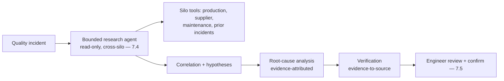
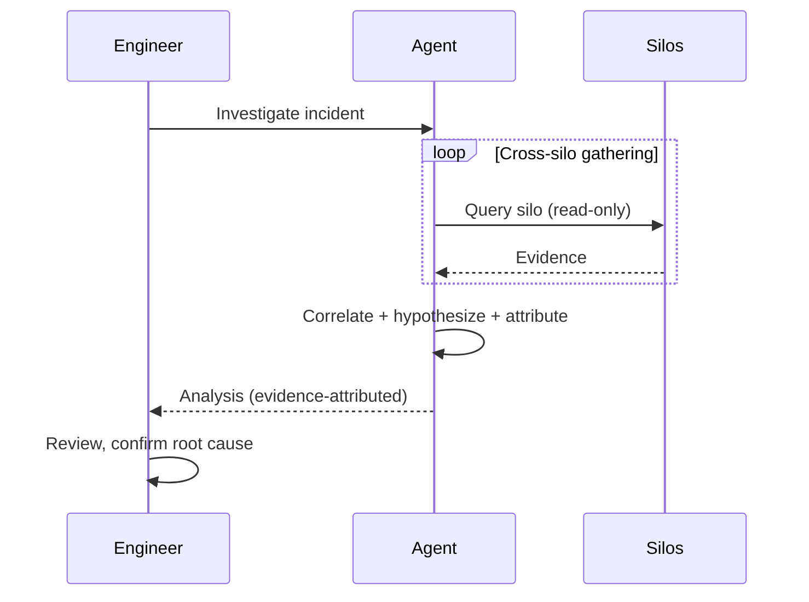
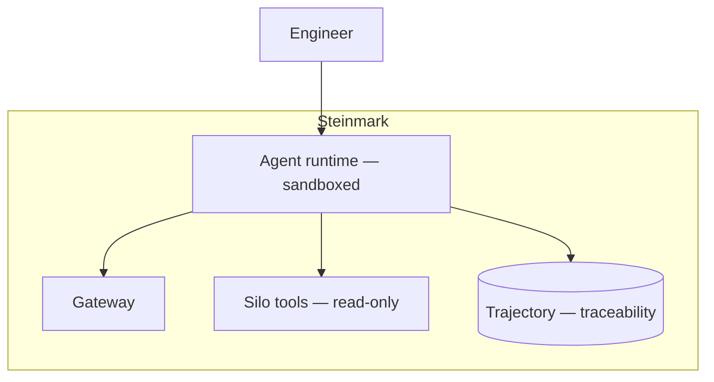

# Case Study CS17 — Quality Incident Analysis

| | |
|---|---|
| **Industry** | Manufacturing |
| **Company profile** | Steinmark Industrial — fictional manufacturer, quality engineering, traceability-regulated |
| **System type** | Agentic root-cause research across data silos |
| **Maturity level exercised** | 4 Architect |

## Business Problem

When a quality incident occurs (defect, failure), engineers investigate root cause by gathering evidence across siloed systems (production data, supplier records, maintenance logs, prior incidents) — slow, and the traceability standards demand a documented, defensible analysis. The goal: an agentic assistant that gathers and correlates evidence across the silos, building the root-cause analysis for the engineer to review — with traceability. The defining challenges: data silos (correlation across them) and traceability standards. Target: faster root-cause analysis, cross-silo correlation, traceability-compliant documentation.

## Stakeholders

| Stakeholder | Role | What they care about | Success measure |
|-------------|------|----------------------|-----------------|
| Quality engineers | Users | Evidence gathering, correlation | Analysis time, quality |
| Quality manager | Sponsor | Root-cause quality, throughput | Analysis quality |
| Regulators/Auditors | External | Traceability, defensibility | Traceability compliance |
| Production/Supply | Data owners | Data access, accuracy | Data quality |

## Requirements

### Functional
- FR-1: Gather evidence across silos (production, supplier, maintenance, prior incidents — read-only tools).
- FR-2: Correlate evidence for root-cause hypotheses.
- FR-3: Build the analysis (structured, evidence-attributed).
- FR-4: Engineer reviews and confirms root cause (7.5).

### Non-functional
- NFR-1 (Traceability): Every analysis element traces to its evidence (traceability standards).
- NFR-2 (Correlation): Cross-silo correlation (the value).
- NFR-3 (Auditability): Full trajectory auditable (4.4).

### Constraints
- Traceability standards; data silos (correlation challenge); read-only agent; engineer confirms root cause.

## Architecture

Bounded agent (7.4, read-only cross-silo — the autonomy-grid top-left) + correlation + evidence attribution (traceability) + human-in-the-loop (7.5). Similar to CS07 (AML) — read-only agentic research with attribution.

## Sequence Diagram

## Deployment Diagram

## Threat Model

| Threat | Vector | Impact | Likelihood | Mitigation |
|--------|--------|--------|------------|------------|
| Hallucinated correlation | Fabrication | Wrong root cause | Med | Evidence-to-source verification (3.8), engineer review |
| Missing evidence | Incomplete gathering | Wrong/incomplete analysis | Med | Bounded-but-thorough; engineer judges |
| Un-traceable analysis | Missing attribution | Traceability failure | Med | Evidence attribution, trajectory audit (4.4) |

## Cost Estimation

| Item | Assumption | Monthly |
|------|-----------|---------|
| Agent inference | Incident volume, multi-step | ~$18K |
| Tools + trajectory | Silo access, audit | ~$6K |
| **Total** | | **~$24K** |

Dominant: multi-step agent. Optimization: bounded loops (4.4).

## Scaling Strategy

Incident-volume-driven (variable). Agent fleet (4.4) with budget hierarchies. Engineer review capacity-bounded. Trajectory store for traceability retention.

## Monitoring Strategy

Fleet observability (4.4): trajectory review, verification-disagreement (hallucinated correlation), root-cause quality (vs. manual). Traceability audit. Cost per incident.

## Lessons Learned

1. **Cross-silo correlation is the agent's value** — the read-only agent (7.4) gathers and correlates across silos that engineers would gather manually; the correlation across silos is where the time is saved.
2. **Traceability is the standards requirement** — every analysis element attributed to its evidence source; the traceability standards demand a defensible, documented analysis (4.4).
3. **The engineer confirms root cause** — the agent hypothesizes, the engineer confirms (7.5); the root-cause determination stays human, backed by the agent's evidence.

---

**Related chapters:** [3.8 Agents](../curriculum/part-3-core-building-blocks-of-genai/chapter-08-agents-concepts.md), [4.5 Multi-Agent](../curriculum/part-4-enterprise-genai-systems/chapter-05-multi-agent-systems.md), [7.4 Agentic Patterns](../curriculum/part-7-enterprise-ai-architecture-patterns/chapter-04-agentic-patterns.md) · **Related patterns:** Bounded Agent Loop (7.4), Tool Sandbox (7.4), Human-in-the-Loop (7.5) · **Similar case studies:** [CS07](cs07-aml-investigation-assistant.md), [CS41](cs41-incident-postmortem-assistant.md)
