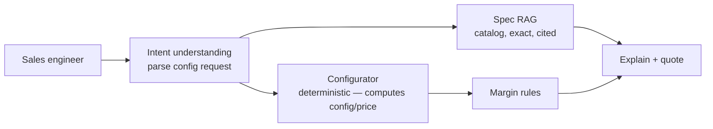
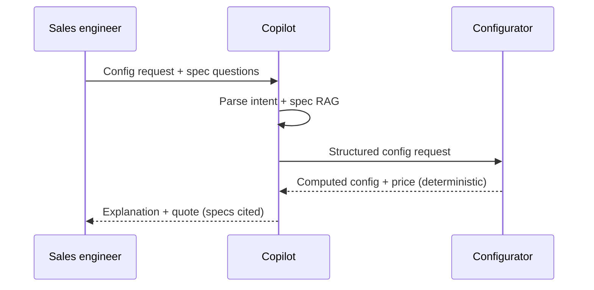
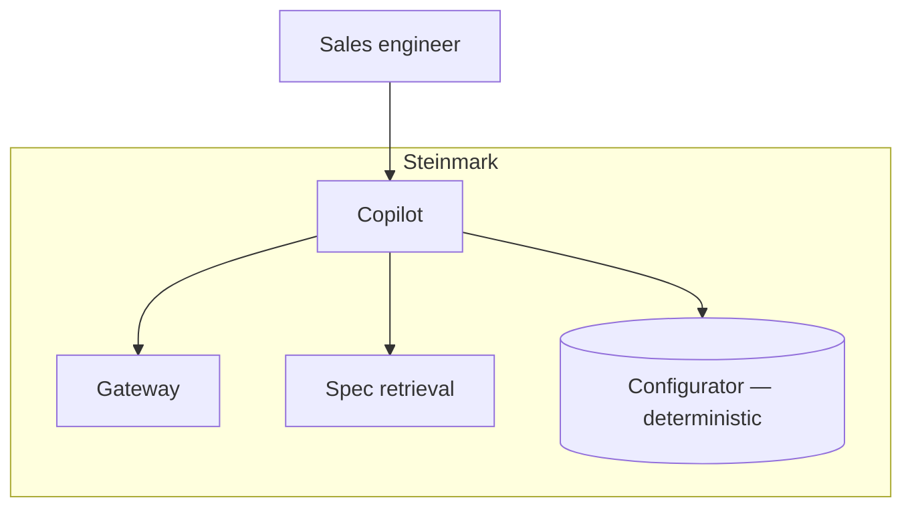

# Case Study CS18 — Sales Engineering Quote Copilot

| | |
|---|---|
| **Industry** | Manufacturing |
| **Company profile** | Steinmark Industrial — fictional manufacturer, sales engineering, complex configurable products |
| **System type** | RAG + configurators, correctness-critical |
| **Maturity level exercised** | 3 Engineer → 4 Architect |

## Business Problem

Sales engineers quote complex, configurable industrial products — correctness on specs and configuration is critical (a wrong quote is a margin loss or a delivery failure), and the process is slow (synthesizing catalog, configuration rules, pricing). The goal: a copilot that answers spec questions and assists configuration/quoting, grounded in the catalog and configuration rules, with margin protection. The defining challenge: correctness on specs (the deterministic configuration must be right — the LLM assists, the configurator decides). Target: faster quotes, correct specs/configuration, margin protection.

## Stakeholders

| Stakeholder | Role | What they care about | Success measure |
|-------------|------|----------------------|-----------------|
| Sales engineers | Users | Speed, spec correctness | Quote time, accuracy |
| Sales leadership | Sponsor | Win rate, margin | Win rate, margin |
| Product/Engineering | Content | Spec accuracy | Accuracy |
| Finance | Gatekeeper | Margin protection | Margin |

## Requirements

### Functional
- FR-1: Answer spec questions (RAG over catalog, cited, exact).
- FR-2: Assist configuration (LLM interprets intent → configurator computes — the correctness split).
- FR-3: Protect margin (pricing rules enforced).

### Non-functional
- NFR-1 (Correctness): Exact spec correctness; configuration computed deterministically (not by the LLM).
- NFR-2 (Margin): Pricing/margin rules enforced.
- NFR-3 (Latency): Interactive.

### Constraints
- Spec correctness (the defining constraint — deterministic where it matters); margin protection; complex configuration.

## Architecture

RAG (7.2, exact specs) + the correctness split (LLM parses intent and explains — the green zone; the deterministic configurator computes — like CS Corvid's duty-calculator, 3.1). Margin rules as guardrails. The LLM never computes the configuration/price.

## Sequence Diagram

## Deployment Diagram

## Threat Model

| Threat | Vector | Impact | Likelihood | Mitigation |
|--------|--------|--------|------------|------------|
| Wrong spec | Hallucination | Wrong quote, delivery failure | Med | Exact-spec RAG (citation), configurator for computation |
| LLM computes config | Precision failure | Wrong config/price | Med | Deterministic configurator (LLM parses only — 3.1) |
| Margin erosion | Pricing rule gap | Margin loss | Med | Margin rules enforced |

## Cost Estimation

| Item | Assumption | Monthly |
|------|-----------|---------|
| Inference | Sales engineers × quotes, tiered | ~$15K |
| Retrieval + configurator | Catalog, config system | ~$6K |
| **Total** | | **~$21K** |

Dominant: quote volume. Optimization: tiering (7.8).

## Scaling Strategy

Business-hours load. Stateless copilot scales horizontally; configurator (existing system) scales independently; spec retrieval on replicas.

## Monitoring Strategy

Quality: spec accuracy (cited-exact), configuration correctness (configurator, not LLM), margin compliance. The correctness split (LLM parses, configurator computes) is verified — no LLM-computed prices. Quote quality/win rate. Cost per quote.

## Lessons Learned

1. **The correctness split protects specs** — the LLM parses intent and explains (green zone — 3.1); the deterministic configurator computes the configuration and price. The LLM never computes what must be exact (Corvid's duty-calculator pattern).
2. **Exact-spec RAG with citation** — spec questions answered with exact, cited specs; a wrong spec is a wrong quote or delivery failure.
3. **Margin rules are guardrails** — pricing/margin rules enforced deterministically; margin protection is a hard control, not a hope.

---

**Related chapters:** [3.1 LLM Capabilities & Limits](../curriculum/part-3-core-building-blocks-of-genai/chapter-01-llm-capabilities-limits.md), [3.7 Tool Use](../curriculum/part-3-core-building-blocks-of-genai/chapter-07-function-calling-tool-use.md), [3.6 RAG](../curriculum/part-3-core-building-blocks-of-genai/chapter-06-rag-fundamentals.md) · **Related patterns:** Citation-First (7.2), Routing (7.3) · **Similar case studies:** [CS34](cs34-b2b-proposal-automation.md), [CS29](cs29-policy-qa-for-agents.md)
