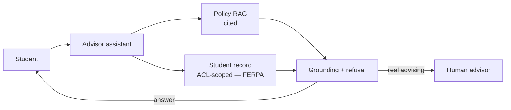
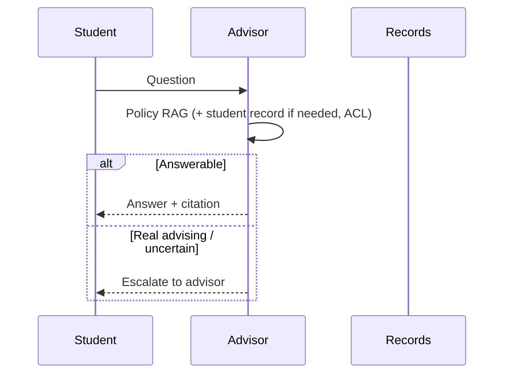
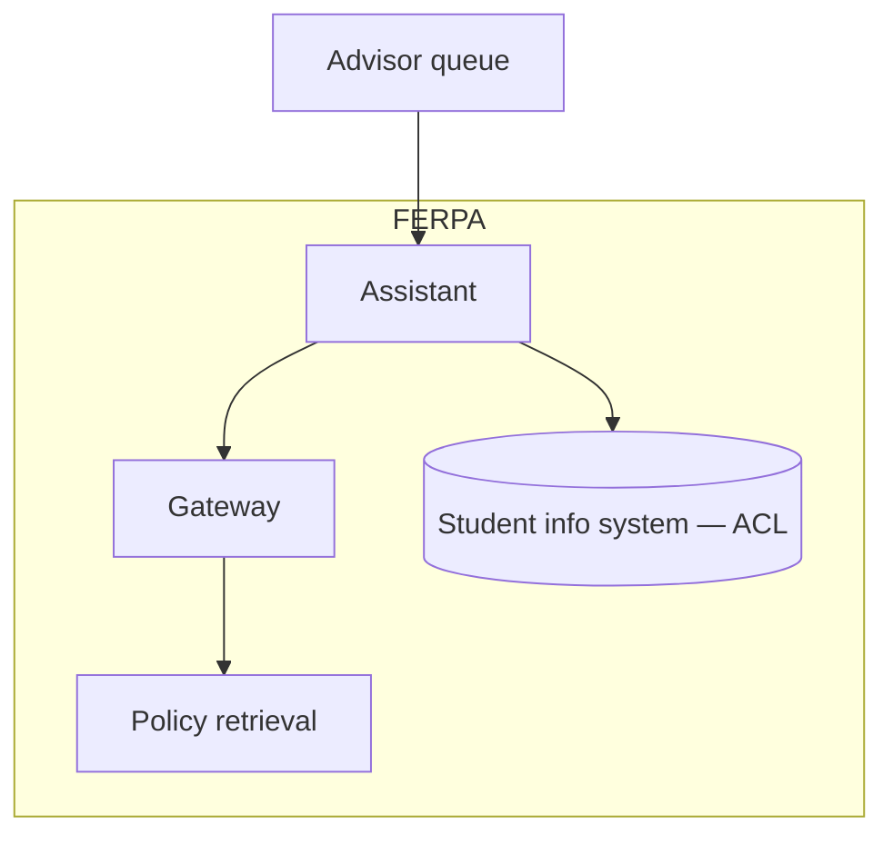

# Case Study CS19 — University Student Advisor

| | |
|---|---|
| **Industry** | Education |
| **Company profile** | Kingsmere University — fictional university, ~30,000 students, FERPA-regulated |
| **System type** | RAG assistant with privacy and equity emphasis |
| **Maturity level exercised** | 3 Engineer → 4 Architect |

## Business Problem

Students have many routine questions (course requirements, deadlines, policies, financial aid) that overwhelm advising staff, leaving less time for the students who need real advising. The goal: a student advisor assistant answering routine questions from university policies, with strong privacy (FERPA), equity of access (all students served well), and careful handling of the hallucinated-policy risk (a wrong policy answer misleads a student's academic path). Target: deflect routine questions, FERPA-compliant, equitable, no misleading policy answers.

## Stakeholders

| Stakeholder | Role | What they care about | Success measure |
|-------------|------|----------------------|-----------------|
| Students | Users | Fast, correct, equitable help | Adoption, satisfaction |
| Advising staff | Beneficiary | Deflection of routine | Advisor capacity |
| Registrar/Compliance | Gatekeeper | FERPA, accuracy | FERPA compliance |
| Equity office | Gatekeeper | Equity of access | Equity metrics |

## Requirements

### Functional
- FR-1: Answer routine questions from policies (RAG, cited).
- FR-2: Handle student-specific questions (ACL-scoped to the student's record — FERPA).
- FR-3: Refuse/escalate beyond policy scope (no invented policy).
- FR-4: Multilingual/accessible (equity).

### Non-functional
- NFR-1 (Privacy): FERPA; student records ACL-scoped (4.14/6.6).
- NFR-2 (Accuracy): No invented policy (grounded, cited); refuse on uncertain.
- NFR-3 (Equity): Equitable access/quality across student groups (2.8 fairness).
- NFR-4 (Escalation): Real advising needs escalated to humans.

### Constraints
- FERPA (the defining privacy constraint); equity; policy accuracy; escalation for real advising.

## Architecture

RAG (7.2) + ACL-scoped student record (FERPA — 4.14/6.6) + designed refusal + escalation (7.5). Equity monitored (2.8 — quality across student groups).

## Sequence Diagram

## Deployment Diagram

## Threat Model

| Threat | Vector | Impact | Likelihood | Mitigation |
|--------|--------|--------|------------|------------|
| Invented policy | Hallucination | Misleads academic path | Med | Grounding, citation, refuse-on-uncertain |
| FERPA violation | ACL / record exposure | Regulatory, privacy | Med | ACL-scoped records, identity (6.6) |
| Equity gap | Uneven quality by group | Equity violation, harm | Med | Fairness monitoring by group (2.8) |
| Missing real-advising escalation | Over-answering | Student underserved | Med | Escalation for real advising (7.5) |

## Cost Estimation

| Item | Assumption | Monthly |
|------|-----------|---------|
| Inference | 30K students, seasonal (registration), tiered | ~$15K |
| Retrieval + records | Policy corpus, SIS | ~$6K |
| **Total** | | **~$21K** |

Dominant: seasonal query spikes. Optimization: caching, tiering (7.8).

## Scaling Strategy

Highly seasonal (registration, deadlines, start of term). Stateless assistant scales horizontally; seasonal provisioning for peaks. Policy retrieval cached. Escalation capacity-bounded.

## Monitoring Strategy

Quality + equity: policy accuracy (cited), equity of quality across student groups (2.8's fairness monitoring — the equity requirement), refusal/escalation calibration, FERPA compliance. Seasonal load. Student satisfaction.

## Lessons Learned

1. **Hallucinated policy misleads academic paths** — a wrong policy answer can misdirect a student's registration or degree progress; grounding, citation, and refuse-on-uncertain (3.6) prevent it.
2. **Equity is a monitored requirement** — the assistant must serve all student groups equitably (2.8); fairness monitoring by group ensures the quality doesn't degrade for some.
3. **FERPA scopes the records** — student-specific questions access the ACL-scoped record (4.14/6.6); the privacy constraint is enforced at retrieval.

---

**Related chapters:** [4.14 Privacy/Compliance](../curriculum/part-4-enterprise-genai-systems/chapter-14-privacy-compliance-governance.md), [2.8 Responsible AI](../curriculum/part-2-artificial-intelligence/chapter-08-responsible-ai.md), [3.6 RAG](../curriculum/part-3-core-building-blocks-of-genai/chapter-06-rag-fundamentals.md) · **Related patterns:** Citation-First (7.2), Escalation (7.5), ACL-Propagated Index (7.7) · **Similar case studies:** [CS35](cs35-citizen-services-portal-assistant.md), [CS43](cs43-employee-policy-assistant.md)
