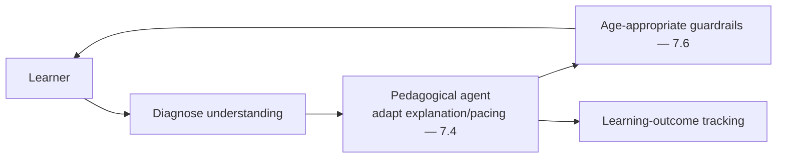
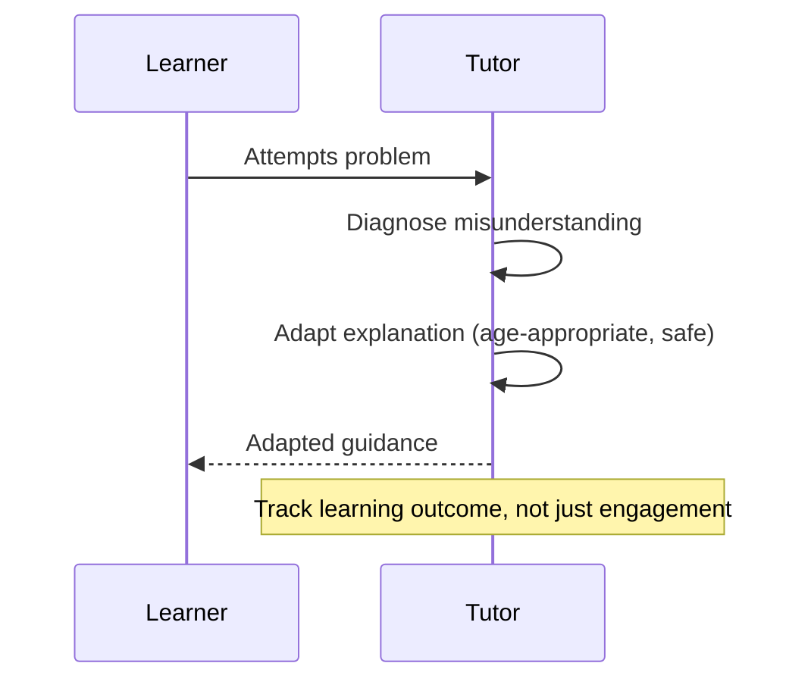
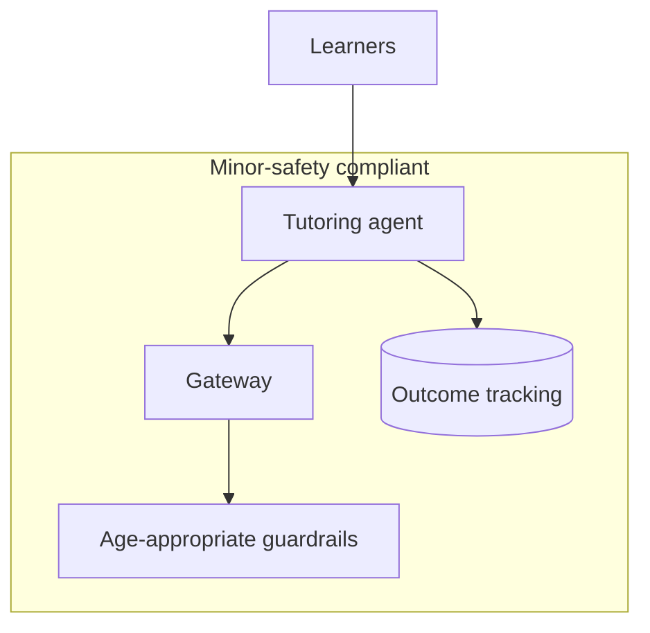

# Case Study CS20 — Adaptive Tutoring System

| | |
|---|---|
| **Industry** | Education |
| **Company profile** | Kingsmere University / EdTech division — fictional, K-12 + higher-ed tutoring, minor-safety-regulated |
| **System type** | Multi-step pedagogical agent |
| **Maturity level exercised** | 4 Architect |

## Business Problem

Effective tutoring adapts to the learner — diagnosing misunderstanding, adjusting explanation, pacing. A tutoring system that adapts (not just answers) can improve learning outcomes. The defining challenges: age-appropriate safety (many learners are minors), and measuring learning outcomes (not just engagement). The goal: an adaptive tutoring agent that diagnoses and adapts pedagogically, is age-appropriate/safe, and is evaluated on learning outcomes. Target: improved learning outcomes, age-appropriate safety, outcome-measured (not engagement-optimized).

## Stakeholders

| Stakeholder | Role | What they care about | Success measure |
|-------------|------|----------------------|-----------------|
| Learners | Users | Effective, safe learning | Learning outcomes |
| Educators | Beneficiary | Learning support | Outcomes |
| Parents/Guardians | Gatekeeper | Safety, age-appropriate | Safety |
| Product | Sponsor | Outcomes (not just engagement) | Learning-outcome metrics |
| Safety/Compliance | Gatekeeper | Minor safety | Zero safety incidents |

## Requirements

### Functional
- FR-1: Diagnose learner understanding (assess).
- FR-2: Adapt explanation/pacing pedagogically (multi-step agent — 7.4).
- FR-3: Age-appropriate, safe content (guardrails — 7.6).
- FR-4: Measure learning outcomes (not just engagement).

### Non-functional
- NFR-1 (Safety): Age-appropriate; zero unsafe content; minor-safety guardrails (7.6).
- NFR-2 (Outcomes): Optimized for learning outcomes, not engagement (1.2's proxy trap).
- NFR-3 (Adaptivity): Genuinely adaptive (diagnose → adapt).

### Constraints
- Minor safety (the defining constraint); learning outcomes (not engagement proxy); age-appropriateness.

## Architecture

Pedagogical agent (7.4, bounded — the adaptation loop) + age-appropriate guardrails (7.6) + outcome measurement (evals on learning outcomes, not engagement — 2.7/4.7). The minor-safety guardrails and the outcome-not-engagement measurement are the defining designs.

## Sequence Diagram

## Deployment Diagram

## Threat Model

| Threat | Vector | Impact | Likelihood | Mitigation |
|--------|--------|--------|------------|------------|
| Unsafe/inappropriate content | Generation | Harm to minor | Med-High | Age-appropriate guardrails (7.6), content safety |
| Engagement over outcomes | Proxy optimization | Ineffective learning (addictive not educational) | Med | Outcome measurement (1.2's paired metrics) |
| Wrong pedagogical content | Hallucination | Mislearning | Med | Grounding, outcome evals |
| Data on minors | Privacy | Regulatory | Med | Minor-data governance (4.14) |

## Cost Estimation

| Item | Assumption | Monthly |
|------|-----------|---------|
| Agent inference | Learner sessions, multi-step | ~$50K |
| Guardrails + outcome tracking | Per-session | ~$15K |
| **Total** | | **~$65K** |

Dominant: multi-step agent sessions. Optimization: bounded loops, tiering (7.8).

## Scaling Strategy

Seasonal (school terms). Agent fleet (4.4) with budgets. Guardrails on every interaction (minor safety). Outcome tracking scales with learners.

## Monitoring Strategy

Safety + outcomes: unsafe-content rate (zero, minor-safety-critical), learning-outcome metrics (the primary metric — not engagement — 1.2), pedagogical quality, adaptivity effectiveness. Minor-data governance. The outcome-not-engagement measurement is the key monitor.

## Lessons Learned

1. **Measure outcomes, not engagement** (1.2's proxy trap) — optimizing engagement produces an addictive, not educational, tutor; the learning-outcome measurement is what keeps it educational. This is the classic proxy-goal-detachment (1.2).
2. **Minor safety is the defining constraint** — age-appropriate guardrails (7.6) on every interaction; the minor-safety requirement is non-negotiable.
3. **Adaptivity requires diagnosis** — genuine adaptation (diagnose understanding → adapt) is the value; a system that just answers isn't a tutor.

---

**Related chapters:** [1.2 Systems Thinking](../curriculum/part-1-professional-foundation/chapter-02-systems-thinking-design-thinking.md), [7.6 Safety Patterns](../curriculum/part-7-enterprise-ai-architecture-patterns/chapter-06-safety-guardrail-patterns.md), [2.8 Responsible AI](../curriculum/part-2-artificial-intelligence/chapter-08-responsible-ai.md) · **Related patterns:** Bounded Agent Loop (7.4), Layered Filters (7.6) · **Similar case studies:** [CS21](cs21-curriculum-content-pipeline.md), [CS45](cs45-learning-development-recommender.md)
