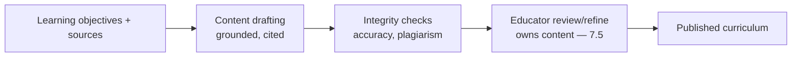
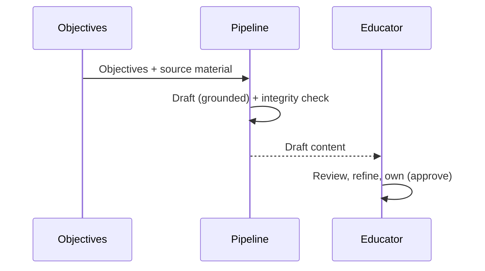
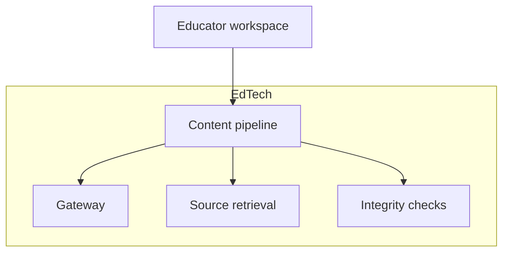

# Case Study CS21 — Curriculum Content Pipeline

| | |
|---|---|
| **Industry** | Education |
| **Company profile** | Kingsmere University / EdTech — fictional, curriculum development |
| **System type** | Authoring assistance at scale with reviewer workflow |
| **Maturity level exercised** | 3 Engineer |

## Business Problem

Developing curriculum content (lessons, exercises, assessments) at scale is labor-intensive, and quality/academic-integrity must be maintained. The goal: an authoring-assistance pipeline that drafts curriculum content for educators to review and refine, with academic-integrity safeguards and a reviewer workflow. The defining challenges: academic integrity (accurate, non-plagiarized, pedagogically sound) and the reviewer workflow (educators own the content). Target: accelerate content development, maintain academic integrity, educator-reviewed.

## Stakeholders

| Stakeholder | Role | What they care about | Success measure |
|-------------|------|----------------------|-----------------|
| Curriculum developers/educators | Users/reviewers | Draft quality, time saved | Development time, quality |
| Academic leadership | Sponsor | Content quality, integrity | Quality, integrity |
| Academic integrity office | Gatekeeper | Accuracy, non-plagiarism | Integrity compliance |

## Requirements

### Functional
- FR-1: Draft curriculum content (lessons, exercises) from learning objectives + source material (RAG).
- FR-2: Academic-integrity checks (accuracy, non-plagiarism).
- FR-3: Reviewer workflow (educators review/refine/own — 7.5).

### Non-functional
- NFR-1 (Integrity): Accurate, pedagogically sound, non-plagiarized content.
- NFR-2 (Quality): Educator-reviewed; educators own the content.
- NFR-3 (Grounding): Content grounded in source material (cited).

### Constraints
- Academic integrity (the defining constraint); educator ownership; pedagogical soundness.

## Architecture

Drafting (grounded in sources) + integrity checks (guardrails) + reviewer workflow (7.5 — draft-not-publish, educators own). The integrity checks and educator ownership are the defining designs.

## Sequence Diagram

## Deployment Diagram

## Threat Model

| Threat | Vector | Impact | Likelihood | Mitigation |
|--------|--------|--------|------------|------------|
| Inaccurate content | Hallucination | Mislearning | Med | Grounding, integrity checks, educator review |
| Plagiarism | Un-original generation | Integrity violation | Med | Plagiarism/integrity checks |
| Pedagogically unsound | Poor generation | Ineffective content | Med | Educator review (7.5) |

## Cost Estimation

| Item | Assumption | Monthly |
|------|-----------|---------|
| Drafting inference | Content volume, batch | ~$12K |
| Integrity + retrieval | Checks, sources | ~$4K |
| **Total** | | **~$16K** |

Dominant: content drafting. Optimization: batch lanes (7.8).

## Scaling Strategy

Batch-oriented (curriculum development cycles). Batch lanes (7.8); educator review capacity-bounded. Content-cycle provisioning.

## Monitoring Strategy

Quality + integrity: content accuracy (grounded), integrity-check results (plagiarism, accuracy), educator edit/refine rates. The integrity and educator-review are the key monitors.

## Lessons Learned

1. **Educators own the content** — the pipeline drafts, educators review/refine/own (7.5 draft-not-publish); the academic content is never autonomously published.
2. **Academic integrity is checked, not assumed** — accuracy and non-plagiarism are checked (guardrails); the integrity constraint demands verification.
3. **Ground content in sources** — content grounded in source material (cited) maintains accuracy and provenance.

---

**Related chapters:** [7.5 Human-in-the-Loop](../curriculum/part-7-enterprise-ai-architecture-patterns/chapter-05-human-in-the-loop-patterns.md), [4.8 Guardrails](../curriculum/part-4-enterprise-genai-systems/chapter-08-guardrails-content-safety.md), [3.6 RAG](../curriculum/part-3-core-building-blocks-of-genai/chapter-06-rag-fundamentals.md) · **Related patterns:** Draft-Not-Send (7.5), Layered Filters (7.6), Citation-First (7.2) · **Similar case studies:** [CS20](cs20-adaptive-tutoring-system.md), [CS11](cs11-product-catalog-enrichment.md)
