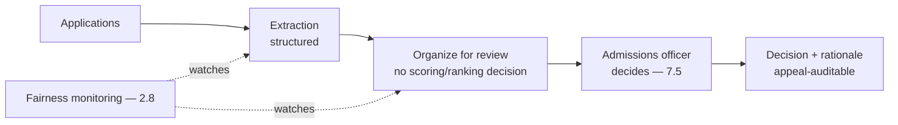
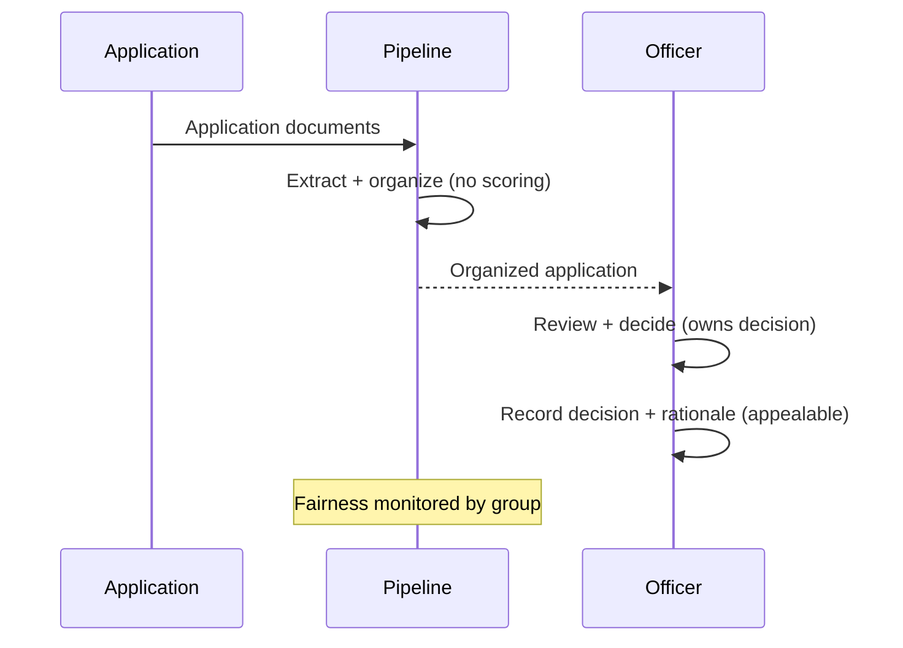
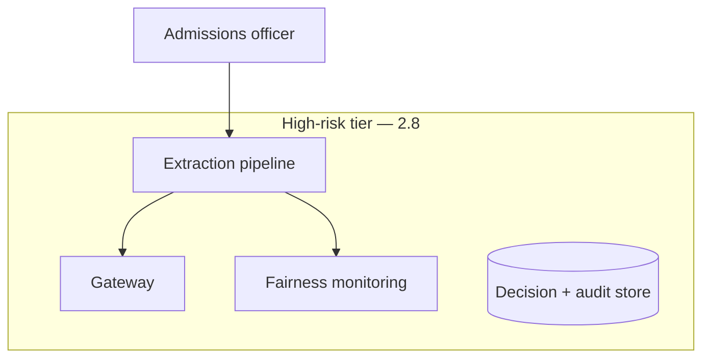

# Case Study CS22 — Admissions Document Processing

| | |
|---|---|
| **Industry** | Education |
| **Company profile** | Kingsmere University — fictional, admissions office, fairness-regulated |
| **System type** | Extraction + workflow with bias/fairness review |
| **Maturity level exercised** | 4 Architect |

## Business Problem

Admissions processes high volumes of applications (transcripts, essays, recommendations) — extracting and organizing the data is labor-intensive, and the fairness/bias risk is acute (admissions decisions affect life outcomes; bias is illegal and harmful). The goal: a pipeline that extracts and organizes application data for human admissions officers, with rigorous bias/fairness review and appeal auditability. The defining challenge: fairness (the system assists extraction/organization; humans decide; bias is monitored). Target: faster processing, fairness-monitored, appeal-auditable, human decisions.

## Stakeholders

| Stakeholder | Role | What they care about | Success measure |
|-------------|------|----------------------|-----------------|
| Admissions officers | Users | Data organization, decisions | Processing time |
| Applicants | Affected | Fair, unbiased consideration | Fairness |
| Admissions leadership | Sponsor | Efficiency, fairness | Efficiency, fairness |
| Legal/Equity | Gatekeeper | Anti-discrimination, appeals | Fairness compliance, appeal-auditability |

## Requirements

### Functional
- FR-1: Extract application data (transcripts, essays — structured).
- FR-2: Organize for admissions officer review (assists, doesn't decide).
- FR-3: Bias/fairness monitoring (across applicant groups — 2.8).
- FR-4: Appeal-auditable (decisions traceable).

### Non-functional
- NFR-1 (Fairness): No bias in extraction/organization; fairness monitored by group (2.8); human decisions.
- NFR-2 (Auditability): Decisions appealable and traceable (2.8's procedural fairness).
- NFR-3 (Accuracy): Accurate extraction.

### Constraints
- Anti-discrimination law (the defining constraint — high-risk-tier — 2.8); human decision (the system assists extraction, humans decide); appeal auditability.

## Architecture

Extraction (3.4) + organization (assists, doesn't decide/score) + human decision (7.5) + fairness monitoring (2.8, by group) + appeal-auditability (2.8's procedural fairness). The system deliberately does not score/rank applicants (that decision stays human) — the high-risk fairness posture.

## Sequence Diagram

## Deployment Diagram

## Threat Model

| Threat | Vector | Impact | Likelihood | Mitigation |
|--------|--------|--------|------------|------------|
| Bias in processing | Model/data bias | Discrimination, harm | Med-High | Fairness monitoring by group (2.8), no autonomous scoring, human decision |
| Autonomous admissions decision | Scope creep | Illegal automated decision | Low | Extraction/organization only; humans decide (7.5) |
| Un-appealable decision | Missing audit | Procedural-fairness failure | Med | Decision + rationale recording (2.8) |
| Extraction error | Hallucination | Wrong application data | Med | Span-check, human review |

## Cost Estimation

| Item | Assumption | Monthly (admissions season) |
|------|-----------|---------|
| Extraction inference | Application volume, batch | ~$20K |
| Fairness monitoring + audit | Per-application | ~$6K |
| **Total** | | **~$26K** |

Dominant: seasonal application volume. Optimization: batch lanes (7.8).

## Scaling Strategy

Highly seasonal (admissions cycles). Batch lanes for extraction (7.8); human decisions capacity-bounded. Fairness monitoring on all processing. Seasonal provisioning.

## Monitoring Strategy

Fairness-first (2.8): fairness metrics by applicant group (the high-risk requirement), no-autonomous-scoring compliance, extraction accuracy, appeal-audit completeness. Fairness monitoring is the critical control; the high-risk-tier obligations (2.8) apply.

## Lessons Learned

1. **The system assists, humans decide** — admissions is a high-risk fairness domain (2.8); the system extracts and organizes but never scores/ranks/decides (7.5). The autonomous-scoring line is the fairness boundary.
2. **Fairness is monitored by group** — the fairness metrics by applicant group (2.8) are the critical control; bias in a life-affecting decision is illegal and harmful.
3. **Decisions must be appealable** — the decision + rationale recording (2.8's procedural fairness) makes decisions auditable and appealable; the high-risk tier demands it.

---

**Related chapters:** [2.8 Responsible AI](../curriculum/part-2-artificial-intelligence/chapter-08-responsible-ai.md), [7.5 Human-in-the-Loop](../curriculum/part-7-enterprise-ai-architecture-patterns/chapter-05-human-in-the-loop-patterns.md), [3.4 Structured Outputs](../curriculum/part-3-core-building-blocks-of-genai/chapter-04-structured-outputs.md) · **Related patterns:** Human-in-the-Loop (7.5), Review Sampling (7.5) · **Similar case studies:** [CS44](cs44-recruiting-screening-support.md), [CS36](cs36-caseworker-decision-support.md)
