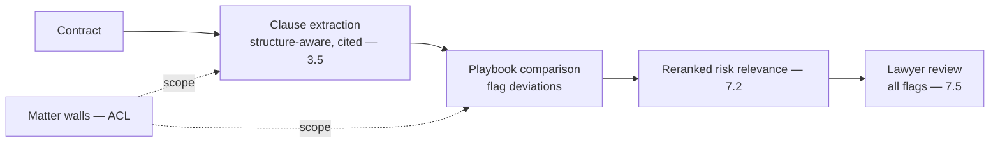
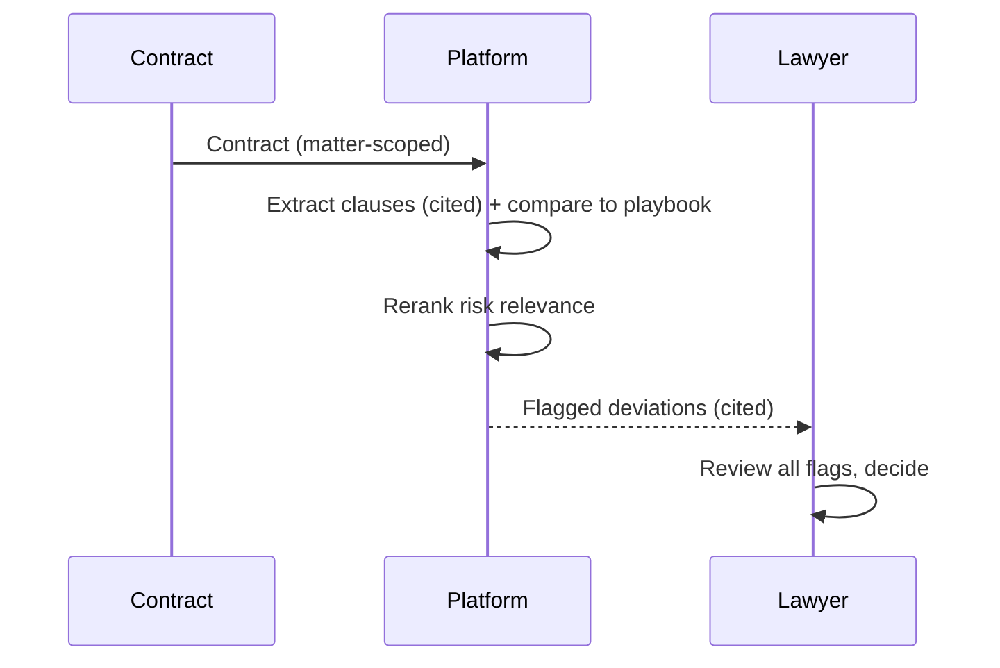
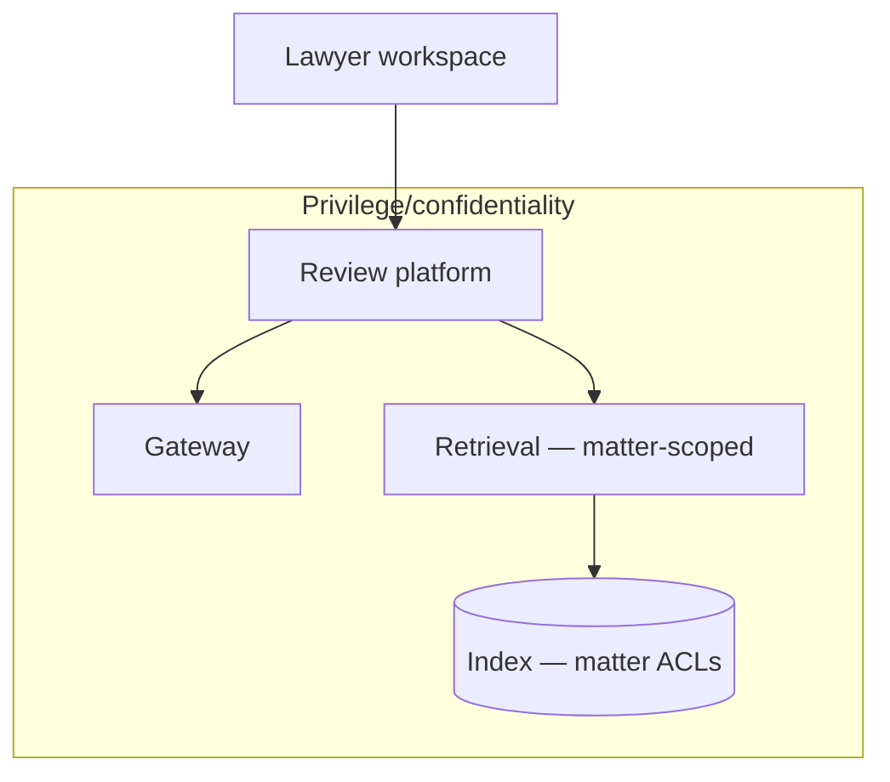

# Case Study CS23 — Contract Review Platform

| | |
|---|---|
| **Industry** | Legal |
| **Company profile** | Halvard & Roth — fictional law firm, ~900 lawyers, privilege/confidentiality-critical |
| **System type** | Extraction + playbook comparison, precision-first |
| **Maturity level exercised** | 4 Architect |

## Business Problem

Contract review (extracting clauses, comparing against the firm's playbook, flagging risks) is high-volume, precision-critical work. The goal: a platform that extracts clauses, compares against the firm's playbook, and flags deviations/risks for the lawyer to review — with privilege/confidentiality walls, precision-first evaluation, and citation integrity (no fabricated clause references). The defining challenges: privilege/confidentiality, precision (a missed risky clause is malpractice), and matter-wall isolation. Target: faster review, precision-first (high recall on risky clauses), privilege-respecting, citation-accurate.

## Stakeholders

| Stakeholder | Role | What they care about | Success measure |
|-------------|------|----------------------|-----------------|
| Lawyers | Users | Precision, time, trust | Review time, precision |
| Practice group heads | Sponsor | Efficiency, quality | Efficiency |
| Malpractice/Risk | Gatekeeper | No missed risks | Recall on risky clauses |
| Confidentiality/Ethics | Gatekeeper | Privilege, walls | Zero privilege breaches |

## Requirements

### Functional
- FR-1: Extract clauses (structure-aware, cited to source location).
- FR-2: Compare against the firm playbook; flag deviations/risks.
- FR-3: Respect matter walls/privilege (ACL-scoped — 4.1/6.5).
- FR-4: Lawyer reviews all flags; lawyer decides (7.5).

### Non-functional
- NFR-1 (Precision-first): High recall on risky clauses (a missed risk is malpractice); precision managed.
- NFR-2 (Privilege): Matter walls; confidentiality; citation to source (no fabricated references).
- NFR-3 (Citation integrity): Every clause reference verifiable (the hallucinated-citation risk — 3.6).

### Constraints
- Privilege/confidentiality (the defining constraint); malpractice (precision/recall); matter walls; citation integrity.

## Architecture

Structure-aware extraction (3.5 — clause-level with citations) + hybrid/reranked RAG (7.2, precision) + playbook comparison + matter-wall ACL (4.1/6.5) + human-in-the-loop (7.5). This is Halvard & Roth's contract-analysis RAG (the pattern-combination example — 7.2).

## Sequence Diagram

## Deployment Diagram

## Threat Model

| Threat | Vector | Impact | Likelihood | Mitigation |
|--------|--------|--------|------------|------------|
| Missed risky clause | Recall failure | Malpractice | Med | Precision-first (high recall), lawyer review of all flags |
| Fabricated clause citation | Hallucination | Trust loss, wrong reliance | Med | Citation validation (3.6), span-check |
| Matter-wall breach | ACL failure | Privilege violation, ethics | Med | Matter-scoped ACL, filter-before-similarity (4.1) |
| Confidentiality leak to model | Data handling | Privilege breach | Med | In-boundary/BAA handling, no cross-matter (4.14) |

## Cost Estimation

| Item | Assumption | Monthly |
|------|-----------|---------|
| Extraction + comparison | Contract volume, reranked | ~$60K |
| Retrieval (reranked, matter-scoped) | Matter corpus | ~$18K |
| **Total** | | **~$78K** |

Dominant: contract volume + reranking. Optimization: tiering, rerank on flagged only (7.8).

## Scaling Strategy

Steady with matter volume. Extraction scales with worker pools; matter-scoped indexes; reranking on the risk-relevant slice. Lawyer review capacity-bounded.

## Monitoring Strategy

Precision-first quality: recall on risky clauses (the malpractice-critical metric — high recall), citation validity (no fabricated references), matter-wall compliance (privilege), lawyer flag-acceptance. The recall on risky clauses is the critical monitor.

## Lessons Learned

1. **Precision-first means high recall on risk** — a missed risky clause is malpractice; the system is tuned for high recall on risky clauses (the miss cost dominates), with the lawyer reviewing all flags.
2. **Citation integrity is the trust foundation** — fabricated clause citations destroy trust (3.6); citation validation and span-checks make every reference verifiable.
3. **Matter walls are the privilege control** — matter-scoped ACLs (4.1/6.5) enforce the confidentiality walls; a cross-matter retrieval is a privilege violation (Halvard & Roth's core concern).

---

**Related chapters:** [3.5 Embeddings/Search](../curriculum/part-3-core-building-blocks-of-genai/chapter-05-embeddings-semantic-search.md), [4.2 Advanced Retrieval](../curriculum/part-4-enterprise-genai-systems/chapter-02-advanced-retrieval.md), [4.1 Production RAG](../curriculum/part-4-enterprise-genai-systems/chapter-01-production-rag.md) · **Related patterns:** Reranked RAG (7.2), Citation-First (7.2), ACL-Propagated Index (7.7) · **Similar case studies:** [CS25](cs25-legal-research-assistant.md), [CS49](cs49-procurement-contract-intelligence.md)
