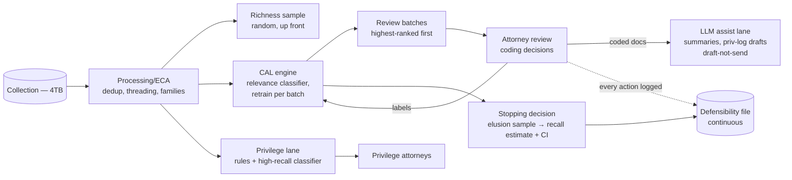
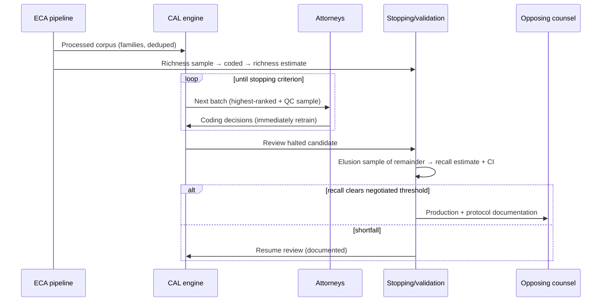
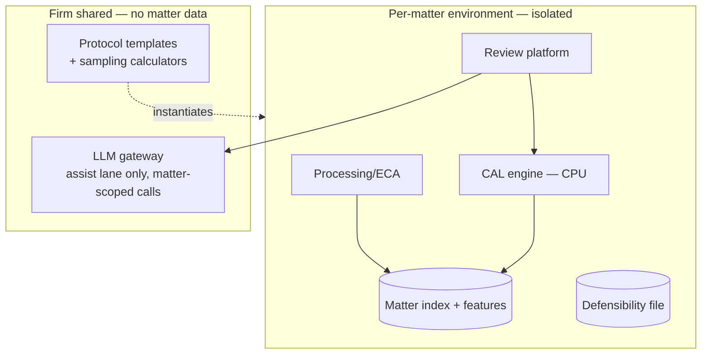

# Case Study CS24 — eDiscovery Triage

| | |
|---|---|
| **Industry** | Legal |
| **Company profile** | Halvard & Roth — fictional law firm, litigation support, defensibility-critical |
| **System type** | Classical ML — technology-assisted review (continuous active learning), per-matter; LLM in a bounded assist lane |
| **Maturity level exercised** | 4 Architect |

## Business Problem

A single large matter can mean 4TB of collected data — emails, chats, shared drives — reduced to ~3M reviewable documents, of which perhaps 5–10% are responsive. Reviewed manually at 50 docs/hour and $40–60/hour, that is a **$2.5–4M review bill per matter**, repeated across the firm's caseload. The goal is triage: prioritize human review so attorneys read the responsive documents early and can stop reading when the remainder is statistically empty. The governing constraint is **defensibility**: opposing counsel and the court can challenge the process, and the accepted answer in this domain is not a model architecture — it is a *protocol*: technology-assisted review (TAR) with **continuous active learning (CAL)**, documented sampling statistics, and a validated stopping decision. Courts have accepted TAR for over a decade precisely because its statistical validation is legible ([2.7](../curriculum/part-2-artificial-intelligence/chapter-07-evaluating-ml-systems.md)); novelty is a liability here, not a feature — a point [2.11](../curriculum/part-2-artificial-intelligence/chapter-11-choosing-the-right-ai-approach.md)'s triage would make on explainability grounds alone.

## Stakeholders

| Stakeholder | Role | What they care about | Success measure |
|-------------|------|----------------------|-----------------|
| Lead litigation partner | Sponsor & signer | Cost, speed, and a process they can defend in a meet-and-confer | Review spend −60%+; protocol survives challenge |
| Reviewing attorneys | Users | Prioritized, coherent batches | Responsive-docs-per-reviewed-hour |
| Opposing counsel / court | External adversarial | Statistical adequacy of the production | Recall estimate with confidence interval; no sanctions |
| Privilege/Ethics partner | Gatekeeper | Zero privilege waivers | Privilege lane recall; clawback events = 0 |
| Litigation-support (ops) | Operator | Per-matter setup speed, repeatability | Matter onboarding <1 week; protocol templated |

## Requirements

### Functional
- FR-1: Per-matter relevance classifier trained by **continuous active learning**: attorneys review model-selected batches (highest-value docs first), every coding decision immediately retrains/refreshes the ranking — the reviewers are the labeling function and the consumers simultaneously.
- FR-2: Richness estimation up front (random elusion/richness sample) to size the problem and set expectations before the first batch.
- FR-3: **Statistical stopping criterion**: review halts when the estimated recall (with confidence interval, from an elusion sample of the unreviewed remainder) clears the negotiated threshold — typically recall ≥75–80% documented, with the math in the protocol.
- FR-4: **Privilege lane, separate and conservative**: rule-based screens (counsel names, domains, date ranges) + a privilege classifier tuned for high recall route candidates to privilege attorneys; nothing leaves without human privilege review of flagged families; document-family integrity preserved throughout.
- FR-5: Full audit artifact generation: seed decisions, batch composition, coding history, sampling frames, recall calculations — the defensibility file is a system output, produced continuously ([4.14](../curriculum/part-4-enterprise-genai-systems/chapter-14-privacy-compliance-governance.md)'s evidence-from-engineering-artifacts, litigation edition).
- FR-6 (bounded assist lane): an LLM drafts document summaries and privilege-log entries *for documents attorneys have already coded* — downstream of every decision, draft-not-send ([7.5](../curriculum/part-7-enterprise-ai-architecture-patterns/chapter-05-human-in-the-loop-patterns.md)); it never codes, ranks, or excludes a document.

### Non-functional
- NFR-1 (Defensibility): Every number the protocol reports carries its sampling frame and confidence interval; the process is reproducible from the audit trail alone.
- NFR-2 (Privilege): Privilege-lane recall is the system's only recall target set near-absolute; the asymmetry is explicit — a waived privileged document is a one-way door ([1.4](../curriculum/part-1-professional-foundation/chapter-04-tradeoff-analysis.md)), a late responsive document is a cost.
- NFR-3 (Economics): Total cost per matter (compute + review hours) — the model exists to buy back attorney hours; a fancier model that saves no additional review hours is worse ([6.10](../curriculum/part-6-enterprise-architecture/chapter-10-tco-business-case.md)).
- NFR-4 (Isolation): Strict per-matter isolation — models, features, and coding data never cross matters (client confidentiality; also legal: each matter's protocol stands alone).

### Constraints
- Per-matter cold start is structural: every matter trains from zero (no cross-matter transfer without client consent); adversarial scrutiny of the *protocol*, not the code; ECA/processing pipeline (dedup, threading, family assembly) upstream is half the battle; reviewer consistency drifts across a six-week review and the labels are the training data.

## Architecture

Defining decisions: (1) **CAL over train-then-classify** — continuous active learning reaches target recall with fewer reviewed documents than one-shot classification and has the deepest acceptance record; the reviewers' work *is* the training loop, so no separate labeling budget exists; (2) **the stopping decision is a statistical event, not a feeling** — an elusion sample of the unreviewed remainder produces the recall estimate and CI that the protocol reports; review stops when the number clears the negotiated bar, and the negotiation happens *before* review starts; (3) **privilege runs as its own conservative lane** — different objective (recall-near-absolute), different reviewers, family-aware, never merged with relevance ranking; (4) **the LLM is confined to post-decision drafting** — summaries and privilege-log entries are exactly the tedious, verifiable text work LLMs are good at, and placing them after the human decision means a hallucination costs an edit, not a production error; the trade-off of using LLMs *in* the responsiveness decision was analyzed and declined on defensibility precedent, with the ADR noting the revisit trigger (courts accepting LLM-based protocols at scale); (5) **per-matter everything** — isolation is both an ethical wall and what makes each protocol self-contained under challenge.

## Sequence Diagram

## Deployment Diagram

## Threat Model

| Threat | Vector | Impact | Likelihood | Mitigation |
|--------|--------|--------|------------|------------|
| Missed privileged family | Family member coded individually; privilege screen gap | Privilege waiver — the one-way door | Low (by design) | Family-aware privilege lane; high-recall screens; human review of all flagged families; clawback agreement as backstop |
| Protocol challenge | Opposing counsel attacks sampling math or stopping decision | Re-review ordered; sanctions risk; credibility | Med | Pre-negotiated protocol; standard statistics; complete audit file; the boring-and-precedented design is itself the mitigation |
| Reviewer drift poisoning the ranking | Coding standards drift across weeks/teams | Model chases inconsistent labels; recall estimate undermined | High | Ongoing QC overlap samples (inter-reviewer agreement tracked); calibration sessions when agreement drops; decision log for contested calls |
| Richness surprise | True responsiveness far from the early estimate | Budget and timeline blown mid-matter | Med | Richness re-estimated as review proceeds; escalation gates at burn thresholds |
| Assist-lane text treated as record | LLM summary quoted as if it were the document | Misstatement propagates into work product | Low | Summaries watermarked as drafts, source-linked; privilege log entries verified against the document before filing |

## Cost Estimation

| Item | Assumption | Per matter (3M docs) |
|------|-----------|---------|
| Processing/ECA | Dedup, threading, families, indexing | ~$45K |
| CAL compute | Per-batch retraining, CPU — negligible next to review | ~$3K |
| Attorney review (the real line) | ~12% of corpus reviewed to stopping vs. 100% manual | ~$450K (vs. ~$3.2M manual) |
| Privilege lane review | Flagged families, senior rates | ~$120K |
| LLM assist lane | Summaries + priv-log drafts for coded docs | ~$14K |
| Validation + protocol documentation | Sampling, statistician time | ~$18K |
| **Total** | | **~$650K (vs. ~$3.4M manual) — ~80% saved** |

Dominant driver: attorney hours, always — which is why the CAL engine (the component that *reduces reviewed volume*) matters and the model's sophistication beyond that does not. The LLM assist lane is 2% of cost and none of the risk surface.

## Scaling Strategy

Scaling is per-matter and portfolio-level, not QPS: matters run in parallel isolated environments instantiated from the protocol template (onboarding <1 week is the ops metric that matters); within a matter, ECA parallelizes and CAL is CPU-light. The portfolio bottleneck is *reviewer supply and QC consistency*, not compute. Redesign trigger: cross-matter model reuse (with client consent) or LLM-in-the-loop responsiveness ranking — both are protocol changes to be negotiated and precedent-checked, not engineering upgrades to be deployed.

## Monitoring Strategy

Per-matter, the dashboard is the protocol: **progress plane** (docs reviewed, responsive-rate by batch — CAL's signature declining curve is itself evidence the ranking works), **statistical plane** (rolling richness estimate, projected stopping point, elusion-sample results with CIs, QC overlap agreement), **privilege plane** (flag rates, family-completeness checks, zero-tolerance exceptions), **economics plane** (burn vs. budget, cost per responsive doc found). Reviewer agreement below threshold triggers calibration before the model retrains on disputed labels — the labels are the model, so labeler QC *is* model QC ([2.7](../curriculum/part-2-artificial-intelligence/chapter-07-evaluating-ml-systems.md)'s noise-floor discipline applied to the humans).

## Lessons Learned

1. **In adversarial domains, the boring protocol is the strong architecture** — CAL with documented sampling won not because it out-benchmarks alternatives but because a decade of acceptance makes it cheap to defend. The architecture decision was really a *precedent* decision; the revisit trigger (courts accepting newer protocols) is written down, which is what makes conservatism a strategy rather than inertia ([1.4](../curriculum/part-1-professional-foundation/chapter-04-tradeoff-analysis.md)).
2. **The reviewers are the training pipeline — govern them like one** — the largest quality incidents were coding-standard drift, not model failures. Overlap samples, agreement tracking, and calibration sessions did more for recall than any modeling change. When humans produce the labels in-line, human QC is the data-quality program ([2.9](../curriculum/part-2-artificial-intelligence/chapter-09-classical-ml-system-design.md)'s data-quality ceiling, with attorneys as the pipeline).
3. **Fencing the LLM bought its benefits at zero protocol cost** — because the assist lane sits entirely after human decisions, the firm captured the drafting productivity without a single line of the defensibility file depending on generative output. The placement decision — not the model choice — is what made the risk acceptable (P22's per-rung assignment; [2.11](../curriculum/part-2-artificial-intelligence/chapter-11-choosing-the-right-ai-approach.md)).

---

**Related chapters:** [2.7 Evaluating ML Systems](../curriculum/part-2-artificial-intelligence/chapter-07-evaluating-ml-systems.md), [2.9 Classical ML System Design](../curriculum/part-2-artificial-intelligence/chapter-09-classical-ml-system-design.md), [2.11 Choosing the Right AI Approach](../curriculum/part-2-artificial-intelligence/chapter-11-choosing-the-right-ai-approach.md), [4.3 Ingestion](../curriculum/part-4-enterprise-genai-systems/chapter-03-document-ingestion.md) · **Related patterns:** continuous active learning, statistical stopping, high-recall screening lane ([2.9](../curriculum/part-2-artificial-intelligence/chapter-09-classical-ml-system-design.md)), Draft-Not-Send / Review Sampling ([7.5](../curriculum/part-7-enterprise-ai-architecture-patterns/chapter-05-human-in-the-loop-patterns.md)) · **Similar case studies:** [CS23 Contract Review Platform](cs23-contract-review-platform.md), [CS37 Public Records Request Processing](cs37-public-records-request-processing.md), [CS55 Credit Risk Scoring](cs55-credit-risk-scoring-mrm.md) (governed-protocol kinship)
