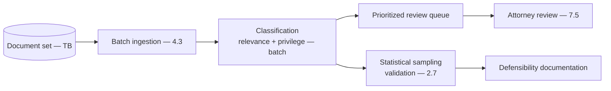
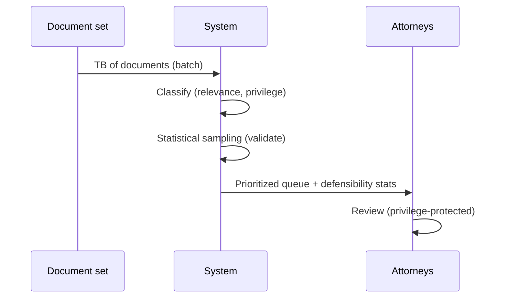
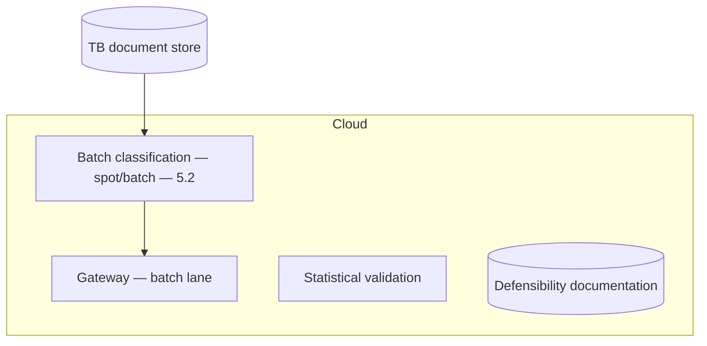

# Case Study CS24 — eDiscovery Triage

| | |
|---|---|
| **Industry** | Legal |
| **Company profile** | Halvard & Roth — fictional law firm, litigation support, defensibility-critical |
| **System type** | Classification at scale (TB-scale, defensible) |
| **Maturity level exercised** | 4 Architect |

## Business Problem

eDiscovery (reviewing document sets — often terabytes — for relevance/privilege in litigation) is enormously expensive and slow. The goal: a triage system that classifies documents (relevant/not, privileged/not) at scale to prioritize human review, with defensibility (the process must be legally defensible) and sampling-based quality control. The defining challenges: scale (TB, millions of documents — cost engineering), defensibility (the classification process must be documented and statistically validated), and privilege detection. Target: dramatically reduce review cost, defensible process, privilege-protected.

## Stakeholders

| Stakeholder | Role | What they care about | Success measure |
|-------------|------|----------------------|-----------------|
| Litigation team | Users | Cost, speed, defensibility | Review cost, speed |
| Reviewing attorneys | Beneficiary | Prioritized review | Review efficiency |
| Court/Opposing counsel | External | Defensibility | Defensibility (challenges) |
| Privilege/Ethics | Gatekeeper | Privilege protection | Zero privilege waivers |

## Requirements

### Functional
- FR-1: Classify documents (relevant/not, privileged/not) at scale.
- FR-2: Prioritize human review.
- FR-3: Defensible process (documented, statistically validated).
- FR-4: Privilege detection (protect privileged documents).

### Non-functional
- NFR-1 (Defensibility): Documented, statistically validated process (sampling statistics — 2.7); court-defensible.
- NFR-2 (Scale/Cost): TB/millions of documents economically (7.8).
- NFR-3 (Privilege): High recall on privilege (a missed privileged doc is a waiver).

### Constraints
- Defensibility (the defining constraint — statistical validation); TB scale (cost); privilege protection; legal process standards.

## Architecture

Batch classification at scale (7.8, TB) + statistical sampling validation (2.7, defensibility) + privilege detection (high recall) + human review (7.5). The statistical defensibility and cost-at-TB-scale are the defining designs.

## Sequence Diagram

## Deployment Diagram

## Threat Model

| Threat | Vector | Impact | Likelihood | Mitigation |
|--------|--------|--------|------------|------------|
| Missed privileged document | Classification error | Privilege waiver | Med | High-recall privilege detection, human review, sampling |
| Indefensible process | Un-validated | Court challenge, sanctions | Med | Statistical validation (2.7), documentation |
| Cost overrun at TB scale | Un-engineered | Budget | Med | Batch economics, tiering (7.8) |
| Relevance miss | Classification error | Missed evidence | Med | Statistical recall validation |

## Cost Estimation

| Item | Assumption | Per matter (TB-scale) |
|------|-----------|---------|
| Batch classification | Millions of docs, batch pricing + compact model | ~$50K-200K/matter (vs. $Ms manual) |
| Sampling + validation | Statistical validation | ~$10K |
| **Total** | | **~$60K-210K/matter** |

Dominant: document volume. Huge savings vs. manual review. Optimization: compact model + batch pricing (7.8) — the TB-scale cost case.

## Scaling Strategy

Per-matter batch (TB). Batch/spot compute (5.2), batch pricing (7.8). Classification scales with document volume; sampling validates. Fully latency-tolerant.

## Monitoring Strategy

Defensibility-first: statistical recall/precision on relevance and privilege (the defensibility metrics — 2.7's sampling statistics), privilege-recall (waiver-critical), classification quality, cost per matter. The statistical validation IS the defensibility.

## Lessons Learned

1. **Defensibility is statistical validation** — the classification process must be documented and statistically validated (2.7's sampling); the court-defensibility depends on the statistical rigor, not the model.
2. **Privilege recall is waiver-critical** — a missed privileged document is a privilege waiver; high-recall privilege detection plus human review plus sampling protects it.
3. **TB-scale is a cost-engineering problem** — the millions-of-documents scale makes batch economics and compact models (7.8) the difference between viable and unaffordable; the savings vs. manual review are enormous.

---

**Related chapters:** [2.7 Evaluating ML Systems](../curriculum/part-2-artificial-intelligence/chapter-07-evaluating-ml-systems.md), [4.11 Cost Engineering](../curriculum/part-4-enterprise-genai-systems/chapter-11-cost-engineering.md), [4.3 Ingestion](../curriculum/part-4-enterprise-genai-systems/chapter-03-document-ingestion.md) · **Related patterns:** Batch Lanes (7.8), Model Tiering (7.8), Review Sampling (7.5) · **Similar case studies:** [CS23](cs23-contract-review-platform.md), [CS37](cs37-public-records-request-processing.md)
