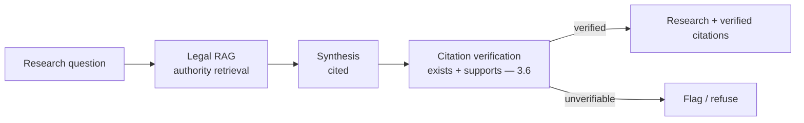
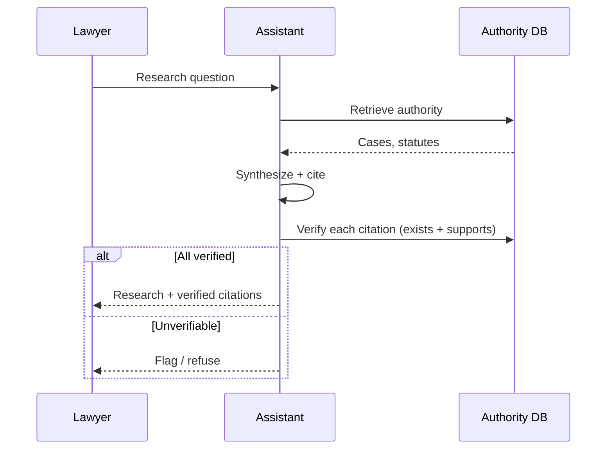
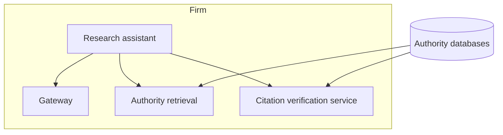

# Case Study CS25 — Legal Research Assistant

| | |
|---|---|
| **Industry** | Legal |
| **Company profile** | Halvard & Roth — fictional law firm, legal research |
| **System type** | RAG with citation verification (hallucinated-citation-critical) |
| **Maturity level exercised** | 4 Architect |

## Business Problem

Legal research (finding relevant case law, statutes, precedents) is time-intensive, and the hallucinated-citation risk is notorious and severe (fabricated case citations have led to sanctions and professional embarrassment). The goal: a research assistant that finds and synthesizes relevant authority with rigorously verified citations — every cited case/statute must exist and support the proposition. The defining challenge: citation integrity (the hallucinated-citation problem — 3.1/3.6 — at its most acute). Target: faster research, zero fabricated citations, citations verified to exist and support.

## Stakeholders

| Stakeholder | Role | What they care about | Success measure |
|-------------|------|----------------------|-----------------|
| Lawyers | Users | Research speed, citation trust | Research time, trust |
| Partners | Sponsor | Efficiency, no sanctions | Efficiency, zero sanctions |
| Risk/Ethics | Gatekeeper | No fabricated citations | Zero fabricated citations |

## Requirements

### Functional
- FR-1: Find relevant authority (case law, statutes) via RAG.
- FR-2: Synthesize research with citations.
- FR-3: Verify every citation (exists + supports the proposition — the shepardizing-style check).
- FR-4: Refuse/flag when no supporting authority found.

### Non-functional
- NFR-1 (Citation integrity): Zero fabricated citations; every citation verified to exist and support (the defining requirement).
- NFR-2 (Accuracy): Faithful synthesis; refuse on no-authority.
- NFR-3 (Coverage): Comprehensive authority retrieval.

### Constraints
- Citation integrity (the defining constraint — sanctions risk); accuracy; comprehensive coverage.

## Architecture

RAG (7.2 citation-first) + rigorous citation verification (3.6 — every citation checked to exist and support, a shepardizing-style verification) + refusal on no-authority. The citation verification is the defining component — the hallucinated-citation problem demands it.

## Sequence Diagram

## Deployment Diagram

## Threat Model

| Threat | Vector | Impact | Likelihood | Mitigation |
|--------|--------|--------|------------|------------|
| Fabricated citation | Hallucination | Sanctions, embarrassment | Med-High | Rigorous citation verification (exists + supports — 3.6) |
| Wrong proposition support | Miscitation | Wrong legal argument | Med | Support-verification (not just existence) |
| Missed authority | Retrieval gap | Incomplete research | Med | Comprehensive retrieval, coverage evals |
| Confident wrong synthesis | Hallucination | Wrong research | Med | Grounding, refuse-on-no-authority |

## Cost Estimation

| Item | Assumption | Monthly |
|------|-----------|---------|
| Inference (research + synthesis) | Research volume, reranked | ~$40K |
| Retrieval + citation verification | Authority DBs, verification | ~$20K |
| **Total** | | **~$60K** |

Dominant: research + verification (the verification adds cost but is essential). Optimization: tiering (7.8).

## Scaling Strategy

Steady with research demand. Retrieval + verification scale; citation verification is a critical (non-skippable) stage. Latency acceptable for research (not real-time).

## Monitoring Strategy

Citation-integrity-first: fabricated-citation rate (zero — the critical metric), citation-support accuracy (exists AND supports), synthesis faithfulness, coverage. The citation-verification pass and its results are the critical monitor.

## Lessons Learned

1. **Citation verification is non-negotiable** — the hallucinated-citation problem (3.1/3.6) is at its most acute in legal research (sanctions); every citation is verified to exist AND support the proposition — a shepardizing-style check, not just existence.
2. **Refuse on no-authority** — better to flag/refuse than fabricate a supporting citation (3.6); the refusal protects against the sanctions risk.
3. **Support-verification beyond existence** — a citation that exists but doesn't support the proposition is still wrong; the verification checks both existence and support.

---

**Related chapters:** [3.6 RAG](../curriculum/part-3-core-building-blocks-of-genai/chapter-06-rag-fundamentals.md), [3.1 LLM Limits](../curriculum/part-3-core-building-blocks-of-genai/chapter-01-llm-capabilities-limits.md), [4.2 Advanced Retrieval](../curriculum/part-4-enterprise-genai-systems/chapter-02-advanced-retrieval.md) · **Related patterns:** Citation-First (7.2), Reranked RAG (7.2), Dual-Model Verification (7.6) · **Similar case studies:** [CS23](cs23-contract-review-platform.md), [CS38](cs38-policy-analysis-assistant.md)
