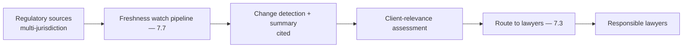
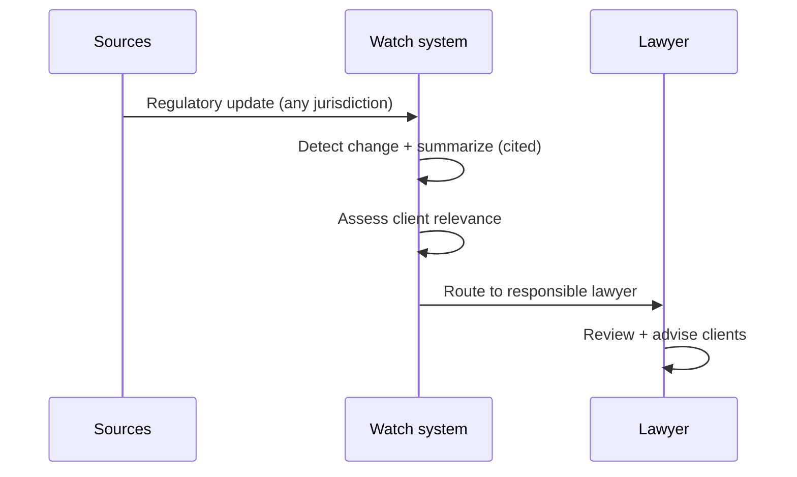
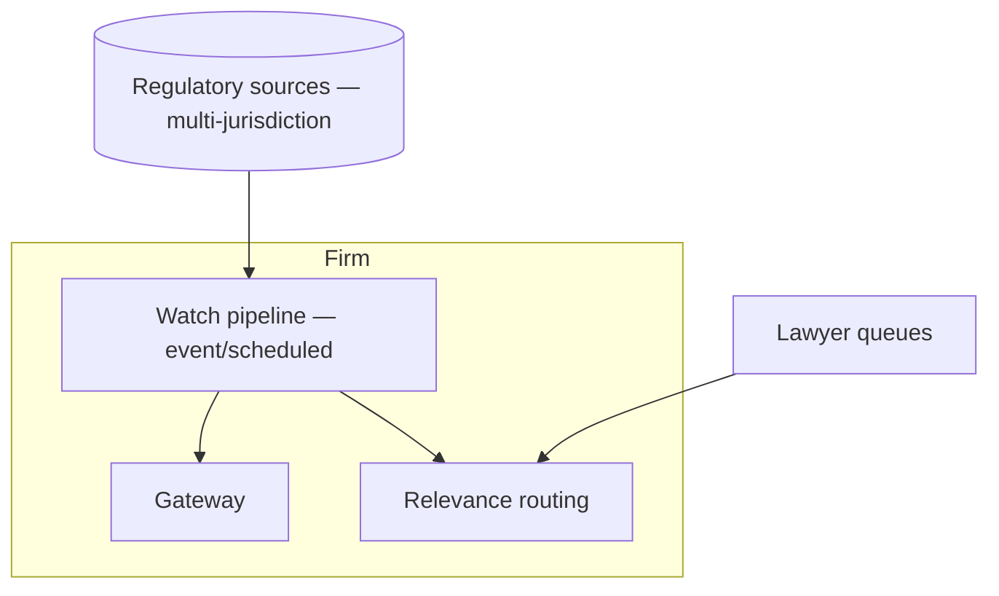

# Case Study CS26 — Regulatory Change Monitoring

| | |
|---|---|
| **Industry** | Legal |
| **Company profile** | Halvard & Roth — fictional law firm, regulatory/compliance practice, multi-jurisdiction |
| **System type** | Watch + summarize + route (freshness + jurisdiction fan-out) |
| **Maturity level exercised** | 3 Engineer → 4 Architect |

## Business Problem

Regulatory changes across many jurisdictions affect clients, and monitoring them manually is impossible at scale — missing a change is a client-harm and liability event. The goal: a system that watches regulatory sources across jurisdictions, summarizes changes, assesses relevance to clients, and routes to the responsible lawyers. The defining challenges: freshness (changes must be caught promptly), jurisdiction fan-out (many sources), and relevance routing. Target: comprehensive change detection, prompt (fresh) summaries, accurate client-relevance routing.

## Stakeholders

| Stakeholder | Role | What they care about | Success measure |
|-------------|------|----------------------|-----------------|
| Regulatory lawyers | Users | Change detection, routing | Detection completeness, timeliness |
| Clients | Beneficiary | Timely regulatory alerts | Alert timeliness |
| Practice head | Sponsor | Coverage, efficiency | Coverage |
| Risk | Gatekeeper | No missed changes | Zero missed material changes |

## Requirements

### Functional
- FR-1: Watch regulatory sources across jurisdictions (freshness pipeline — 7.7).
- FR-2: Detect and summarize changes (cited to source).
- FR-3: Assess client relevance and route to responsible lawyers.
- FR-4: Comprehensive jurisdiction coverage.

### Non-functional
- NFR-1 (Freshness): Changes detected promptly (freshness SLA per source — 7.7).
- NFR-2 (Coverage): Comprehensive across jurisdictions (no missed material change).
- NFR-3 (Accuracy): Accurate summaries, correct relevance routing.

### Constraints
- Freshness (the defining constraint — missing a change is harm); jurisdiction fan-out; relevance accuracy.

## Architecture

Freshness pipeline (7.7, multi-source) + change detection/summarization (cited) + relevance routing (7.3) + human lawyers. The freshness pipeline (jurisdiction fan-out) is the defining component.

## Sequence Diagram

## Deployment Diagram

## Threat Model

| Threat | Vector | Impact | Likelihood | Mitigation |
|--------|--------|--------|------------|------------|
| Missed material change | Freshness/coverage gap | Client harm, liability | Med | Freshness SLA per source, coverage monitoring (7.7) |
| Wrong relevance routing | Classification error | Change misrouted/missed | Med | Relevance evals, lawyer review |
| Inaccurate summary | Hallucination | Wrong understanding | Med | Citation-first, faithfulness |
| Source-change break | Silent watch failure | Missed changes | Med | Watch monitoring, source-freshness alerts |

## Cost Estimation

| Item | Assumption | Monthly |
|------|-----------|---------|
| Watch + summarization | Source volume, jurisdictions | ~$20K |
| Retrieval + routing | Change corpus, routing | ~$6K |
| **Total** | | **~$26K** |

Dominant: source-watch volume. Optimization: tiering, batch summarization (7.8).

## Scaling Strategy

Source-volume-driven, jurisdiction fan-out. Watch pipeline scales per source (event-driven where feeds exist, scheduled otherwise — 7.7). Summarization scales with change volume. Routing to lawyer queues.

## Monitoring Strategy

Freshness + coverage: source-freshness lag (the timeliness metric), coverage completeness (no missed sources), relevance-routing accuracy, summary faithfulness. The freshness-lag and coverage monitoring are critical (a missed change is harm).

## Lessons Learned

1. **Freshness is the harm-prevention** — missing a regulatory change is client harm; the freshness pipeline (7.7) with per-source SLAs and coverage monitoring is the core safety.
2. **Jurisdiction fan-out demands per-source handling** — many jurisdictions/sources with varying feeds; per-source freshness handling (event vs. scheduled) and coverage monitoring.
3. **Relevance routing connects to action** — detecting a change is only useful if routed to the right lawyer; the relevance assessment + routing (7.3) is what makes it actionable.

---

**Related chapters:** [7.7 Knowledge & Data Patterns](../curriculum/part-7-enterprise-ai-architecture-patterns/chapter-07-knowledge-data-patterns.md), [4.1 Production RAG](../curriculum/part-4-enterprise-genai-systems/chapter-01-production-rag.md), [7.3 Workflow Patterns](../curriculum/part-7-enterprise-ai-architecture-patterns/chapter-03-workflow-patterns.md) · **Related patterns:** Freshness Pipeline (7.7), Routing (7.3), Citation-First (7.2) · **Similar case studies:** [CS10](cs10-trading-floor-research-summarizer.md), [CS38](cs38-policy-analysis-assistant.md)
