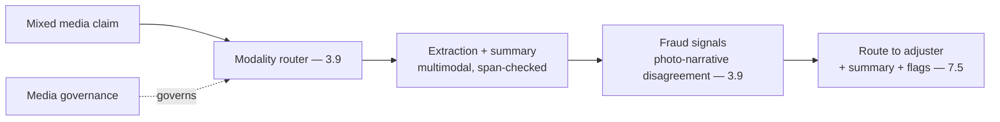
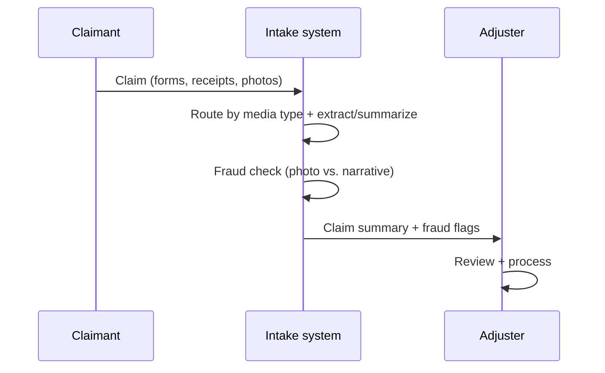
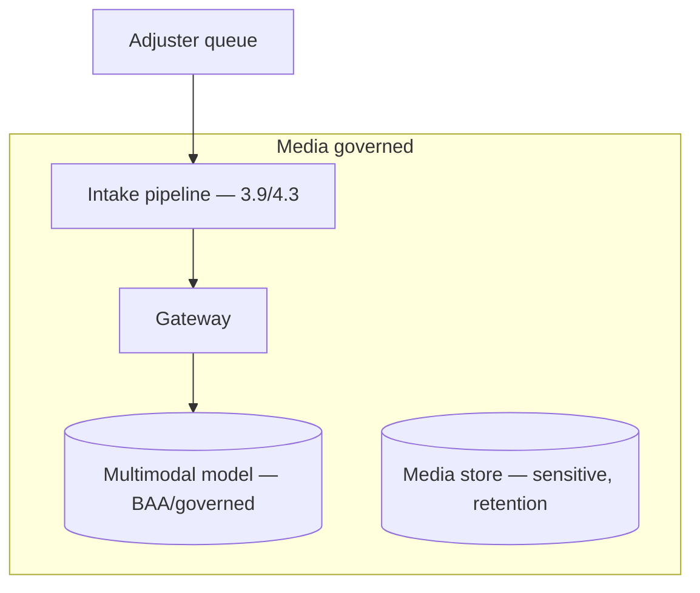

# Case Study CS27 — Claims Intake & Summarization

| | |
|---|---|
| **Industry** | Insurance |
| **Company profile** | Kestrel Assurance — fictional insurer, claims operations |
| **System type** | Multimodal intake pipeline (photos + documents) |
| **Maturity level exercised** | 3 Engineer → 4 Architect |

## Business Problem

Claims arrive as mixed media (claim forms, receipts, photos of damage, medical letters) requiring manual intake, summarization, and routing to adjusters — slow, and the fraud dimension requires attention. The goal: a multimodal intake pipeline that reads the mixed media, extracts and summarizes the claim, flags fraud signals, and routes to adjusters. This is Kestrel's claims-intake platform (the CS3.9 example). The defining challenges: multimodal (photos + documents), fraud signals, and adjuster workflow. Target: faster intake, accurate extraction/summary, fraud-signal flagging, adjuster-ready.

## Stakeholders

| Stakeholder | Role | What they care about | Success measure |
|-------------|------|----------------------|-----------------|
| Adjusters | Users | Claim-ready summaries | Intake time, quality |
| Claims manager | Sponsor | Throughput, accuracy | Throughput |
| Fraud/SIU | Beneficiary | Fraud signals | Fraud detection |
| Compliance | Gatekeeper | PII, media sensitivity | Compliance |

## Requirements

### Functional
- FR-1: Read mixed media (forms, receipts, photos — multimodal — 3.9).
- FR-2: Extract and summarize the claim (structured).
- FR-3: Flag fraud signals (e.g., photo-narrative disagreement — 3.9).
- FR-4: Route to adjusters with the summary.

### Non-functional
- NFR-1 (Multimodal accuracy): Accurate reading of forms, receipts, photos (3.9).
- NFR-2 (Fraud): Fraud signals flagged for SIU review.
- NFR-3 (Privacy): Media (photos — faces, homes) governed (4.14/3.9).

### Constraints
- Multimodal media (the defining constraint); fraud surface; media sensitivity (photos); adjuster workflow.

## Architecture

Multimodal intake (3.9, modality router) + extraction/summary (span-checked) + fraud signals (3.9 — the narrative-vs-photo disagreement weaponized as signal — Kestrel's lesson) + adjuster routing (7.5). Media governance (4.14) for the sensitive photos.

## Sequence Diagram

## Deployment Diagram

## Threat Model

| Threat | Vector | Impact | Likelihood | Mitigation |
|--------|--------|--------|------------|------------|
| Visual hallucination | Photo misread | Wrong claim data | Med | Blind-first reads, span-checks (3.9) |
| Missed fraud | Detection gap | Fraud loss | Med | Fraud signals, narrative-photo disagreement (3.9), SIU review |
| Media exposure | Photo/PII leak | Privacy breach | Med | Media governance, retention (4.14/3.9) |
| Extraction error | Hallucination | Wrong claim | Med | Span-check, adjuster review |

## Cost Estimation

| Item | Assumption | Monthly |
|------|-----------|---------|
| Multimodal intake | Claim volume, photo-heavy | ~$35K |
| Media governance + retrieval | Media store, extraction | ~$10K |
| **Total** | | **~$45K** |

Dominant: multimodal (photo) intake. Optimization: modality routing (text-only where possible), tiering (3.9/7.8).

## Scaling Strategy

Volume with claim frequency (spikes with events/catastrophes). Intake scales with worker pools; multimodal handled per media type; batch for bulk. Catastrophe-event surge provisioning.

## Monitoring Strategy

Multimodal quality + fraud: extraction accuracy (span-checked), fraud-signal effectiveness, media-governance compliance, visual-hallucination rate. The fraud-signal (narrative-photo disagreement) and media governance are key monitors.

## Lessons Learned

1. **Weaponize the disagreement as fraud signal** (3.9's Kestrel lesson) — the narrative-vs-photo disagreement (a hallucination vector when context-anchored) becomes a fraud-signal feature when photos are read context-blind and compared to the narrative.
2. **Media is sensitive data** — claim photos (faces, homes) are sensitive (4.14/3.9); governance, retention, and redaction from the first pipeline.
3. **Multimodal routing controls cost** — routing text-only documents to cheap paths and photos to vision (3.9) controls the multimodal cost.

---

**Related chapters:** [3.9 Multimodal](../curriculum/part-3-core-building-blocks-of-genai/chapter-09-multimodal-models.md), [4.3 Ingestion](../curriculum/part-4-enterprise-genai-systems/chapter-03-document-ingestion.md), [4.14 Privacy](../curriculum/part-4-enterprise-genai-systems/chapter-14-privacy-compliance-governance.md) · **Related patterns:** Human-in-the-Loop (7.5), Layered Filters (7.6) · **Similar case studies:** [CS01](cs01-clinical-documentation-assistant.md), [CS30](cs30-subrogation-opportunity-detection.md)
