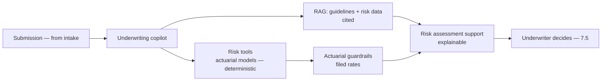
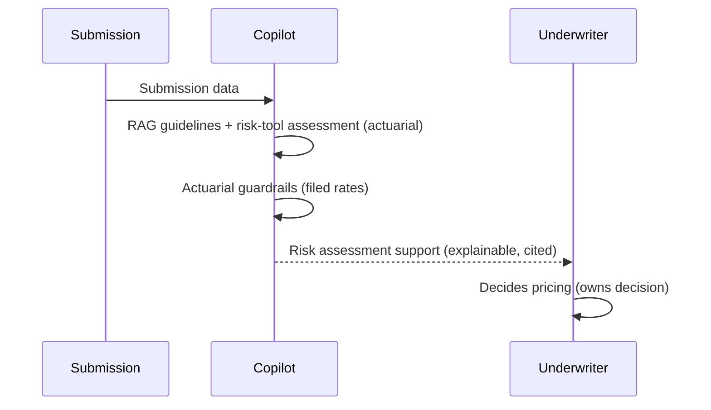
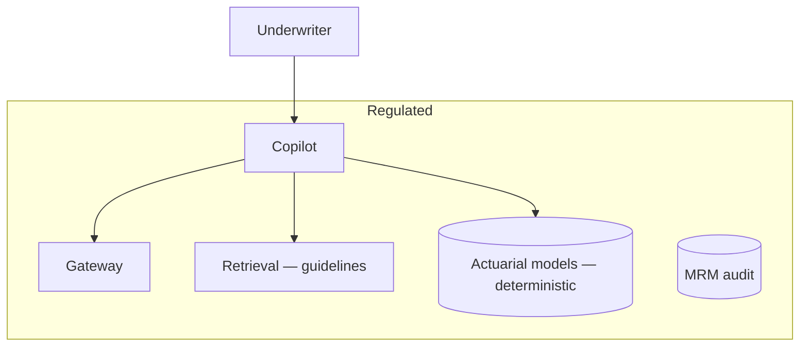

# Case Study CS28 — Underwriting Copilot

| | |
|---|---|
| **Industry** | Insurance |
| **Company profile** | Bellhaven Insurance — fictional commercial insurer, underwriting |
| **System type** | RAG + risk tools, actuarial-governed |
| **Maturity level exercised** | 4 Architect |

## Business Problem

Underwriters assess risk and price policies — synthesizing submission data, risk factors, and guidelines, a slow and expertise-intensive process. The goal: a copilot that surfaces risk information and assists assessment, grounded in guidelines and risk data, with actuarial guardrails, regulatory-filing compliance, and explainability. This complements Bellhaven's intake platform (the extraction feeds the copilot). The defining challenges: actuarial soundness (the pricing must respect actuarial guidelines), regulatory filings (rates are filed/regulated), and explainability. Target: faster underwriting, actuarially-sound assistance, explainable, human underwriter decides.

## Stakeholders

| Stakeholder | Role | What they care about | Success measure |
|-------------|------|----------------------|-----------------|
| Underwriters | Users | Speed, risk insight | Underwriting time |
| Chief underwriter | Sponsor | Throughput, quality | Throughput, loss ratio |
| Actuarial | Gatekeeper | Actuarial soundness | Pricing compliance |
| Regulatory/Compliance | Gatekeeper | Filed rates, explainability | Regulatory compliance |

## Requirements

### Functional
- FR-1: Surface risk information (RAG over guidelines + risk data, cited).
- FR-2: Assist risk assessment (the underwriter decides).
- FR-3: Actuarial guardrails (pricing respects filed rates/guidelines).
- FR-4: Explainable assistance (why this risk assessment).

### Non-functional
- NFR-1 (Actuarial): Pricing/risk respects actuarial guidelines and filed rates (guardrails).
- NFR-2 (Explainability): Risk assessment explainable/traceable (regulatory).
- NFR-3 (Governance): MRM; underwriter decides.

### Constraints
- Actuarial soundness (the defining constraint); filed/regulated rates; explainability; underwriter decides; MRM.

## Architecture

RAG (7.2) + risk tools (deterministic actuarial models — the LLM assists, models compute) + actuarial guardrails (filed rates) + human-in-the-loop (7.5). Like CS06 (RM copilot) — advice-support under regulation, MRM-governed.

## Sequence Diagram

## Deployment Diagram

## Threat Model

| Threat | Vector | Impact | Likelihood | Mitigation |
|--------|--------|--------|------------|------------|
| Actuarially unsound pricing | Model / guideline gap | Loss ratio, regulatory | Med | Actuarial guardrails (filed rates), deterministic models, underwriter decides |
| Un-explainable assessment | Missing traceability | Regulatory failure | Med | Explainability, citation, audit |
| LLM computes pricing | Precision failure | Wrong price | Med | Deterministic actuarial models (LLM assists — 3.1) |
| Model drift | Silent change | Assessment degradation | Med | MRM monitoring, eval gates |

## Cost Estimation

| Item | Assumption | Monthly |
|------|-----------|---------|
| Inference | Submission volume, tiered | ~$45K |
| Retrieval + actuarial models | Guidelines, models | ~$12K |
| **Total** | | **~$57K** |

Dominant: submission volume. Optimization: tiering (7.8).

## Scaling Strategy

Business-hours load. Copilot scales horizontally; actuarial models (existing) scale independently; retrieval on replicas.

## Monitoring Strategy

Quality + governance: actuarial compliance (filed-rate adherence), explainability completeness, assessment quality, loss-ratio impact (the business outcome). MRM monitoring (drift, eval gates). Underwriter override rates.

## Lessons Learned

1. **Actuarial models compute, the LLM assists** — the pricing/risk computation uses deterministic actuarial models (the value-chain-critical exactness — 3.1); the LLM surfaces and explains, never computes the price.
2. **Filed rates are guardrails** — the actuarial guardrails enforce filed/regulated rates; pricing compliance is a hard control (regulatory).
3. **Explainability is regulatory** — the risk assessment must be explainable/traceable for regulatory filing and defense; explainability is a first-class requirement.

---

**Related chapters:** [4.14 Privacy/Compliance](../curriculum/part-4-enterprise-genai-systems/chapter-14-privacy-compliance-governance.md), [3.7 Tool Use](../curriculum/part-3-core-building-blocks-of-genai/chapter-07-function-calling-tool-use.md), [2.8 Responsible AI](../curriculum/part-2-artificial-intelligence/chapter-08-responsible-ai.md) · **Related patterns:** Human-in-the-Loop (7.5), Layered Filters (7.6), Citation-First (7.2) · **Similar case studies:** [CS06](cs06-relationship-manager-copilot.md), [CS08](cs08-credit-memo-drafting.md)
