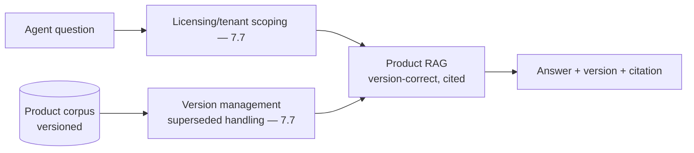
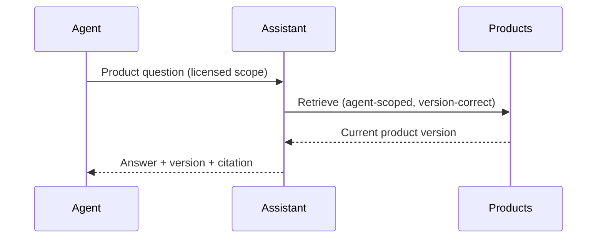
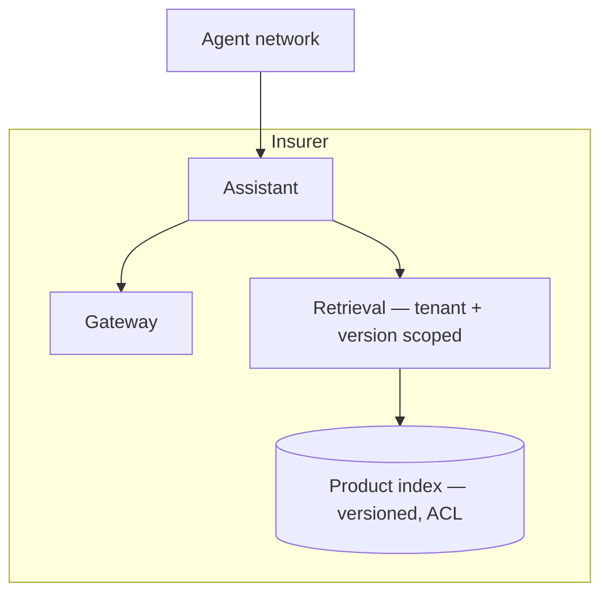

# Case Study CS29 — Policy Q&A for Agents

| | |
|---|---|
| **Industry** | Insurance |
| **Company profile** | Bellhaven Insurance — fictional insurer, agent/broker network, multi-product |
| **System type** | Multi-tenant RAG (product-version correctness) |
| **Maturity level exercised** | 3 Engineer → 4 Architect |

## Business Problem

Insurance agents/brokers need accurate answers about products, coverage, and policies — across many products and versions, and across the agent network (multi-tenant, with agent-licensing rules on what each agent can sell). The goal: a multi-tenant policy Q&A assistant answering product questions accurately, respecting product-version correctness (the right version for the right context) and agent-licensing scoping. The defining challenges: product-version correctness (a wrong version is wrong advice) and multi-tenancy (agents see their permitted products). Target: accurate product answers, correct versions, licensing-scoped, agent-adopted.

## Stakeholders

| Stakeholder | Role | What they care about | Success measure |
|-------------|------|----------------------|-----------------|
| Agents/brokers | Users | Accurate product answers | Adoption, accuracy |
| Product team | Content owners | Version correctness | Version accuracy |
| Compliance | Gatekeeper | Licensing, accuracy | Licensing compliance |
| Distribution head | Sponsor | Agent effectiveness | Sales effectiveness |

## Requirements

### Functional
- FR-1: Answer product/coverage questions (RAG, cited).
- FR-2: Product-version correctness (right version for context).
- FR-3: Multi-tenant/licensing scoping (agents see permitted products — ACL — 7.7).

### Non-functional
- NFR-1 (Version correctness): The correct product version surfaced (superseded-version handling — 7.7).
- NFR-2 (Multi-tenancy): Agent-scoped (licensing — 4.1 tenancy).
- NFR-3 (Accuracy): Accurate, cited answers.

### Constraints
- Product-version correctness (the defining constraint); multi-tenancy/licensing; accuracy.

## Architecture

Multi-tenant RAG (7.7 tenant isolation + version management) + citation-first. The product-version correctness (superseded-version handling — 7.7) and licensing-scoping (tenancy) are defining.

## Sequence Diagram

## Deployment Diagram

## Threat Model

| Threat | Vector | Impact | Likelihood | Mitigation |
|--------|--------|--------|------------|------------|
| Wrong product version | Version handling gap | Wrong advice, mis-sale | Med | Version management, superseded handling (7.7) |
| Cross-tenant/licensing leak | ACL failure | Compliance violation | Med | Tenant/licensing scoping (7.7) |
| Inaccurate answer | Hallucination | Wrong advice | Med | Citation-first, grounding |

## Cost Estimation

| Item | Assumption | Monthly |
|------|-----------|---------|
| Inference | Agent network volume, tiered | ~$25K |
| Retrieval (multi-tenant, versioned) | Product corpus | ~$8K |
| **Total** | | **~$33K** |

Dominant: agent-network volume. Optimization: caching, tiering (7.8).

## Scaling Strategy

Business-hours load across agent network. Stateless assistant scales horizontally; multi-tenant versioned index; caching for common product questions.

## Monitoring Strategy

Quality + correctness: version-correctness (right version surfaced), tenant/licensing-scoping compliance, answer accuracy, agent adoption. Version-correctness is the key monitor (a wrong version is wrong advice).

## Lessons Learned

1. **Product-version correctness is the accuracy control** — surfacing the wrong (e.g., superseded) product version is wrong advice; version management and superseded-handling (7.7) ensure the correct version.
2. **Licensing scopes the tenancy** — agents see only their licensed products (7.7 tenant isolation with licensing scoping); the multi-tenancy respects licensing rules.
3. **Citations enable version verification** — citing the product version lets the agent verify currency; the citation includes the version.

---

**Related chapters:** [7.7 Knowledge & Data Patterns](../curriculum/part-7-enterprise-ai-architecture-patterns/chapter-07-knowledge-data-patterns.md), [4.1 Production RAG](../curriculum/part-4-enterprise-genai-systems/chapter-01-production-rag.md), [3.6 RAG](../curriculum/part-3-core-building-blocks-of-genai/chapter-06-rag-fundamentals.md) · **Related patterns:** Tenant Isolation (7.7), Freshness Pipeline (7.7), Citation-First (7.2) · **Similar case studies:** [CS43](cs43-employee-policy-assistant.md), [CS18](cs18-sales-engineering-quote-copilot.md)
