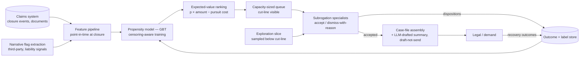
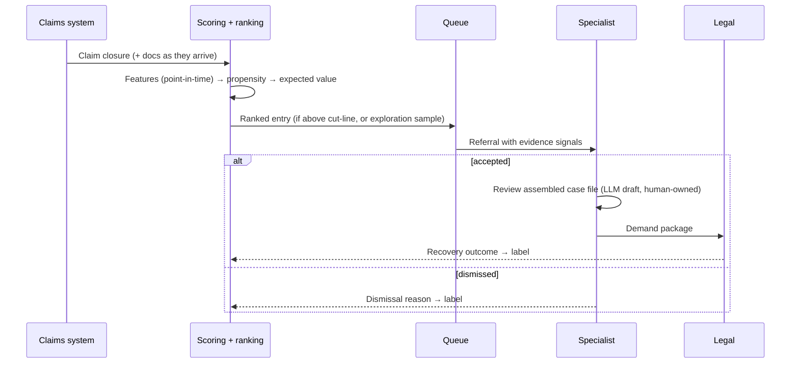
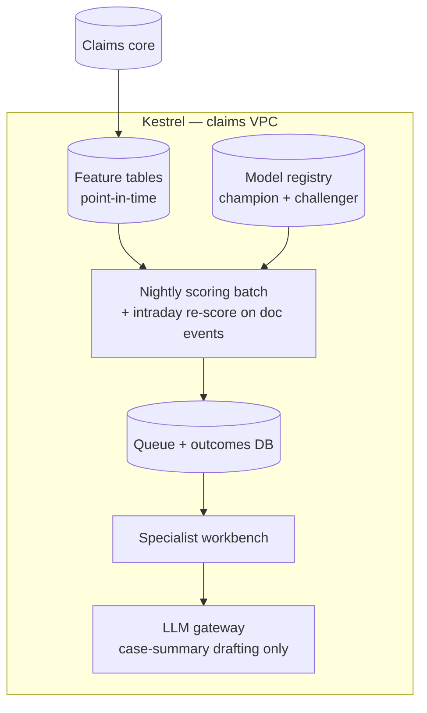

# Case Study CS30 — Subrogation Opportunity Detection

| | |
|---|---|
| **Industry** | Insurance |
| **Company profile** | Kestrel Assurance — fictional P&C insurer, ~600K claims/year, subrogation team of 22 specialists |
| **System type** | Classical ML — propensity scoring + expected-value ranking (LLM only in the downstream case-file drafting, outside the scoring path) |
| **Maturity level exercised** | 3 Engineer → 4 Architect |

## Business Problem

Subrogation — recovering claim costs from a liable third party — leaks money by omission: adjusters closing claims under time pressure miss recovery signals buried in loss descriptions, police-report fields, and payment patterns. Industry benchmarks put missed subrogation at 1–3% of paid losses; for Kestrel that is a ₹-free, directly measurable **$15–45M/year** left with liable third parties. The old process relied on adjuster referral (inconsistent) and a quarterly manual audit (too late — recovery rights erode with time and evidence decay). The goal: score every closing claim for recovery potential, rank by *expected net recovery* — probability × estimated amount − pursuit cost — and feed a 22-person team exactly the queue it has capacity to work. This is a textbook [2.9](../curriculum/part-2-artificial-intelligence/chapter-09-classical-ml-system-design.md) classification problem with a twist that dominates the design: **only pursued opportunities ever get labels**, so the training data is censored by the very process being automated.

## Stakeholders

| Stakeholder | Role | What they care about | Success measure |
|-------------|------|----------------------|-----------------|
| Subrogation team | Users | Queue quality — worked referrals that pay | Precision at team capacity; $ recovered per specialist-hour |
| Recovery manager | Sponsor | Net recovery dollars | Recovery $ +30% at flat headcount |
| Claims operations | Data owner | No new adjuster workload | Zero added handling time on the standard claim path |
| Legal | Downstream | Pursuable case files | Referral-to-demand conversion; evidence completeness |
| Actuarial/Finance | Beneficiary | Loss-ratio impact, honest attribution | Recovery attributed net of what the old process would have caught |

## Requirements

### Functional
- FR-1: Score every claim at closure (and re-score on late-arriving documents) for subrogation propensity — GBT on structured features: loss type and codes, liability indicators, third-party involvement flags, payment pattern, jurisdiction, plus binary signal-flags extracted from loss narratives.
- FR-2: **Expected-value ranking**: p(recovery) × estimated recoverable amount − estimated pursuit cost; the queue is ordered by expected net dollars, not by score ([2.7](../curriculum/part-2-artificial-intelligence/chapter-07-evaluating-ml-systems.md)'s threshold-as-business-decision, generalized to value-ranking).
- FR-3: Queue sized to capacity: the team works ~350 referrals/week; the system surfaces exactly that, with the marginal referral's expected value visible (the cut-line is a business dial).
- FR-4: Case-file assembly for accepted referrals: the documents, dates, parties, and payment records collated automatically; a drafted case summary (this is the one LLM component, downstream of the decision, draft-not-send — [7.5](../curriculum/part-7-enterprise-ai-architecture-patterns/chapter-05-human-in-the-loop-patterns.md)).
- FR-5: Outcome capture: pursued/not, demand issued, recovered amount, cycle time — every disposition feeds the label store.

### Non-functional
- NFR-1 (Queue quality): ≥3× lift over the adjuster-referral baseline in recovery-$ per worked referral; precision at capacity is the governing metric — recall beyond team capacity is unmonetizable ([2.9](../curriculum/part-2-artificial-intelligence/chapter-09-classical-ml-system-design.md)'s operating-point realism).
- NFR-2 (Timeliness): Scored within 24h of closure — recovery rights and evidence decay; a perfect score in month three is worth a fraction of a good score in week one.
- NFR-3 (Attribution honesty): Measured incremental to the old referral process (the old channel keeps running; the model is credited only with what it adds).
- NFR-4 (Explainability): Each referral carries its top contributing signals — specialists triage faster when they can see *why*, and dismissed-with-reason is a better label than dismissed.

### Constraints
- **Label censoring** — historical outcomes exist only for claims someone chose to pursue; unpursued claims are unlabeled, not negative. Team capacity is fixed (22 specialists) — the system optimizes the use of a scarce resource, it does not scale it. Narrative text is signal-bearing but the *scoring* stays on structured + extracted-flag features for auditability; statute-of-limitations clocks vary by jurisdiction and gate everything.

## Architecture

Defining decisions: (1) **rank by expected net dollars, not by probability** — a 40% chance at $80K outranks an 85% chance at $3K; the ranking objective is the business objective; (2) **censoring-aware training with an exploration slice** — a small sampled set of *below-cut-line* claims is worked each month, deliberately, to keep labels arriving from the region the model would otherwise never see (P21's control-slice discipline, aimed at selection bias instead of action bias); (3) **narrative text enters as extracted binary flags, not as an opaque text embedding** — the scoring model stays auditable and its features defensible in the recovery litigation it feeds; (4) **the LLM is fenced downstream** — it drafts case summaries after the human accepts the referral; it can be wrong, slow, or deleted without touching detection (P22's rung-assignment discipline); (5) **the old referral channel stays alive** as both a safety net and the incrementality baseline.

## Sequence Diagram

## Deployment Diagram

## Threat Model

| Threat | Vector | Impact | Likelihood | Mitigation |
|--------|--------|--------|------------|------------|
| Selection-bias hardening | Model trained only on historically-pursued claim types; novel recovery patterns never surface | The miss pattern the system was built to fix, rebuilt | High | Exploration slice below the cut-line; dismissal reasons reviewed quarterly for emerging patterns |
| Feature leakage from post-decision data | Recovery-correlated fields populated *after* pursuit began leak into training | Inflated offline metrics, weak production queue | Med | Point-in-time features frozen at scoring date; leakage audit in the promotion gate ([2.9](../curriculum/part-2-artificial-intelligence/chapter-09-classical-ml-system-design.md)) |
| Queue gaming by cycle-time pressure | Specialists cherry-pick easy referrals; hard high-value cases age out | Expected-value ranking silently unrealized | Med | Age-in-queue monitoring; statute-clock escalation; worked-order audits |
| Estimated-amount error dominating EV | Recoverable-amount model biased high on large claims | Team time sunk into overvalued pursuits | Med | Amount model validated separately; EV shown with uncertainty band; post-hoc recovered-vs-estimated calibration review |
| Drafted summary error reaching legal | LLM summary misstates a date or party | Weakened demand, credibility cost | Low | Draft-not-send with source-linked fields; the structured case file, not the prose, is the legal record |

## Cost Estimation

| Item | Assumption | Monthly |
|------|-----------|---------|
| Scoring pipeline | 600K claims/year, nightly batch + event re-scores — CPU-trivial | ~$3K |
| Feature + outcome store | Point-in-time tables, dispositions | ~$2K |
| Narrative flag extraction | Batch NLP over closure documents | ~$4K |
| Case-file assembly + LLM drafting | ~1,400 accepted referrals/month, drafting only | ~$3K |
| **Total** | | **~$12K** |

Dominant driver: nothing — the whole system costs less monthly than one specialist. That is the point: the scarce, expensive resource is the 22-person team, and the system's entire job is pointing it at the right $12M. Recovery lift in year one paid for the build in under three weeks ([6.10](../curriculum/part-6-enterprise-architecture/chapter-10-tco-business-case.md)).

## Scaling Strategy

Claim volume could double without infrastructure notice. The real scaling dimensions: **team capacity** (the cut-line moves down as specialists are added — the marginal-referral expected value tells finance exactly what another hire returns, which is a hiring business case few systems can print); **line-of-business expansion** (each new line needs its own feature review, amount model, and censoring baseline — a governed model change, not a config flag); **earlier scoring** (at first-notice-of-loss rather than closure — different features, different leakage surface, its own ADR).

## Monitoring Strategy

**Pipeline plane**: batch completion, feature freshness, re-score latency on document events. **Model plane**: PSI on inputs and score distribution; champion-vs-challenger on maturing outcomes; amount-model calibration (recovered vs. estimated by band). **Business plane** (the ones the sponsor reads): recovery $ per worked referral vs. the adjuster-referral baseline, queue precision at capacity, marginal-referral expected value at the cut-line, exploration-slice hit rate (the canary for selection bias — if below-cut-line sampling starts *finding* money, the model is missing a pattern), statute-clock breaches (must be zero). Label lag is honest on every chart: recovery outcomes mature over 6–18 months, so early reads use demand-issued as a proxy with its correlation to eventual recovery tracked.

## Lessons Learned

1. **The unpursued are not negatives** — the first model, trained naively on pursued-and-recovered vs. pursued-and-failed, ranked well within known patterns and was blind outside them. Treating unpursued claims as unlabeled (not negative) and funding the exploration slice turned selection bias from a silent flaw into a measured, managed quantity ([2.9](../curriculum/part-2-artificial-intelligence/chapter-09-classical-ml-system-design.md)'s label-acquisition question, in its selection-bias form).
2. **Rank in dollars, cut at capacity** — expected-net-value ranking plus a capacity-sized queue turned "should we pursue this?" (a per-claim argument) into "what is the marginal referral worth?" (a portfolio dial). It also produced the cleanest hiring business case finance had seen: the value of specialist #23, read directly off the cut-line.
3. **Keep the model auditable where its output feeds litigation** — extracted-flag features over embeddings cost some lift and were worth it: every referral's rationale survives discovery, and specialists dismiss-with-reason faster when the signals are legible. Explainability here is not regulatory decoration; it is queue-triage speed and legal robustness ([2.11](../curriculum/part-2-artificial-intelligence/chapter-11-choosing-the-right-ai-approach.md)'s explainability question, answered by the downstream consumer).

---

**Related chapters:** [2.9 Classical ML System Design](../curriculum/part-2-artificial-intelligence/chapter-09-classical-ml-system-design.md), [2.7 Evaluating ML Systems](../curriculum/part-2-artificial-intelligence/chapter-07-evaluating-ml-systems.md), [2.11 Choosing the Right AI Approach](../curriculum/part-2-artificial-intelligence/chapter-11-choosing-the-right-ai-approach.md) · **Related patterns:** expected-value ranking, exploration slice, capacity-bounded queue ([2.9](../curriculum/part-2-artificial-intelligence/chapter-09-classical-ml-system-design.md)), Draft-Not-Send ([7.5](../curriculum/part-7-enterprise-ai-architecture-patterns/chapter-05-human-in-the-loop-patterns.md)) · **Similar:** [CS27 Claims Intake & Summarization](cs27-claims-intake-summarization.md) (upstream, GenAI), [CS55 Credit Risk Scoring](cs55-credit-risk-scoring-mrm.md) (censoring under governance), [P22 Hybrid Claims Intake](../projects/p22-hybrid-claims-intake/README.md)
