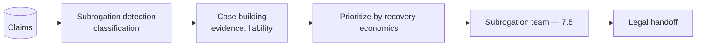
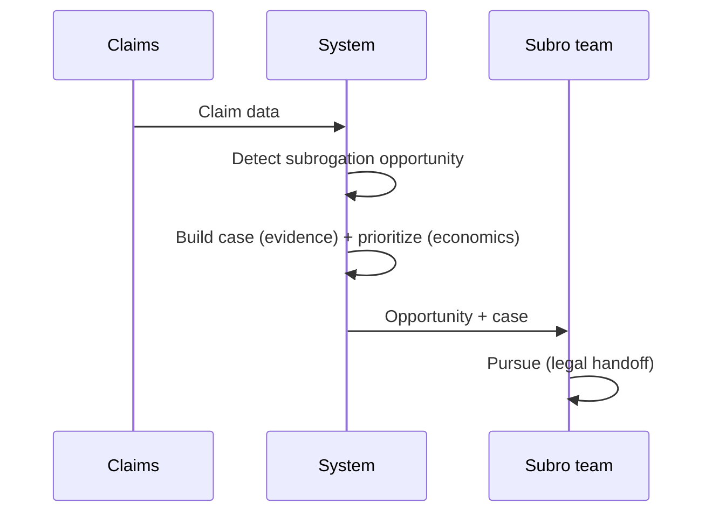
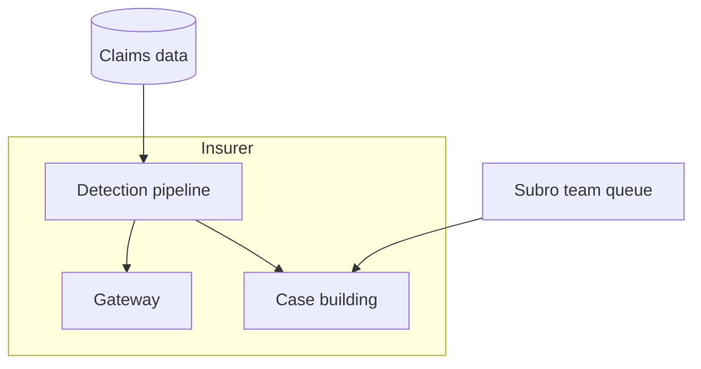

# Case Study CS30 — Subrogation Opportunity Detection

| | |
|---|---|
| **Industry** | Insurance |
| **Company profile** | Kestrel Assurance — fictional insurer, claims/recovery operations |
| **System type** | Classification + case building |
| **Maturity level exercised** | 3 Engineer → 4 Architect |

## Business Problem

Subrogation (recovering claim costs from a liable third party) opportunities are often missed — buried in claim details, requiring manual identification, which leaves recovery money on the table. The goal: a system that analyzes claims to detect subrogation opportunities, builds the recovery case, and routes to the subrogation team. The defining challenges: recovery economics (the value is the recovered money vs. the pursuit cost) and the legal handoff (the case must support legal pursuit). Target: detect missed subrogation opportunities, build supportable cases, positive recovery economics.

## Stakeholders

| Stakeholder | Role | What they care about | Success measure |
|-------------|------|----------------------|-----------------|
| Subrogation team | Users | Opportunity detection, case quality | Opportunities detected, recovery |
| Recovery manager | Sponsor | Recovery amount | Recovery $ |
| Legal | Downstream | Case supportability | Case quality |
| Claims | Data owners | Data access | Data quality |

## Requirements

### Functional
- FR-1: Analyze claims for subrogation opportunities (classification).
- FR-2: Build the recovery case (evidence, liability basis).
- FR-3: Route to subrogation team with the case.
- FR-4: Support legal handoff.

### Non-functional
- NFR-1 (Economics): Positive recovery economics (recovery > pursuit cost); prioritize high-value.
- NFR-2 (Case quality): Cases support legal pursuit (evidence-based).
- NFR-3 (Accuracy): Accurate opportunity detection (precision + recall).

### Constraints
- Recovery economics (the defining constraint — pursue where it pays); legal supportability; claim data.

## Architecture

Classification (subrogation opportunity) + case building (evidence-attributed) + economic prioritization + human subrogation team (7.5). The recovery-economics prioritization and legal-supportability are defining.

## Sequence Diagram

## Deployment Diagram

## Threat Model

| Threat | Vector | Impact | Likelihood | Mitigation |
|--------|--------|--------|------------|------------|
| Missed opportunity | Detection recall gap | Lost recovery | Med | Recall-tuned detection, review |
| Weak case | Poor case building | Failed pursuit | Med | Evidence-based cases, legal review |
| False opportunity | Precision failure | Wasted pursuit | Med | Precision balance, economic prioritization |

## Cost Estimation

| Item | Assumption | Monthly |
|------|-----------|---------|
| Detection + case building | Claim volume, batch | ~$18K |
| Retrieval + data | Claims corpus | ~$5K |
| **Total** | | **~$23K** |

Positive ROI (recovery >> cost). Optimization: batch, tiering (7.8).

## Scaling Strategy

Batch analysis of claims. Detection scales with claim volume (batch lanes — 7.8); subrogation team capacity-bounded. Prioritization ensures the high-value cases surface.

## Monitoring Strategy

Economics + quality: recovery amount (the business metric), opportunity detection rate (recall/precision), case-pursuit success, economic prioritization effectiveness. Recovery $ vs. cost is the key metric.

## Lessons Learned

1. **Recovery economics drive prioritization** — pursue where the recovery exceeds the pursuit cost; the economic prioritization surfaces the high-value opportunities first.
2. **Cases must support legal pursuit** — evidence-based case building (not just detection) is what makes the opportunity actionable; the legal handoff needs a supportable case.
3. **Recall matters for missed opportunities** — the value is in catching missed opportunities; detection tuned for recall (with precision managed) maximizes recovery.

---

**Related chapters:** [2.7 Evaluating ML](../curriculum/part-2-artificial-intelligence/chapter-07-evaluating-ml-systems.md), [7.3 Workflow Patterns](../curriculum/part-7-enterprise-ai-architecture-patterns/chapter-03-workflow-patterns.md), [4.11 Cost Engineering](../curriculum/part-4-enterprise-genai-systems/chapter-11-cost-engineering.md) · **Related patterns:** Routing (7.3), Human-in-the-Loop (7.5), Batch Lanes (7.8) · **Similar case studies:** [CS27](cs27-claims-intake-summarization.md), [CS14](cs14-returns-complaints-automation.md)
