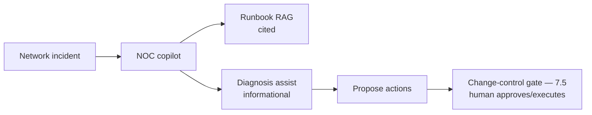
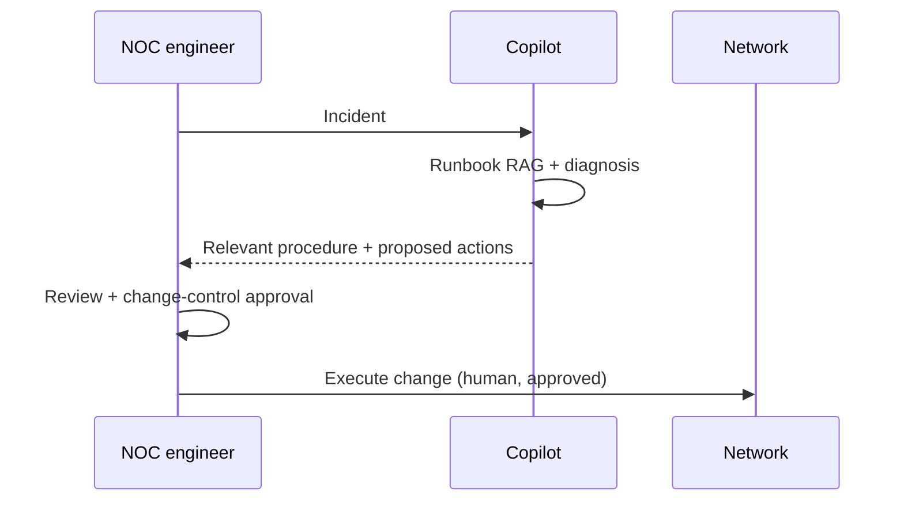
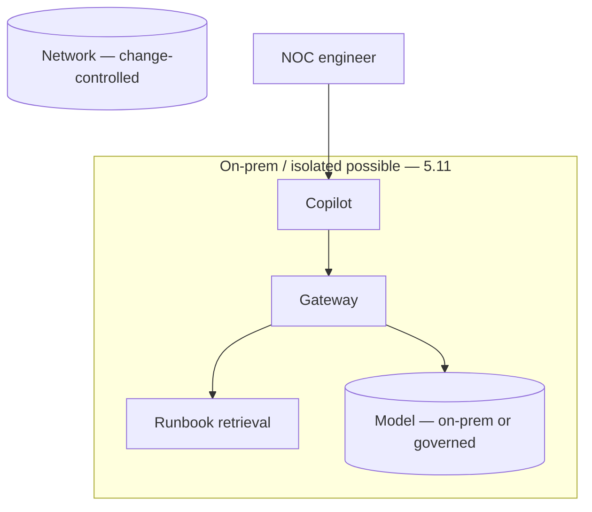

# Case Study CS31 — Network Operations Copilot

| | |
|---|---|
| **Industry** | Telecommunications |
| **Company profile** | Telnet Communications — fictional telecom, network operations center (NOC) |
| **System type** | RAG + runbook agent, change-control-safe |
| **Maturity level exercised** | 4 Architect |

## Business Problem

NOC engineers respond to network incidents by consulting runbooks and executing procedures — under time pressure (incidents affect service), with change-control constraints (network changes are governed), and often on-prem/isolated infrastructure. The goal: a copilot that surfaces the relevant runbook/procedure for an incident and assists (with strong change-control safety — the copilot informs and proposes, humans execute and approve changes). The defining challenges: change-control safety (network changes are high-blast-radius), incident latency, and on-prem constraints. Target: faster incident response, change-control-safe, on-prem-capable.

## Stakeholders

| Stakeholder | Role | What they care about | Success measure |
|-------------|------|----------------------|-----------------|
| NOC engineers | Users | Fast runbook access, safety | Incident response time |
| NOC manager | Sponsor | MTTR, safety | MTTR |
| Change control | Gatekeeper | Change safety | Zero unauthorized changes |
| Network security | Gatekeeper | On-prem, isolation | Security compliance |

## Requirements

### Functional
- FR-1: Surface relevant runbook/procedure for an incident (RAG, cited).
- FR-2: Assist incident diagnosis (informational).
- FR-3: Change-control safety (propose changes; humans approve/execute — 7.5).

### Non-functional
- NFR-1 (Change safety): No autonomous network changes; change-control gates (7.5); high-blast-radius awareness.
- NFR-2 (Latency): Fast (incident urgency).
- NFR-3 (On-prem): Deployable on-prem/isolated where required (5.11).

### Constraints
- Change-control (the defining safety constraint); incident latency; on-prem/isolation possible.

## Architecture

RAG (7.2, runbooks) + diagnosis assist (informational) + change-control gates (7.5 — the copilot proposes, humans approve/execute — no autonomous network changes). On-prem-capable (5.11) where required.

## Sequence Diagram

## Deployment Diagram

## Threat Model

| Threat | Vector | Impact | Likelihood | Mitigation |
|--------|--------|--------|------------|------------|
| Autonomous network change | Bypass | Service outage (high blast radius) | Low | Change-control gates (7.5), no autonomous execution |
| Wrong procedure | Hallucination | Wrong action, outage | Med | Citation-first, engineer review |
| Stale runbook | Freshness | Wrong procedure | Med | Freshness pipeline (7.7) |
| On-prem data exposure | Isolation breach | Security | Low | On-prem deployment, isolation (5.11) |

## Cost Estimation

| Item | Assumption | Monthly |
|------|-----------|---------|
| Inference | NOC incidents, tiered (or on-prem self-host) | ~$20K (or self-host — 5.2) |
| Retrieval + runbooks | Runbook corpus | ~$6K |
| **Total** | | **~$26K (managed) / higher self-host** |

Dominant: incident volume. On-prem self-host changes the cost (5.2). Optimization: tiering (7.8).

## Scaling Strategy

Incident-driven (spiky during outages). Copilot scales with incident volume; latency-critical during incidents. On-prem deployment (5.11) where required — self-hosted serving (5.3).

## Monitoring Strategy

Safety + quality: change-control compliance (no autonomous changes — the critical control), procedure accuracy, runbook freshness, incident-response-time (MTTR). Change-control-gate monitoring is the safety-critical metric.

## Lessons Learned

1. **Change-control is the safety keystone** — network changes are high-blast-radius (service outages); the copilot proposes, humans approve and execute (7.5) — no autonomous network changes, ever.
2. **On-prem may be required** — isolated network infrastructure may require on-prem/self-hosted deployment (5.11/5.3); the deployment respects the isolation.
3. **Freshness of runbooks matters** — a stale runbook is a wrong procedure; the freshness pipeline (7.7) keeps runbooks current.

---

**Related chapters:** [7.5 Human-in-the-Loop](../curriculum/part-7-enterprise-ai-architecture-patterns/chapter-05-human-in-the-loop-patterns.md), [5.11 Multi-cloud/Hybrid/Sovereignty](../curriculum/part-5-cloud-infrastructure-platform/chapter-11-multicloud-hybrid-sovereignty.md), [3.6 RAG](../curriculum/part-3-core-building-blocks-of-genai/chapter-06-rag-fundamentals.md) · **Related patterns:** Approval Gate (7.5), Freshness Pipeline (7.7), Citation-First (7.2) · **Similar case studies:** [CS05](cs05-hospital-knowledge-hub.md), [CS41](cs41-incident-postmortem-assistant.md)
