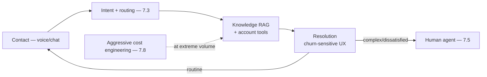
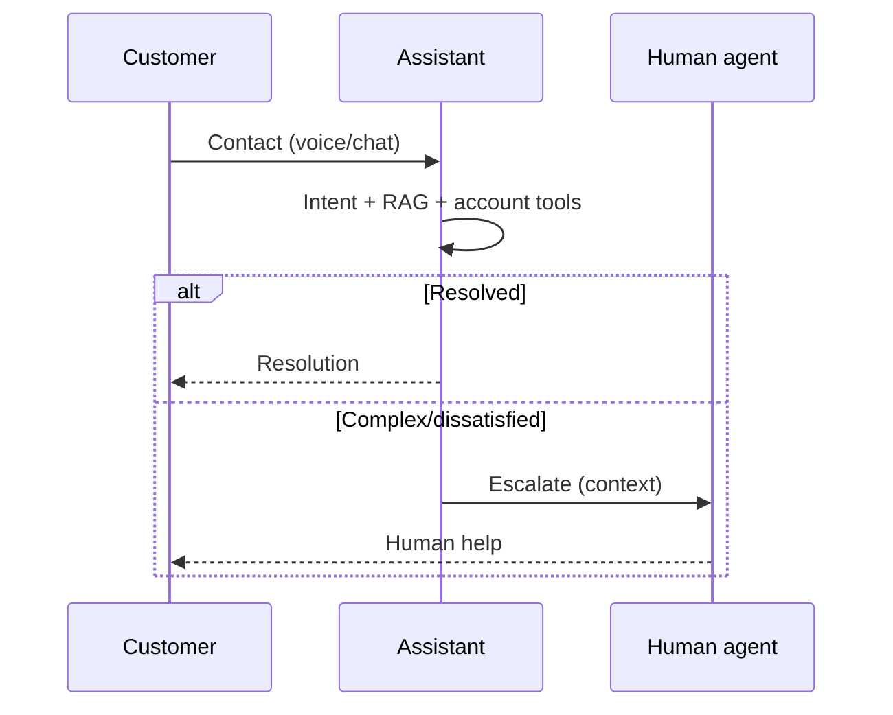
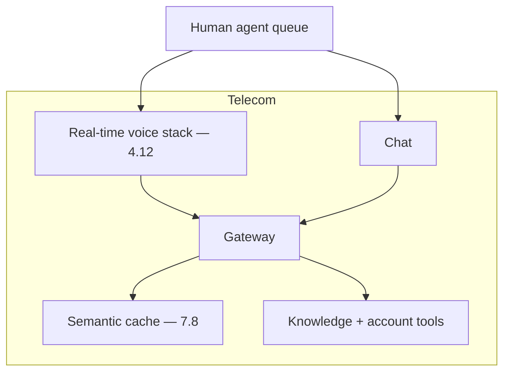

# Case Study CS32 — Customer Care Deflection

| | |
|---|---|
| **Industry** | Telecommunications |
| **Company profile** | Telnet Communications — fictional telecom, customer care, very high volume |
| **System type** | Voice + chat assistant, extreme-volume economics |
| **Maturity level exercised** | 4 Architect |

## Business Problem

Telecom customer care is very high volume (millions of contacts) and expensive; deflecting routine contacts (billing, technical, account) to an assistant has enormous cost impact — but the volume makes unit economics critical, and churn-sensitivity makes UX critical (a bad experience loses a customer). The goal: a voice + chat assistant deflecting routine contacts, with extreme-volume cost economics and churn-sensitive UX. The defining challenges: very high volume economics (7.8 at scale) and churn-sensitive UX (deflection paired with satisfaction). Target: significant deflection, positive unit economics at extreme volume, churn-neutral-or-positive UX.

## Stakeholders

| Stakeholder | Role | What they care about | Success measure |
|-------------|------|----------------------|-----------------|
| Customers | Users | Fast, effective, satisfying help | CSAT, resolution |
| Care operations | Sponsor | Deflection, cost | Deflection, cost per contact |
| Finance | Gatekeeper | Unit economics at volume | Cost per contact |
| Retention/Marketing | Gatekeeper | Churn (UX quality) | Churn impact |

## Requirements

### Functional
- FR-1: Handle routine contacts (billing, technical, account) via voice + chat.
- FR-2: Resolve or route (escalation for the rest).
- FR-3: Churn-sensitive UX (satisfying, not frustrating).

### Non-functional
- NFR-1 (Economics): Positive unit economics at extreme volume (millions of contacts — 7.8).
- NFR-2 (UX): Churn-neutral-or-positive; deflection paired with CSAT (1.2).
- NFR-3 (Latency): Voice real-time (4.12); chat fast.

### Constraints
- Extreme volume economics (the defining constraint); churn-sensitivity; voice latency; deflection paired with satisfaction.

## Architecture

Voice + chat (real-time voice — 4.12) + RAG (7.2) + account tools (3.7) + routing (7.3) + escalation (7.5). Aggressive cost engineering (7.8) at extreme volume; deflection paired with CSAT (1.2).

## Sequence Diagram

## Deployment Diagram

## Threat Model

| Threat | Vector | Impact | Likelihood | Mitigation |
|--------|--------|--------|------------|------------|
| Churn from bad UX | Poor deflection | Customer loss | Med-High | CSAT-paired deflection (1.2), escalation on dissatisfaction |
| Cost overrun at volume | Un-engineered | Budget (huge at scale) | Med | Aggressive cost engineering (7.8), semantic caching |
| Account action fraud | Tool abuse | Fraud | Med | Authenticated, gated actions (7.5/4.9) |
| Wrong answer | Hallucination | Frustration, wrong action | Med | Grounding, citation |

## Cost Estimation

| Item | Assumption | Monthly |
|------|-----------|---------|
| Inference (voice + chat) | Millions of contacts, aggressive tiering + caching | ~$400K |
| Voice stack | Real-time | ~$150K |
| **Total** | | **~$550K** |

Dominant: extreme volume. Optimization: THE cost case — tiering, semantic caching (FAQ-shaped), compact models (7.8); every lever matters at this volume.

## Scaling Strategy

Extreme, spiky volume (outages, billing cycles). Stateless assistant scales horizontally; voice stack scales for concurrency; semantic caching relieves provider limits (5.8/7.8). Provider capacity pooled, provisioned throughput for the interactive lane (5.4).

## Monitoring Strategy

Economics + UX: cost per contact (the extreme-volume metric — 7.8), deflection paired with CSAT and churn (1.2), resolution rate, escalation-on-dissatisfaction, voice latency (4.12). Cost per contact and churn impact are the critical metrics.

## Lessons Learned

1. **Extreme volume makes cost engineering the architecture** — millions of contacts makes every cost lever (tiering, semantic caching, compact models — 7.8) essential; the unit economics decide viability.
2. **Deflection paired with CSAT and churn** (1.2) — deflecting at the cost of customer satisfaction loses customers; the paired metrics (CSAT, churn) keep deflection honest, with escalation on dissatisfaction.
3. **Voice latency is real-time** — the voice path (4.12) needs the real-time stack; latency is a churn factor.

---

**Related chapters:** [4.11 Cost Engineering](../curriculum/part-4-enterprise-genai-systems/chapter-11-cost-engineering.md), [4.12 Latency](../curriculum/part-4-enterprise-genai-systems/chapter-12-latency-performance.md), [7.8 Cost & Performance Patterns](../curriculum/part-7-enterprise-ai-architecture-patterns/chapter-08-cost-performance-patterns.md) · **Related patterns:** Semantic Caching (7.8), Model Tiering (7.8), Escalation (7.5) · **Similar case studies:** [CS02](cs02-patient-portal-triage-chatbot.md), [CS09](cs09-retail-bank-support-assistant.md)
