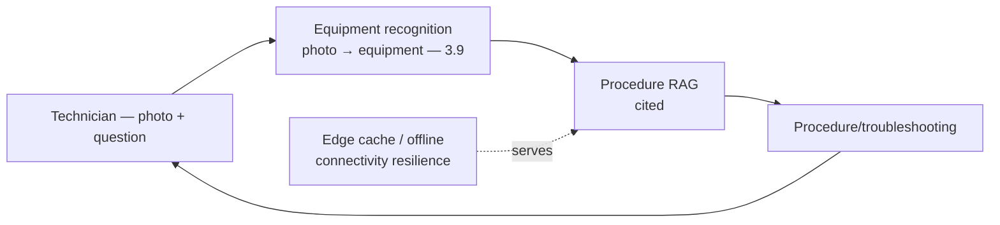
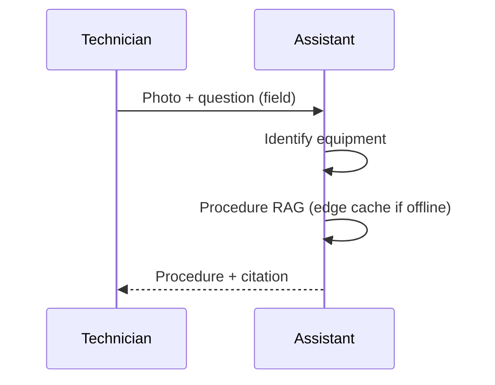
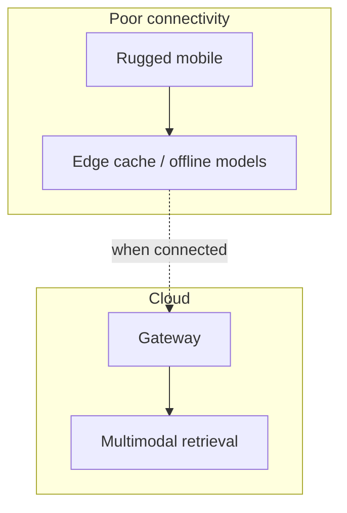

# Case Study CS33 — Field Technician Assistant

| | |
|---|---|
| **Industry** | Telecommunications |
| **Company profile** | Telnet Communications — fictional telecom, field service operations |
| **System type** | Mobile multimodal RAG (connectivity gaps, equipment recognition) |
| **Maturity level exercised** | 3 Engineer → 4 Architect |

## Business Problem

Field technicians install and repair telecom equipment at customer sites and in the field — needing procedures, equipment identification, and troubleshooting, often with poor connectivity and hands full. The goal: a mobile multimodal assistant that identifies equipment (photo), provides procedures, and troubleshoots, robust under connectivity gaps. The defining challenges: connectivity gaps (field locations), equipment recognition (multimodal), and mobile/hands-variable UX. Target: faster field resolution, equipment-recognition accuracy, connectivity-resilient.

## Stakeholders

| Stakeholder | Role | What they care about | Success measure |
|-------------|------|----------------------|-----------------|
| Field technicians | Users | Procedures, equipment ID, works in field | Resolution time, adoption |
| Field ops manager | Sponsor | First-time-fix, efficiency | First-time-fix rate |
| IT | Operator | Mobile, connectivity | Reliability |

## Requirements

### Functional
- FR-1: Identify equipment from photos (multimodal — 3.9).
- FR-2: Provide procedures/troubleshooting (RAG, cited).
- FR-3: Robust under connectivity gaps (edge caching/offline).

### Non-functional
- NFR-1 (Equipment recognition): Accurate equipment/part ID from photos (3.9).
- NFR-2 (Connectivity): Graceful under poor/no connectivity (edge/offline capability).
- NFR-3 (Mobile UX): Field-usable (hands-variable, rugged).

### Constraints
- Connectivity gaps (the defining constraint); equipment recognition; mobile/field environment.

## Architecture

Multimodal (3.9, equipment recognition) + RAG (7.2, procedures) + edge/offline resilience (connectivity gaps). Similar to CS13/CS15 (mobile field RAG) with connectivity + equipment-recognition emphasis.

## Sequence Diagram

## Deployment Diagram

## Threat Model

| Threat | Vector | Impact | Likelihood | Mitigation |
|--------|--------|--------|------------|------------|
| Connectivity failure | Field location | Unavailable | High | Edge caching, offline capability, graceful degradation |
| Wrong equipment ID | Multimodal error | Wrong procedure | Med | Recognition accuracy, confidence, citation to verify (3.9) |
| Wrong procedure | Hallucination | Field error | Med | Citation-first, procedure grounding |

## Cost Estimation

| Item | Assumption | Monthly |
|------|-----------|---------|
| Multimodal inference | Field technicians, photo queries | ~$18K |
| Retrieval + edge | Procedures, edge cache | ~$6K |
| **Total** | | **~$24K** |

Dominant: multimodal field queries. Optimization: edge caching (common procedures), tiering (7.8).

## Scaling Strategy

Field-activity-driven. Multimodal inference scales; edge caching for offline resilience and common procedures. Field-schedule-driven load.

## Monitoring Strategy

Quality + resilience: equipment-recognition accuracy, procedure accuracy, connectivity-failure handling, first-time-fix rate (the business metric). Connectivity-resilience and recognition accuracy are key monitors.

## Lessons Learned

1. **Connectivity resilience is the field requirement** — field locations have poor connectivity; edge caching and offline capability keep the assistant usable where the network isn't.
2. **Equipment recognition needs multimodal accuracy** — identifying equipment from photos (3.9) is the field value; recognition accuracy plus citation-to-verify.
3. **Field UX like the store floor** (CS13) — hands-variable, rugged, fast; designed for the field, not the desk.

---

**Related chapters:** [3.9 Multimodal](../curriculum/part-3-core-building-blocks-of-genai/chapter-09-multimodal-models.md), [3.6 RAG](../curriculum/part-3-core-building-blocks-of-genai/chapter-06-rag-fundamentals.md), [4.12 Latency](../curriculum/part-4-enterprise-genai-systems/chapter-12-latency-performance.md) · **Related patterns:** Citation-First (7.2), Semantic Caching (7.8), Freshness Pipeline (7.7) · **Similar case studies:** [CS13](cs13-store-operations-copilot.md), [CS15](cs15-maintenance-manual-assistant.md)
