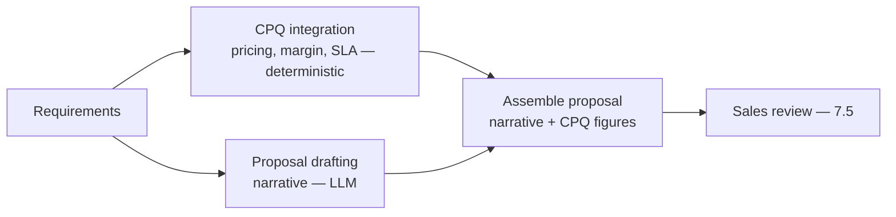
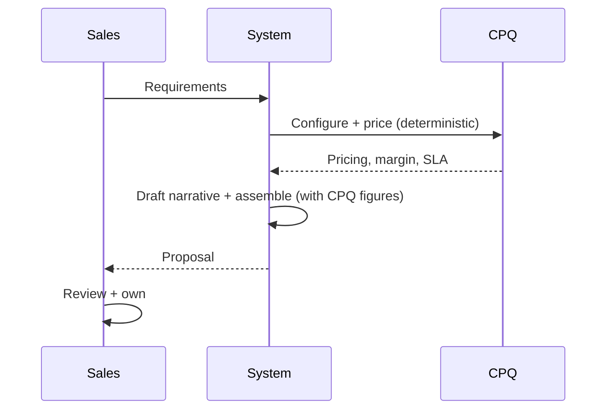
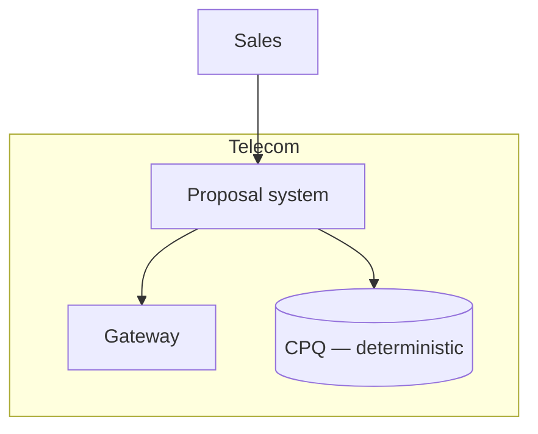

# Case Study CS34 — B2B Proposal Automation

| | |
|---|---|
| **Industry** | Telecommunications |
| **Company profile** | Telnet Communications — fictional telecom, B2B sales |
| **System type** | Document generation (CPQ integration, margin/SLA correctness) |
| **Maturity level exercised** | 3 Engineer → 4 Architect |

## Business Problem

B2B telecom proposals (custom connectivity/services with pricing, SLAs, terms) are complex and slow to produce, and correctness on margin and SLAs is critical (a wrong SLA or margin is a costly commitment). The goal: a proposal-generation system that drafts proposals from requirements, integrating with CPQ (configure-price-quote) for pricing, with margin and SLA correctness. The defining challenge: correctness on margin/SLA (the CPQ computes; the LLM assembles the narrative — the correctness split, like CS18). Target: faster proposals, correct margin/SLA, sales-adopted.

## Stakeholders

| Stakeholder | Role | What they care about | Success measure |
|-------------|------|----------------------|-----------------|
| B2B sales | Users | Speed, correctness | Proposal time |
| Sales leadership | Sponsor | Win rate, margin | Win rate, margin |
| Finance | Gatekeeper | Margin correctness | Margin |
| Legal/Ops | Gatekeeper | SLA correctness | SLA compliance |

## Requirements

### Functional
- FR-1: Draft proposals from requirements (narrative + structure).
- FR-2: Integrate with CPQ for pricing (CPQ computes — the correctness split).
- FR-3: Margin and SLA correctness (from CPQ/rules, not the LLM).

### Non-functional
- NFR-1 (Correctness): Margin/SLA computed by CPQ/rules (deterministic); the LLM assembles narrative.
- NFR-2 (Quality): Professional, accurate proposals.
- NFR-3 (Speed): Faster than manual.

### Constraints
- Margin/SLA correctness (the defining constraint — deterministic where it matters); CPQ integration; proposal quality.

## Architecture

Narrative drafting (LLM — green zone) + CPQ integration (deterministic pricing/margin/SLA — the correctness split, like CS18) + assembly + human review (7.5). The LLM never computes margin/SLA — the CPQ does.

## Sequence Diagram

## Deployment Diagram

## Threat Model

| Threat | Vector | Impact | Likelihood | Mitigation |
|--------|--------|--------|------------|------------|
| Wrong margin/SLA | LLM computes | Costly commitment | Med | CPQ computes (deterministic — 3.1); LLM assembles only |
| Inaccurate proposal narrative | Hallucination | Wrong terms | Med | Grounding, sales review |
| CPQ integration error | Bad data | Wrong figures | Med | CPQ validation, review |

## Cost Estimation

| Item | Assumption | Monthly |
|------|-----------|---------|
| Inference | Proposal volume, tiered | ~$12K |
| CPQ integration | Existing | ~$3K |
| **Total** | | **~$15K** |

Dominant: proposal volume. Optimization: tiering (7.8).

## Scaling Strategy

Sales-volume-driven. Proposal generation scales; CPQ (existing) scales independently. Business-hours load.

## Monitoring Strategy

Quality + correctness: margin/SLA correctness (from CPQ, verified), proposal quality, win rate, the correctness split (no LLM-computed figures). Margin/SLA correctness is the critical monitor.

## Lessons Learned

1. **CPQ computes, the LLM assembles** — margin and SLA are computed by the deterministic CPQ (the correctness-critical figures — 3.1); the LLM assembles the narrative around them. Same pattern as CS18.
2. **The correctness split protects commitments** — a wrong margin or SLA is a costly commitment; the deterministic computation prevents it.
3. **Sales owns the proposal** — the sales rep reviews and owns the proposal (7.5); the system drafts.

---

**Related chapters:** [3.1 LLM Limits](../curriculum/part-3-core-building-blocks-of-genai/chapter-01-llm-capabilities-limits.md), [3.7 Tool Use](../curriculum/part-3-core-building-blocks-of-genai/chapter-07-function-calling-tool-use.md), [6.4 Enterprise Integration](../curriculum/part-6-enterprise-architecture/chapter-04-enterprise-integration.md) · **Related patterns:** Routing (7.3), Human-in-the-Loop (7.5), Anti-corruption layer (6.4) · **Similar case studies:** [CS18](cs18-sales-engineering-quote-copilot.md), [CS12](cs12-conversational-shopping-assistant.md)
