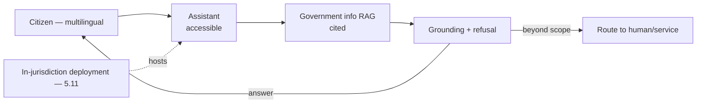
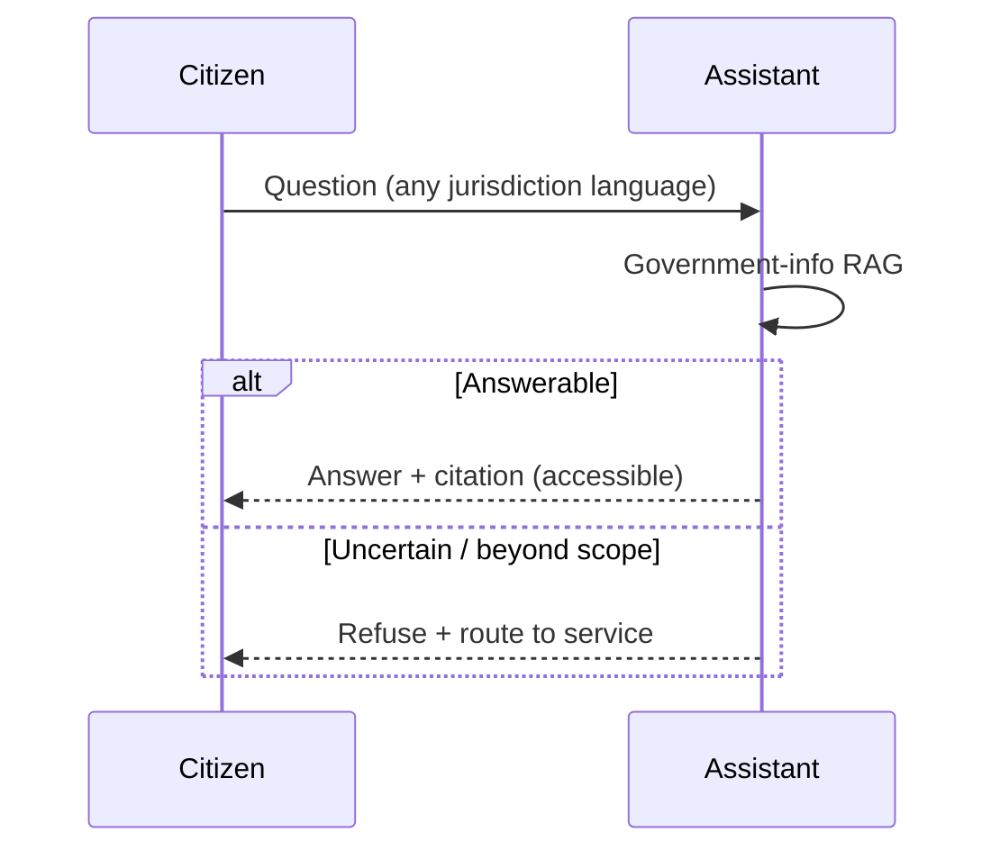
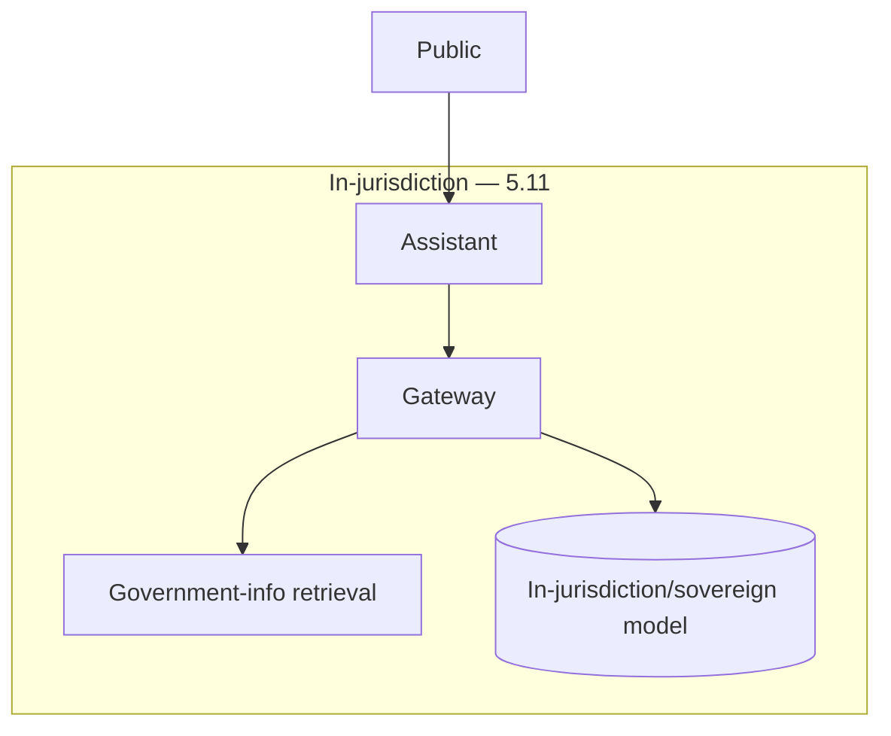

# Case Study CS35 — Citizen Services Portal Assistant

| | |
|---|---|
| **Industry** | Government |
| **Company profile** | Regional government agency — fictional, citizen services, sovereignty + accessibility regulated |
| **System type** | Multilingual public RAG |
| **Maturity level exercised** | 4 Architect |

## Business Problem

Citizens navigate complex government services (benefits, permits, taxes, records) — hard to find the right information, especially across languages and accessibility needs. The goal: a public-facing assistant answering citizen questions from government information, multilingual, accessible, sovereignty-compliant. The defining challenges: accessibility (statutory public-sector duty), sovereignty (citizen data must stay in-jurisdiction — 5.11), and the political-risk of errors (a wrong answer from a government service is a public trust and political issue). Target: better citizen access, multilingual, accessible, sovereignty-compliant, low error rate.

## Stakeholders

| Stakeholder | Role | What they care about | Success measure |
|-------------|------|----------------------|-----------------|
| Citizens | Users | Accessible, accurate, multilingual help | Access, satisfaction |
| Agency leadership | Sponsor | Service quality, cost | Service metrics |
| Accessibility office | Gatekeeper | Statutory accessibility | Accessibility compliance |
| Data sovereignty/Legal | Gatekeeper | In-jurisdiction data | Sovereignty compliance |
| Public/Political | Stakeholder | Trust, no errors | Trust, error rate |

## Requirements

### Functional
- FR-1: Answer citizen questions from government info (RAG, cited).
- FR-2: Multilingual (jurisdiction languages).
- FR-3: Accessible (statutory accessibility standards).
- FR-4: Refuse/escalate beyond scope (no invented policy).

### Non-functional
- NFR-1 (Sovereignty): Citizen data + processing in-jurisdiction (5.11).
- NFR-2 (Accessibility): Statutory accessibility compliance.
- NFR-3 (Accuracy): Low error rate (political-risk); grounded, cited, refuse-on-uncertain.
- NFR-4 (Multilingual): Jurisdiction languages, per-language quality.

### Constraints
- Sovereignty (the defining constraint — in-jurisdiction — 5.11); statutory accessibility; political-risk of errors; multilingual.

## Architecture

Multilingual public RAG (7.2) + accessibility + sovereign deployment (5.11 — in-jurisdiction, possibly a capable in-region/sovereign model). Refusal on uncertain (political-risk). Accessibility and sovereignty are defining.

## Sequence Diagram

## Deployment Diagram

## Threat Model

| Threat | Vector | Impact | Likelihood | Mitigation |
|--------|--------|--------|------------|------------|
| Wrong government info | Hallucination | Public harm, political issue | Med-High | Grounding, citation, refuse-on-uncertain |
| Sovereignty breach | Data leaves jurisdiction | Legal/sovereignty violation | Med | In-jurisdiction deployment (5.11) |
| Accessibility failure | Non-compliant UX | Statutory violation, exclusion | Med | Accessibility standards, testing |
| Language quality gap | Poor per-language | Inequitable access | Med | Per-language quality floors (2.4) |

## Cost Estimation

| Item | Assumption | Monthly |
|------|-----------|---------|
| Inference | Public volume, in-jurisdiction model (possibly self-host — 5.11) | ~$40K (or self-host cost) |
| Retrieval + accessibility | Government corpus | ~$10K |
| **Total** | | **~$50K (managed) / higher sovereign** |

Dominant: public volume. Sovereign deployment changes cost (5.11). Optimization: caching, tiering (7.8).

## Scaling Strategy

Public, spiky (deadlines, events). Assistant scales horizontally within the sovereign boundary; caching for common questions. Sovereign deployment (5.11) constrains to in-jurisdiction capacity.

## Monitoring Strategy

Accuracy + compliance: error rate (political-risk — low tolerance), sovereignty compliance (in-jurisdiction), accessibility compliance, per-language quality (equity — 2.4). Error rate and sovereignty/accessibility compliance are critical.

## Lessons Learned

1. **Sovereignty may require in-jurisdiction deployment** — citizen data and processing must stay in-jurisdiction (5.11); this may mean a capable in-region/sovereign model (accepting the capability trade — 5.11).
2. **Errors carry political risk** — a wrong government answer is a public-trust and political issue; grounding, citation, and refuse-on-uncertain keep the error rate low.
3. **Accessibility is statutory** — public-sector accessibility is a legal duty; the assistant must meet accessibility standards, and multimodal capability (voice) can be an accessibility asset (3.9).

---

**Related chapters:** [5.11 Sovereignty](../curriculum/part-5-cloud-infrastructure-platform/chapter-11-multicloud-hybrid-sovereignty.md), [2.8 Responsible AI](../curriculum/part-2-artificial-intelligence/chapter-08-responsible-ai.md), [3.6 RAG](../curriculum/part-3-core-building-blocks-of-genai/chapter-06-rag-fundamentals.md) · **Related patterns:** Citation-First (7.2), Escalation (7.5), Freshness Pipeline (7.7) · **Similar case studies:** [CS19](cs19-university-student-advisor.md), [CS36](cs36-caseworker-decision-support.md)
