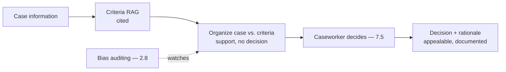
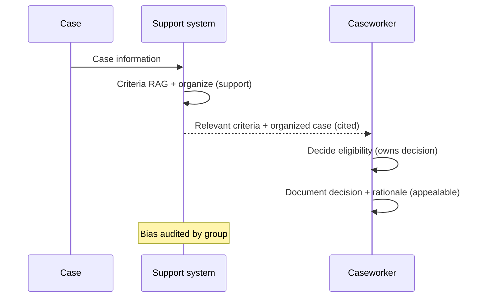
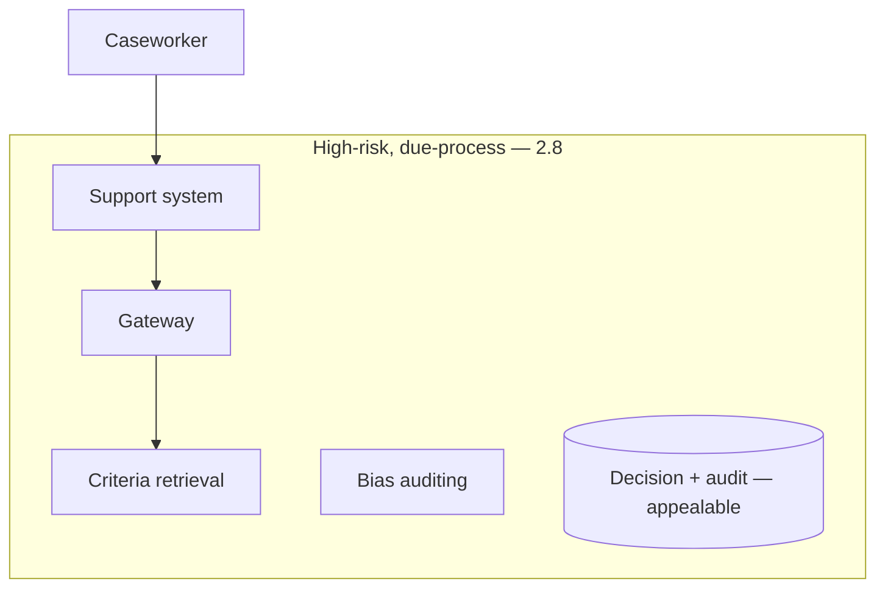

# Case Study CS36 — Caseworker Decision Support

| | |
|---|---|
| **Industry** | Government |
| **Company profile** | Government social services agency — fictional, benefits/eligibility, due-process regulated |
| **System type** | RAG + structured criteria, due-process-critical |
| **Maturity level exercised** | 4 Architect |

## Business Problem

Caseworkers determine benefit eligibility by applying complex criteria to case information — slow, and the decisions affect people's access to essential services (due process, appealability, and bias are acute concerns). The goal: a decision-support system that surfaces relevant criteria and organizes case information for the caseworker, who makes the eligibility decision — with due process (appealable, documented), bias auditing, and no autonomous decisions. The defining challenges: due process (appealable decisions), bias (life-affecting decisions), and the human-decision requirement. Target: faster case processing, due-process-compliant, bias-audited, human decisions.

## Stakeholders

| Stakeholder | Role | What they care about | Success measure |
|-------------|------|----------------------|-----------------|
| Caseworkers | Users | Criteria support, case organization | Processing time |
| Benefits recipients | Affected | Fair, appealable decisions | Fairness, appeal outcomes |
| Agency leadership | Sponsor | Efficiency, fairness | Efficiency, fairness |
| Legal/Oversight | Gatekeeper | Due process, bias, appealability | Due-process compliance |

## Requirements

### Functional
- FR-1: Surface relevant eligibility criteria (RAG, cited).
- FR-2: Organize case information against criteria (support, not decide).
- FR-3: Caseworker makes the decision (7.5 — human decides).
- FR-4: Document decisions (appealable, traceable).

### Non-functional
- NFR-1 (Due process): Decisions appealable, documented, traceable (2.8's procedural fairness).
- NFR-2 (Bias): Bias audited across recipient groups (2.8 — high-risk).
- NFR-3 (Human decision): No autonomous eligibility decisions.

### Constraints
- Due process (the defining constraint — appealability); bias (high-risk — 2.8); human decision required; essential-services impact.

## Architecture

RAG (7.2, criteria) + case organization (support, not decision) + human decision (7.5) + due-process documentation + bias auditing (2.8). The human-decision requirement and due-process documentation are defining (like CS22 admissions — high-risk, human decides).

## Sequence Diagram

## Deployment Diagram

## Threat Model

| Threat | Vector | Impact | Likelihood | Mitigation |
|--------|--------|--------|------------|------------|
| Autonomous eligibility decision | Scope creep | Un-appealable automated decision | Low | Support-only; caseworker decides (7.5) |
| Bias | Model/data bias | Discrimination in essential services | Med-High | Bias auditing by group (2.8), human decision |
| Un-appealable decision | Missing documentation | Due-process violation | Med | Decision + rationale documentation (2.8) |
| Wrong criteria surfaced | Retrieval error | Wrong decision basis | Med | Citation, caseworker review |

## Cost Estimation

| Item | Assumption | Monthly |
|------|-----------|---------|
| Inference | Case volume, tiered | ~$20K |
| Retrieval + bias auditing + audit | Criteria, monitoring | ~$8K |
| **Total** | | **~$28K** |

Dominant: case volume. Optimization: tiering (7.8).

## Scaling Strategy

Case-volume-driven. Support system scales; caseworker decisions capacity-bounded. Bias auditing on all cases. Sovereign/in-jurisdiction if required (5.11).

## Monitoring Strategy

Due process + bias: bias metrics by group (the high-risk requirement — 2.8), due-process documentation completeness, appeal outcomes, no-autonomous-decision compliance, criteria accuracy. Bias auditing and due-process are critical.

## Lessons Learned

1. **The caseworker decides, always** — eligibility is a high-risk, life-affecting decision (2.8); the system supports (criteria, organization), the caseworker decides (7.5). The autonomous-decision line is the due-process boundary.
2. **Due process demands documentation** — decisions must be appealable and documented (2.8's procedural fairness); the decision + rationale documentation is the due-process control.
3. **Bias auditing is the fairness control** — essential-services decisions demand bias auditing by group (2.8); the high-risk tier obligations apply.

---

**Related chapters:** [2.8 Responsible AI](../curriculum/part-2-artificial-intelligence/chapter-08-responsible-ai.md), [7.5 Human-in-the-Loop](../curriculum/part-7-enterprise-ai-architecture-patterns/chapter-05-human-in-the-loop-patterns.md), [4.14 Privacy/Compliance](../curriculum/part-4-enterprise-genai-systems/chapter-14-privacy-compliance-governance.md) · **Related patterns:** Human-in-the-Loop (7.5), Citation-First (7.2) · **Similar case studies:** [CS22](cs22-admissions-document-processing.md), [CS44](cs44-recruiting-screening-support.md)
