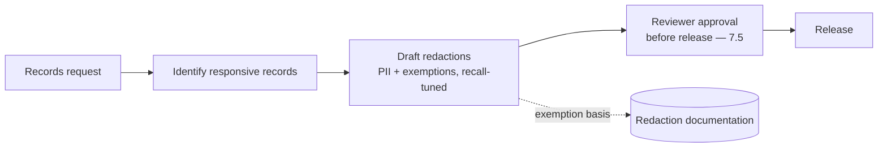
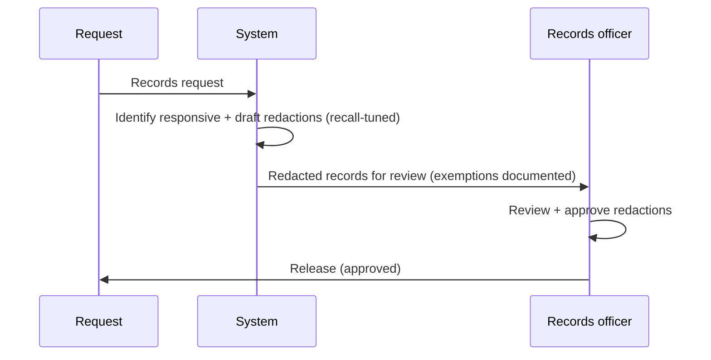
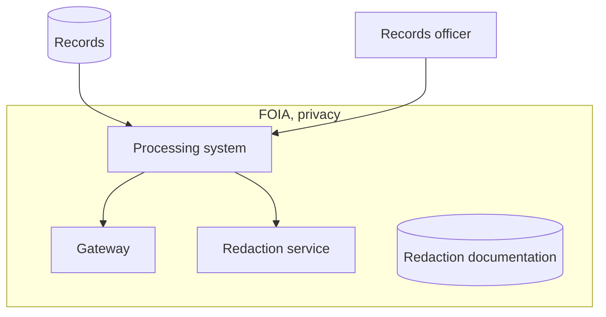

# Case Study CS37 — Public Records Request Processing

| | |
|---|---|
| **Industry** | Government |
| **Company profile** | Government agency — fictional, records/FOIA office, redaction-critical |
| **System type** | Redaction + workflow (FOIA-class rules, PII redaction at scale) |
| **Maturity level exercised** | 4 Architect |

## Business Problem

Public records requests (FOIA-class) require finding responsive records and redacting exempt/sensitive information before release — labor-intensive and error-critical (an unredacted PII disclosure is a privacy breach and legal liability). The goal: a system that identifies responsive records, drafts redactions per exemption rules, and routes to reviewers for approval before release. The defining challenges: PII/exemption redaction at scale (the redaction must be complete — a miss is a breach) and FOIA-class rules. Target: faster request processing, complete redaction (no missed PII/exemptions), reviewer-approved release.

## Stakeholders

| Stakeholder | Role | What they care about | Success measure |
|-------------|------|----------------------|-----------------|
| Records officers | Users | Redaction support, speed | Processing time |
| Requesters | Beneficiary | Timely responses | Response time |
| Privacy/Legal | Gatekeeper | No missed redactions | Zero unredacted disclosures |
| Agency leadership | Sponsor | Compliance, efficiency | Compliance |

## Requirements

### Functional
- FR-1: Identify responsive records for a request.
- FR-2: Draft redactions per exemption rules (PII, exempt info).
- FR-3: Reviewer approval before release (7.5 — human approves).
- FR-4: Document redaction basis (exemption cited).

### Non-functional
- NFR-1 (Redaction completeness): No missed PII/exemptions (recall-critical — a miss is a breach).
- NFR-2 (Rules): FOIA-class exemption rules applied correctly.
- NFR-3 (Review): Reviewer approval before release; redaction basis documented.

### Constraints
- Redaction completeness (the defining constraint — a miss is a breach); FOIA-class rules; reviewer approval before release.

## Architecture

Responsive-record identification + redaction drafting (recall-tuned — a miss is a breach) + reviewer approval (7.5 — before release) + exemption documentation. The redaction completeness (recall) is the defining safety property.

## Sequence Diagram

## Deployment Diagram

## Threat Model

| Threat | Vector | Impact | Likelihood | Mitigation |
|--------|--------|--------|------------|------------|
| Missed PII/exemption | Redaction recall gap | Privacy breach, liability | Med-High | Recall-tuned redaction, reviewer approval (7.5), sampling |
| Over-redaction | Precision failure | Wrongful withholding, transparency failure | Med | Precision balance, reviewer judgment |
| Wrong exemption | Rule error | Wrong redaction | Med | Exemption rules, reviewer review |

## Cost Estimation

| Item | Assumption | Monthly |
|------|-----------|---------|
| Redaction inference | Request volume, document-heavy | ~$25K |
| Retrieval + documentation | Records, redaction docs | ~$8K |
| **Total** | | **~$33K** |

Dominant: document-heavy redaction. Optimization: batch, tiering (7.8).

## Scaling Strategy

Request-volume-driven. Redaction scales with document volume (batch lanes — 7.8); reviewer approval capacity-bounded. Recall-critical redaction on all records.

## Monitoring Strategy

Redaction-completeness-first: missed-redaction rate (zero tolerance — recall, bypass-sampled), over-redaction rate (transparency balance), exemption-rule accuracy, reviewer-approval compliance. The missed-redaction rate is the critical safety metric.

## Lessons Learned

1. **Redaction is recall-critical** — a missed PII/exemption is a privacy breach; the redaction is recall-tuned (over-redact rather than miss) with reviewer approval and sampling as the completeness controls.
2. **Reviewer approves before release** — no autonomous release; the records officer approves the redactions (7.5) before any release — the human is the final redaction check.
3. **Exemption basis is documented** — the redaction basis (exemption cited) is documented for FOIA-class defensibility and the transparency balance.

---

**Related chapters:** [4.8 Guardrails](../curriculum/part-4-enterprise-genai-systems/chapter-08-guardrails-content-safety.md), [7.5 Human-in-the-Loop](../curriculum/part-7-enterprise-ai-architecture-patterns/chapter-05-human-in-the-loop-patterns.md), [4.14 Privacy/Compliance](../curriculum/part-4-enterprise-genai-systems/chapter-14-privacy-compliance-governance.md) · **Related patterns:** Layered Filters (7.6), Human-in-the-Loop (7.5), Review Sampling (7.5) · **Similar case studies:** [CS24](cs24-ediscovery-triage.md), [CS46](cs46-hr-case-management-copilot.md)
