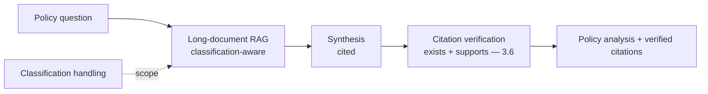
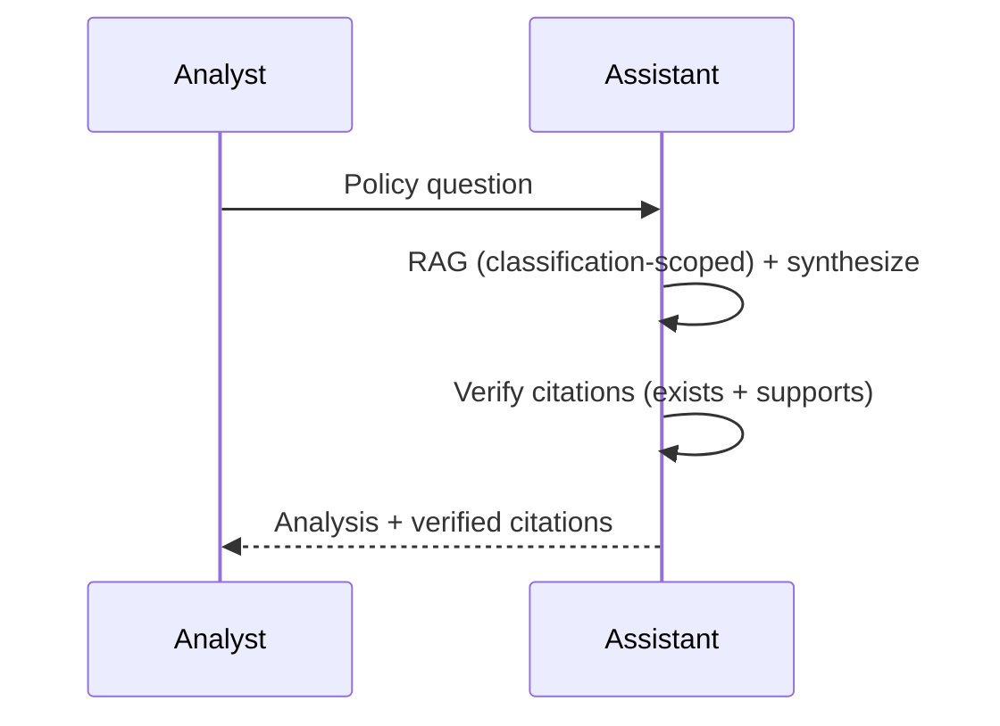
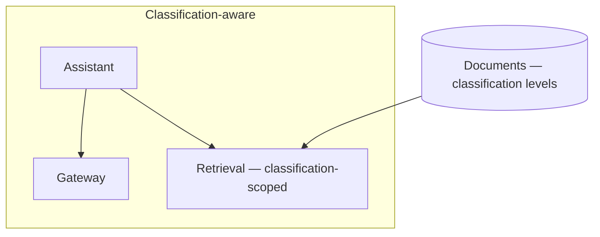

# Case Study CS38 — Policy Analysis Assistant

| | |
|---|---|
| **Industry** | Government |
| **Company profile** | Government policy office — fictional, legislative/policy analysis, classification-aware |
| **System type** | Long-document research with citation integrity |
| **Maturity level exercised** | 4 Architect |

## Business Problem

Policy analysts synthesize long, complex documents (legislation, regulations, reports, prior analyses) to produce policy analysis — time-intensive, with citation integrity critical (analysis must accurately cite sources) and classification levels (some documents are classified, requiring handling). The goal: a research assistant that synthesizes long documents into policy analysis with rigorous citation integrity, respecting classification levels. The defining challenges: citation integrity (accurate source attribution — like CS25), long-document synthesis, and classification handling. Target: faster policy analysis, citation-accurate, classification-compliant.

## Stakeholders

| Stakeholder | Role | What they care about | Success measure |
|-------------|------|----------------------|-----------------|
| Policy analysts | Users | Synthesis, citation accuracy | Analysis time, quality |
| Policy leadership | Sponsor | Analysis quality, timeliness | Quality |
| Security/Classification | Gatekeeper | Classification handling | Classification compliance |

## Requirements

### Functional
- FR-1: Synthesize long documents into policy analysis (RAG, cited).
- FR-2: Citation integrity (accurate source attribution).
- FR-3: Respect classification levels (classification-aware handling).

### Non-functional
- NFR-1 (Citation integrity): Accurate citations (source exists + supports — 3.6).
- NFR-2 (Classification): Classified documents handled per classification (ACL/isolation).
- NFR-3 (Synthesis): Faithful long-document synthesis.

### Constraints
- Citation integrity (the defining constraint); classification levels; long-document synthesis.

## Architecture

Long-document RAG (7.2 citation-first) + citation verification (3.6, like CS25) + classification-aware handling. The citation integrity and classification handling are defining.

## Sequence Diagram

## Deployment Diagram

## Threat Model

| Threat | Vector | Impact | Likelihood | Mitigation |
|--------|--------|--------|------------|------------|
| Fabricated citation | Hallucination | Wrong analysis, credibility | Med | Citation verification (3.6) |
| Classification breach | Handling failure | Security violation | Med | Classification-aware ACL, isolation (6.5) |
| Synthesis error | Hallucination | Wrong analysis | Med | Grounding, faithfulness |

## Cost Estimation

| Item | Assumption | Monthly |
|------|-----------|---------|
| Inference (long-doc synthesis) | Analysis volume, long-context | ~$25K |
| Retrieval + verification | Document corpus | ~$8K |
| **Total** | | **~$33K** |

Dominant: long-document synthesis. Optimization: retrieval over long-context stuffing (7.8), tiering.

## Scaling Strategy

Analysis-demand-driven. Long-document synthesis scales; classification-scoped retrieval; citation verification per analysis. Classified handling may require isolated/sovereign deployment (5.11).

## Monitoring Strategy

Citation + classification: citation integrity (verified), classification-handling compliance, synthesis faithfulness. Citation integrity and classification are critical monitors.

## Lessons Learned

1. **Citation integrity like legal research** (CS25) — policy analysis must cite accurately (source exists + supports — 3.6); the citation verification protects analytical credibility.
2. **Classification scopes handling** — classified documents require classification-aware ACL and isolation (6.5); the handling respects classification levels.
3. **Retrieval beats long-context stuffing** — for long-document synthesis, retrieval of relevant sections beats stuffing whole documents (cost, focus — 7.8/2.5).

---

**Related chapters:** [3.6 RAG](../curriculum/part-3-core-building-blocks-of-genai/chapter-06-rag-fundamentals.md), [4.2 Advanced Retrieval](../curriculum/part-4-enterprise-genai-systems/chapter-02-advanced-retrieval.md), [6.5 Security Architecture](../curriculum/part-6-enterprise-architecture/chapter-05-security-architecture-zero-trust.md) · **Related patterns:** Citation-First (7.2), Reranked RAG (7.2), ACL-Propagated Index (7.7) · **Similar case studies:** [CS25](cs25-legal-research-assistant.md), [CS10](cs10-trading-floor-research-summarizer.md)
