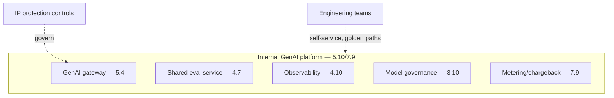
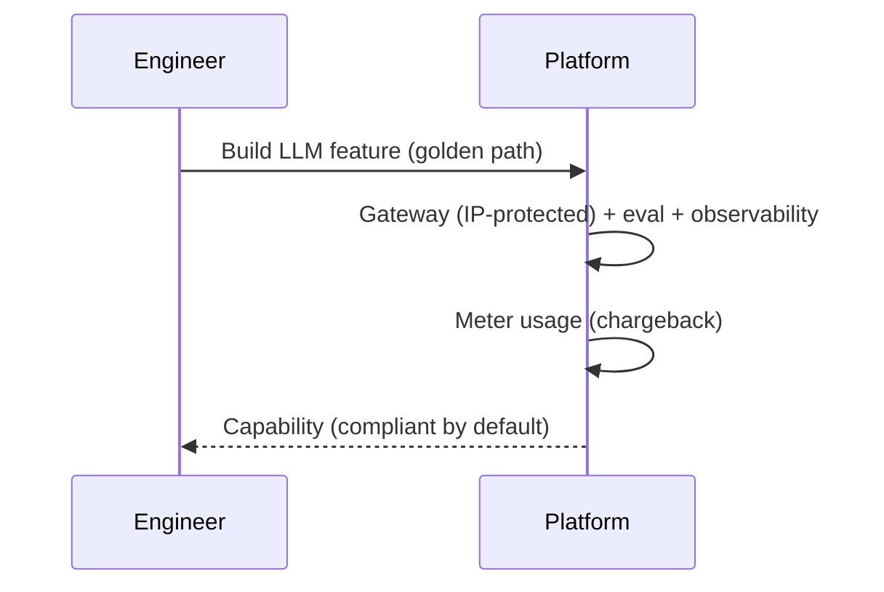
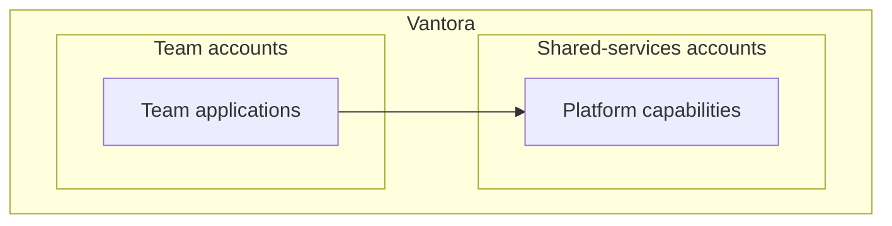

# Case Study CS39 — Internal Developer Copilot Platform

| | |
|---|---|
| **Industry** | Software Engineering |
| **Company profile** | Vantora Systems — fictional software company, 2,000 engineers, internal platform |
| **System type** | Multi-tenant GenAI platform |
| **Maturity level exercised** | 4 Architect → 5 Principal |

## Business Problem

Vantora's engineering teams were each building their own LLM features (the fragmented eleven-teams-six-models chaos — 1.8), with no shared platform — duplicated infrastructure, inconsistent governance, IP-protection and license-compliance risks, and no cost visibility. The goal: a shared internal developer copilot platform providing the GenAI capabilities (gateway, eval, observability, model governance) as self-service, with IP protection, license compliance, and usage metering. This is Vantora's platform (the recurring arc — 5.10/7.9). The defining challenges: platform amortization, IP protection (code/IP not leaked to providers), license compliance, and metering. Target: consolidate the sprawl, shared platform, IP-protected, license-compliant, cost-attributed.

## Stakeholders

| Stakeholder | Role | What they care about | Success measure |
|-------------|------|----------------------|-----------------|
| Engineering teams | Users | Self-service capabilities | Adoption |
| Platform team | Owners | Platform reliability, governance | Platform SLOs |
| Security/Legal | Gatekeeper | IP protection, licensing | IP/license compliance |
| Finance | Gatekeeper | Cost attribution | Chargeback accuracy |
| CTO | Sponsor | Consolidation, governance | Consolidation, cost |

## Requirements

### Functional
- FR-1: Provide GenAI capabilities as self-service (gateway, eval, observability, model governance — 7.9).
- FR-2: IP protection (code/IP handling controls).
- FR-3: License compliance (generated-code licensing).
- FR-4: Usage metering/chargeback (7.9).

### Non-functional
- NFR-1 (Platform): Reliable, self-service, golden paths (5.10).
- NFR-2 (IP protection): Code/IP not leaked (data handling, provider terms — 4.14).
- NFR-3 (License compliance): Generated-code licensing tracked.
- NFR-4 (Metering): Per-team cost attribution (7.9).

### Constraints
- IP protection (the defining constraint); license compliance; multi-tenancy; platform governance.

## Architecture

The full platform-pattern composition (7.9): gateway + eval + observability + model governance + metering, self-service with golden paths (5.10). IP protection (data handling, provider terms) and license compliance are the software-specific overlays.

## Sequence Diagram

## Deployment Diagram

## Threat Model

| Threat | Vector | Impact | Likelihood | Mitigation |
|--------|--------|--------|------------|------------|
| IP/code leak to provider | Data handling | IP loss | Med | IP-protection controls, provider terms (4.14) |
| License violation | Generated code | Legal exposure | Med | License compliance tracking |
| Un-attributed cost | No metering | Cost sprawl | Med | Metering/chargeback (7.9) |
| Platform bypass | Direct provider access | Governance holes | Med | Non-bypassable gateway (5.4) |

## Cost Estimation

| Item | Assumption | Monthly |
|------|-----------|---------|
| Platform inference | 2,000 engineers, tiered, cached | ~$200K |
| Platform operations | Gateway, eval, observability, metering | ~$40K |
| **Total** | | **~$240K** (amortized across teams) |

Dominant: engineer usage. Amortized across teams via chargeback. Optimization: platform-wide caching, tiering (7.8).

## Scaling Strategy

Scales across engineering org. Platform capabilities scale independently; gateway on every path (highest reliability — 5.9). Self-service scales adoption. Provider capacity pooled (5.4).

## Monitoring Strategy

Platform observability (4.10): per-team usage/cost (chargeback — 7.9), platform SLOs, IP-protection compliance, license compliance, adoption (the consolidation metric). The chargeback and platform SLOs are key.

## Lessons Learned

1. **The platform consolidates the sprawl** (Vantora's arc) — the shared platform (5.10/7.9) replaces the per-team reinvention; the amortization, coherence, and governance-by-default are the platform value.
2. **IP protection is the software-specific overlay** — code/IP must not leak to providers (4.14); the IP-protection controls (data handling, provider terms) are the software-domain requirement.
3. **Metering aligns incentives** — per-team chargeback (7.9) makes teams optimize their own usage (the incentive alignment); cost visibility drives efficiency.

---

**Related chapters:** [5.10 Platform Engineering](../curriculum/part-5-cloud-infrastructure-platform/chapter-10-iac-platform-engineering.md), [7.9 Platform & Multi-tenancy Patterns](../curriculum/part-7-enterprise-ai-architecture-patterns/chapter-09-platform-multitenancy-patterns.md), [5.4 API/Gateway](../curriculum/part-5-cloud-infrastructure-platform/chapter-04-api-integration-layer.md) · **Related patterns:** GenAI Gateway (7.9), Shared Eval Service (7.9), Usage Metering/Chargeback (7.9) · **Similar case studies:** [CS42](cs42-api-documentation-automation.md), [CS40](cs40-legacy-code-modernization-factory.md)
