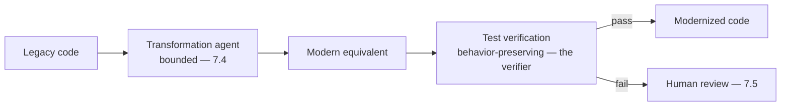
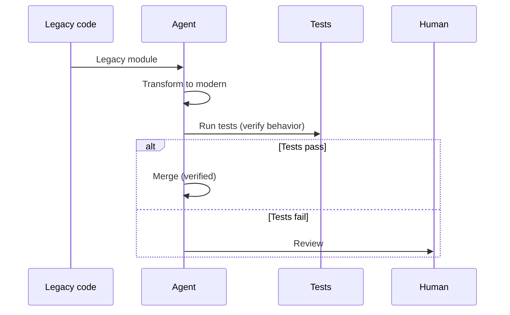
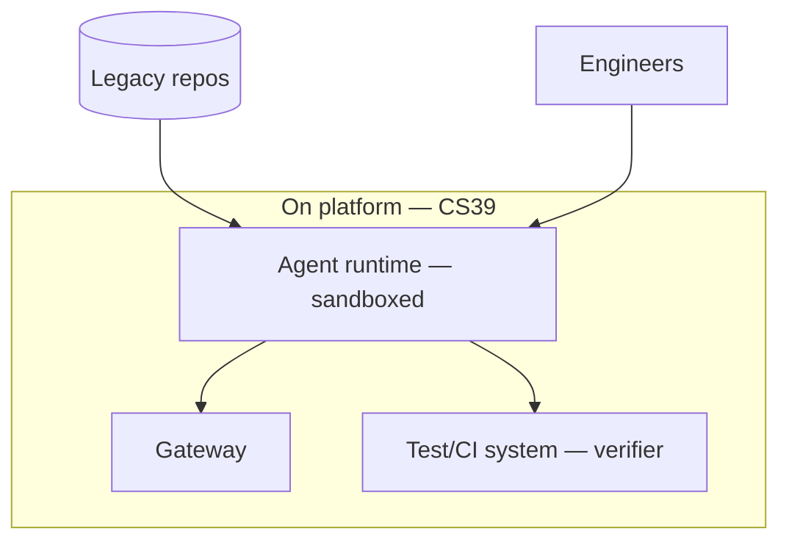

# Case Study CS40 — Legacy Code Modernization Factory

| | |
|---|---|
| **Industry** | Software Engineering |
| **Company profile** | Vantora Systems — fictional software company, modernization program |
| **System type** | Agentic transformation pipeline (verification via tests) |
| **Maturity level exercised** | 4 Architect |

## Business Problem

Vantora has large legacy codebases (old languages/frameworks) that are expensive to maintain and modernize manually. The goal: an agentic pipeline that transforms legacy code to modern equivalents at scale, verified by tests (the transformation must preserve behavior). The defining challenges: verification (behavior preservation — the tests are the verifier, making this the autonomy-grid top-left: verify-cheap), and batch economics (large codebases). This is the classic coding-agent case (verify-cheap: code runs or it doesn't — 3.1/3.8). Target: modernize legacy code at scale, behavior-preserving (test-verified), positive economics.

## Stakeholders

| Stakeholder | Role | What they care about | Success measure |
|-------------|------|----------------------|-----------------|
| Engineering teams | Users/reviewers | Correct transformations | Transformation quality |
| Modernization lead | Sponsor | Modernization progress, cost | Progress, cost |
| Engineering leadership | Sponsor | Legacy risk reduction | Legacy reduction |

## Requirements

### Functional
- FR-1: Transform legacy code to modern equivalents (agentic — 7.4).
- FR-2: Verify via tests (behavior preservation — the verifier).
- FR-3: Route failures to human review; batch process the codebase.

### Non-functional
- NFR-1 (Verification): Behavior-preserving (test-verified — the tests are the verifier, verify-cheap — 3.8).
- NFR-2 (Economics): Batch economics for large codebases (7.8).
- NFR-3 (Quality): Modern-equivalent quality; human review of complex cases.

### Constraints
- Behavior preservation (verified by tests — the defining verify-cheap property); batch economics; human review of failures.

## Architecture

Agentic transformation (7.4, bounded — the autonomy-grid top-left: verify-cheap via tests, recoverable) + test verification (the verifier — 3.8's designable-verifiability) + human review on failure (7.5) + batch (7.8). The tests-as-verifier make this the ideal agentic case.

## Sequence Diagram

## Deployment Diagram

## Threat Model

| Threat | Vector | Impact | Likelihood | Mitigation |
|--------|--------|--------|------------|------------|
| Behavior change | Transformation error | Broken functionality | Med | Test verification (the verifier), human review on fail |
| Insufficient tests | Weak verifier | Undetected behavior change | Med | Test coverage, human review |
| Cost overrun | Un-batched | Budget | Med | Batch economics (7.8) |
| Insecure/bad code | Poor transformation | Quality/security | Med | Security scanning, review |

## Cost Estimation

| Item | Assumption | Monthly (program) |
|------|-----------|---------|
| Agent transformation | Codebase volume, batch | ~$40K/program |
| Test verification (compute) | CI runs | ~$10K |
| **Total** | | **~$50K/program** |

Dominant: transformation volume. Optimization: batch, tiering (7.8). Verification (tests) is the enabler, not the cost driver.

## Scaling Strategy

Batch modernization of codebases. Agent fleet (4.4) with budgets; test verification per transformation; human review capacity-bounded (failures only). On the platform (CS39).

## Monitoring Strategy

Verification + quality: test-pass rate (behavior preservation — the verifier metric), transformation quality, human-review rate (failures), progress, cost. The test-verification is the honesty gauge (verify-cheap — 3.8).

## Lessons Learned

1. **Tests make it the ideal agentic case** — the tests are the verifier (behavior preservation), making transformation the autonomy-grid top-left (verify-cheap, recoverable — 3.8); this is why coding agents work.
2. **Verification is designable** — strong test coverage makes the verification reliable (3.8's designable-verifiability); the better the tests, the more autonomous the transformation.
3. **Human review handles the failures** — test-passing transformations merge; test-failing ones go to human review (7.5); the humans focus on the genuinely hard cases.

---

**Related chapters:** [3.8 Agents](../curriculum/part-3-core-building-blocks-of-genai/chapter-08-agents-concepts.md), [4.4 Agent Architectures](../curriculum/part-4-enterprise-genai-systems/chapter-04-agent-architectures-production.md), [7.4 Agentic Patterns](../curriculum/part-7-enterprise-ai-architecture-patterns/chapter-04-agentic-patterns.md) · **Related patterns:** Bounded Agent Loop (7.4), Reflection (7.4), Batch Lanes (7.8) · **Similar case studies:** [CS39](cs39-internal-developer-copilot-platform.md), [CS17](cs17-quality-incident-analysis.md)
