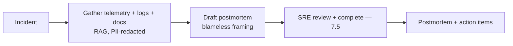
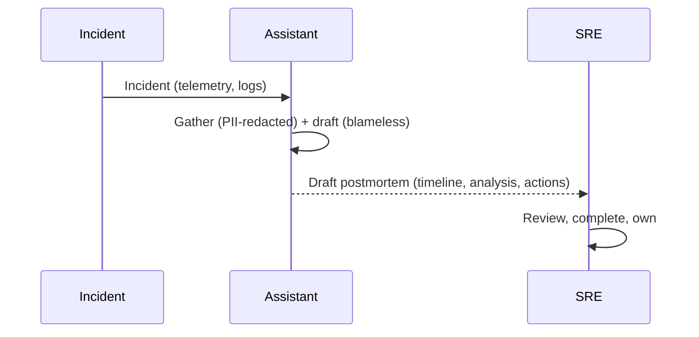
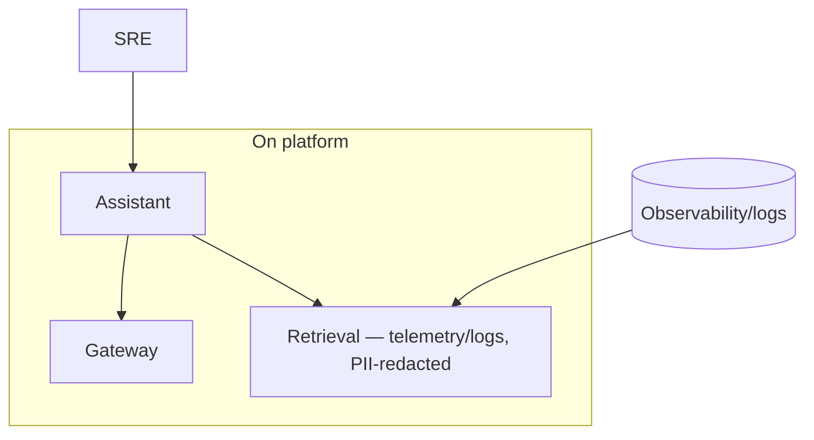

# Case Study CS41 — Incident Postmortem Assistant

| | |
|---|---|
| **Industry** | Software Engineering |
| **Company profile** | Vantora Systems — fictional software company, SRE/reliability |
| **System type** | RAG over telemetry + docs, blameless-culture-aware |
| **Maturity level exercised** | 3 Engineer → 4 Architect |

## Business Problem

After production incidents, SRE teams write postmortems — synthesizing telemetry, logs, timelines, and prior incidents into a root-cause analysis and action items. It's time-intensive, and the blameless culture must be preserved (postmortems focus on systems, not blame). The goal: an assistant that gathers incident telemetry and docs, drafts the postmortem timeline and analysis for the SRE to complete, respecting blameless culture and PII-in-logs concerns. The defining challenges: blameless culture (framing) and PII in logs. Target: faster postmortems, blameless-framed, PII-safe.

## Stakeholders

| Stakeholder | Role | What they care about | Success measure |
|-------------|------|----------------------|-----------------|
| SRE/engineers | Users | Postmortem support, blameless | Postmortem time, quality |
| Reliability leadership | Sponsor | Postmortem quality, learning | Learning, MTTR trends |
| Culture/Management | Gatekeeper | Blameless framing | Blameless culture |
| Privacy | Gatekeeper | PII in logs | PII compliance |

## Requirements

### Functional
- FR-1: Gather incident telemetry, logs, timeline (RAG over observability + docs).
- FR-2: Draft postmortem (timeline, root-cause analysis, action items).
- FR-3: Blameless framing (systems-focused, not blame).
- FR-4: PII-safe (logs may contain PII).

### Non-functional
- NFR-1 (Blameless): Systems-focused framing, not individual blame (culture).
- NFR-2 (PII): PII in logs handled (redaction — 4.8).
- NFR-3 (Accuracy): Accurate timeline/analysis (grounded in telemetry).

### Constraints
- Blameless culture (the defining framing constraint); PII in logs; accuracy.

## Architecture

RAG over telemetry/logs (7.2, PII-redacted — 4.8) + postmortem drafting (blameless framing) + SRE completion (7.5). Blameless framing and PII redaction are defining.

## Sequence Diagram

## Deployment Diagram

## Threat Model

| Threat | Vector | Impact | Likelihood | Mitigation |
|--------|--------|--------|------------|------------|
| Blame framing | Poor generation | Culture damage | Med | Blameless framing (prompt/guardrails), SRE review |
| PII exposure | Logs with PII | Privacy breach | Med | PII redaction (4.8) |
| Inaccurate analysis | Hallucination | Wrong root cause | Med | Grounding in telemetry, SRE review |

## Cost Estimation

| Item | Assumption | Monthly |
|------|-----------|---------|
| Inference | Incident volume, telemetry-heavy | ~$12K |
| Retrieval + redaction | Telemetry/logs | ~$4K |
| **Total** | | **~$16K** |

Dominant: incident volume. On the platform (CS39). Optimization: tiering (7.8).

## Scaling Strategy

Incident-driven. Assistant scales with incident volume; on the platform. Telemetry retrieval scales with observability data.

## Monitoring Strategy

Quality + culture: postmortem quality, blameless-framing compliance, PII-redaction effectiveness, accuracy. Blameless framing and PII redaction are key monitors.

## Lessons Learned

1. **Blameless framing is a culture control** — postmortems focus on systems, not individual blame; the blameless framing (prompt/guardrails + SRE review) preserves the culture.
2. **PII in logs must be redacted** — logs may contain PII (4.8's redaction); the redaction protects privacy in the postmortem.
3. **The SRE owns the postmortem** — the assistant drafts, the SRE completes and owns (7.5); the analysis and learning stay human.

---

**Related chapters:** [4.10 Observability](../curriculum/part-4-enterprise-genai-systems/chapter-10-observability.md), [4.8 Guardrails](../curriculum/part-4-enterprise-genai-systems/chapter-08-guardrails-content-safety.md), [3.6 RAG](../curriculum/part-3-core-building-blocks-of-genai/chapter-06-rag-fundamentals.md) · **Related patterns:** Layered Filters (7.6), Human-in-the-Loop (7.5), Citation-First (7.2) · **Similar case studies:** [CS17](cs17-quality-incident-analysis.md), [CS31](cs31-network-operations-copilot.md)
