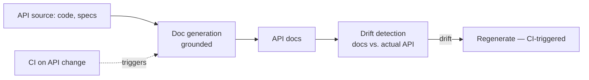
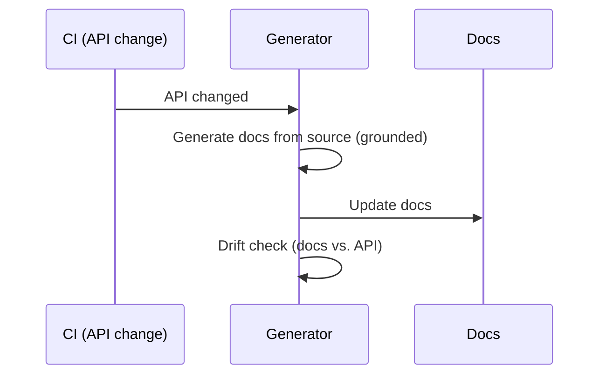
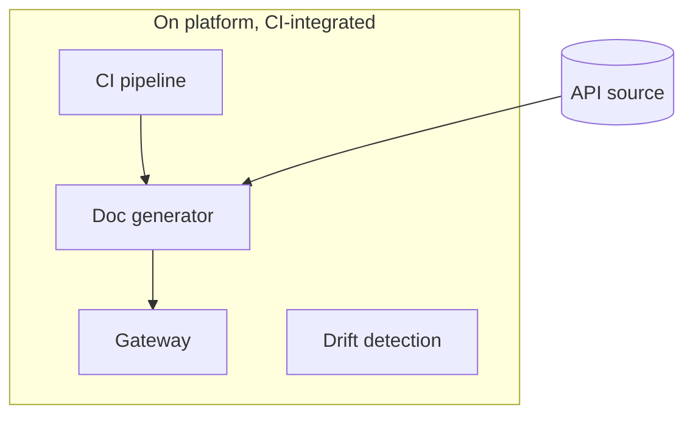

# Case Study CS42 — API Documentation Automation

| | |
|---|---|
| **Industry** | Software Engineering |
| **Company profile** | Vantora Systems — fictional software company, developer platform / API teams |
| **System type** | Generation + drift detection (source-of-truth discipline) |
| **Maturity level exercised** | 3 Engineer |

## Business Problem

API documentation drifts from the actual APIs (code changes, docs lag), frustrating internal and external developers. The goal: a system that generates API documentation from the source (code, specs) and detects drift (docs vs. actual API), keeping docs current. The defining challenges: source-of-truth discipline (docs generated from the authoritative source, not drifting) and CI integration (docs regenerated on API changes). Target: current, accurate API docs, drift-detected, CI-integrated.

## Stakeholders

| Stakeholder | Role | What they care about | Success measure |
|-------------|------|----------------------|-----------------|
| Developers (internal/external) | Users | Accurate, current docs | Doc accuracy, satisfaction |
| API teams | Content owners | Docs stay current | Doc currency |
| Developer platform | Sponsor | Doc quality, coverage | Coverage, accuracy |

## Requirements

### Functional
- FR-1: Generate API docs from source (code, specs — grounded).
- FR-2: Detect drift (docs vs. actual API).
- FR-3: CI integration (regenerate on API changes).

### Non-functional
- NFR-1 (Source-of-truth): Docs generated from the authoritative source (no drift).
- NFR-2 (Accuracy): Accurate docs (grounded in code/specs).
- NFR-3 (Currency): Docs current with API (CI-driven regeneration).

### Constraints
- Source-of-truth discipline (the defining constraint); CI integration; accuracy.

## Architecture

Doc generation (grounded in source) + drift detection (docs vs. API) + CI integration (regenerate on change). The source-of-truth discipline and CI-driven currency are defining.

## Sequence Diagram

## Deployment Diagram

## Threat Model

| Threat | Vector | Impact | Likelihood | Mitigation |
|--------|--------|--------|------------|------------|
| Doc drift | Un-regenerated | Wrong docs | Med | CI-driven regeneration, drift detection |
| Inaccurate docs | Hallucination | Wrong docs | Med | Grounding in source, drift check |
| Incomplete coverage | Generation gap | Missing docs | Med | Coverage monitoring |

## Cost Estimation

| Item | Assumption | Monthly |
|------|-----------|---------|
| Generation | API change volume, batch | ~$8K |
| Drift detection + CI | Per-change | ~$3K |
| **Total** | | **~$11K** |

Dominant: API change volume. On the platform (CS39). Optimization: incremental generation (changed APIs only), batch (7.8).

## Scaling Strategy

API-change-driven (CI). Generation incremental (changed APIs); drift detection continuous. On the platform.

## Monitoring Strategy

Currency + accuracy: doc-drift rate (docs vs. API — the currency metric), doc accuracy (grounded), coverage. The drift detection is the currency control.

## Lessons Learned

1. **Source-of-truth discipline prevents drift** — docs generated from the authoritative source (code/specs), CI-regenerated on change; the docs never drift from the API because they're generated from it.
2. **Drift detection is the currency check** — the drift detection (docs vs. actual API) catches any divergence; CI-driven regeneration keeps docs current.
3. **Ground docs in the source** — docs grounded in code/specs (not invented) ensures accuracy.

---

**Related chapters:** [5.7 LLMOps](../curriculum/part-5-cloud-infrastructure-platform/chapter-07-llmops.md), [3.4 Structured Outputs](../curriculum/part-3-core-building-blocks-of-genai/chapter-04-structured-outputs.md), [7.7 Knowledge & Data Patterns](../curriculum/part-7-enterprise-ai-architecture-patterns/chapter-07-knowledge-data-patterns.md) · **Related patterns:** Freshness Pipeline (7.7), Feedback-to-Dataset (7.7) · **Similar case studies:** [CS11](cs11-product-catalog-enrichment.md), [CS21](cs21-curriculum-content-pipeline.md)
