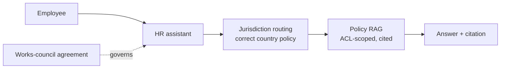
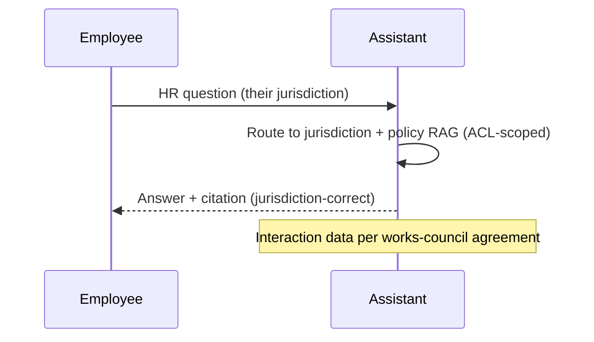
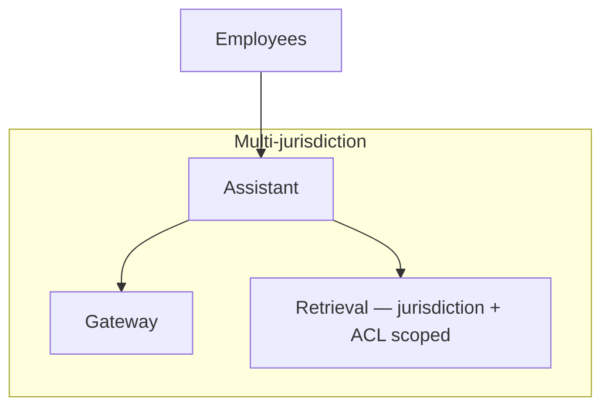

# Case Study CS43 — Employee Policy Assistant

| | |
|---|---|
| **Industry** | HR |
| **Company profile** | Meridian Health Partners — fictional employer, HR, multi-country, works-council jurisdictions |
| **System type** | ACL-aware RAG (works-council/union constraints, jurisdiction variants) |
| **Maturity level exercised** | 3 Engineer → 4 Architect |

## Business Problem

Employees have many HR-policy questions (benefits, leave, conduct) that vary by country/jurisdiction, and HR staff are overwhelmed. The goal: an HR-policy assistant answering employee questions from the correct jurisdiction's policies, ACL-scoped (some policies are role/region-specific), respecting works-council/union constraints (in applicable jurisdictions, employee-facing systems require consultation). The defining challenges: works-council/union constraints (consultation, monitoring), jurisdiction variants (correct policy per country), and privacy. Target: deflect routine HR questions, jurisdiction-correct, works-council-compliant, privacy-respecting.

## Stakeholders

| Stakeholder | Role | What they care about | Success measure |
|-------------|------|----------------------|-----------------|
| Employees | Users | Correct, private HR answers | Adoption, accuracy |
| HR staff | Beneficiary | Deflection of routine | HR capacity |
| Works councils/Unions | Gatekeeper | Consultation, monitoring limits | Consultation compliance |
| Privacy/Legal | Gatekeeper | Employee data, jurisdiction | Privacy compliance |

## Requirements

### Functional
- FR-1: Answer HR-policy questions (RAG, cited, jurisdiction-correct).
- FR-2: Jurisdiction variants (correct policy per country).
- FR-3: ACL-scoped (role/region-specific policies).
- FR-4: Works-council-compliant (consultation, no covert monitoring).

### Non-functional
- NFR-1 (Jurisdiction): Correct jurisdiction's policy (variant handling).
- NFR-2 (Works-council): Consultation completed; no employee-monitoring beyond agreed scope.
- NFR-3 (Privacy): Employee data protected; interaction data governed.

### Constraints
- Works-council/union constraints (the defining constraint — consultation, monitoring); jurisdiction variants; employee privacy.

## Architecture

Multilingual/multi-jurisdiction RAG (7.2 + tenant/jurisdiction routing — 7.7) + ACL scoping + works-council-compliant design (consultation, monitoring limits). Jurisdiction variants and works-council compliance are defining.

## Sequence Diagram

## Deployment Diagram

## Threat Model

| Threat | Vector | Impact | Likelihood | Mitigation |
|--------|--------|--------|------------|------------|
| Wrong jurisdiction policy | Variant handling gap | Wrong HR advice | Med | Jurisdiction routing, variant handling |
| Works-council violation | Covert monitoring | Legal/labor issue | Med | Consultation, monitoring-limit compliance |
| Employee data exposure | ACL/logging | Privacy breach | Med | ACL scoping, governed interaction data (4.14) |

## Cost Estimation

| Item | Assumption | Monthly |
|------|-----------|---------|
| Inference | Employee population, tiered | ~$18K |
| Retrieval (multi-jurisdiction) | Policy corpus | ~$6K |
| **Total** | | **~$24K** |

Dominant: employee query volume. Optimization: caching, tiering (7.8).

## Scaling Strategy

Business-hours load across geographies. Assistant scales horizontally; jurisdiction-scoped retrieval; caching for common questions. Multi-jurisdiction handling.

## Monitoring Strategy

Quality + compliance: jurisdiction-correctness, works-council compliance (monitoring limits), policy accuracy, privacy compliance. Works-council compliance and jurisdiction-correctness are key.

## Lessons Learned

1. **Works-council consultation is required** — employee-facing systems in works-council jurisdictions require consultation (1.6/1.8); the interaction-data handling respects the agreed monitoring limits.
2. **Jurisdiction variants demand routing** — HR policies vary by country; jurisdiction routing surfaces the correct policy for the employee's jurisdiction.
3. **Employee interaction data is governed** — the interaction data is sensitive (4.14) and works-council-constrained; governed with the monitoring limits.

---

**Related chapters:** [1.6 Requirements/Stakeholders](../curriculum/part-1-professional-foundation/chapter-06-requirements-stakeholders.md), [7.7 Knowledge & Data Patterns](../curriculum/part-7-enterprise-ai-architecture-patterns/chapter-07-knowledge-data-patterns.md), [4.14 Privacy](../curriculum/part-4-enterprise-genai-systems/chapter-14-privacy-compliance-governance.md) · **Related patterns:** Tenant Isolation (7.7), Citation-First (7.2), ACL-Propagated Index (7.7) · **Similar case studies:** [CS29](cs29-policy-qa-for-agents.md), [CS19](cs19-university-student-advisor.md)
