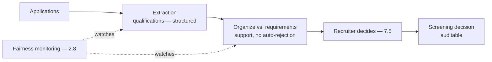
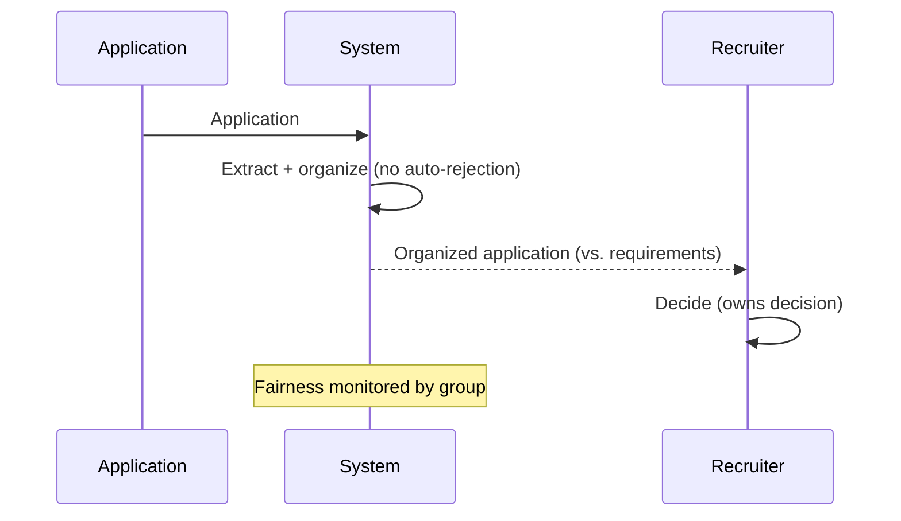
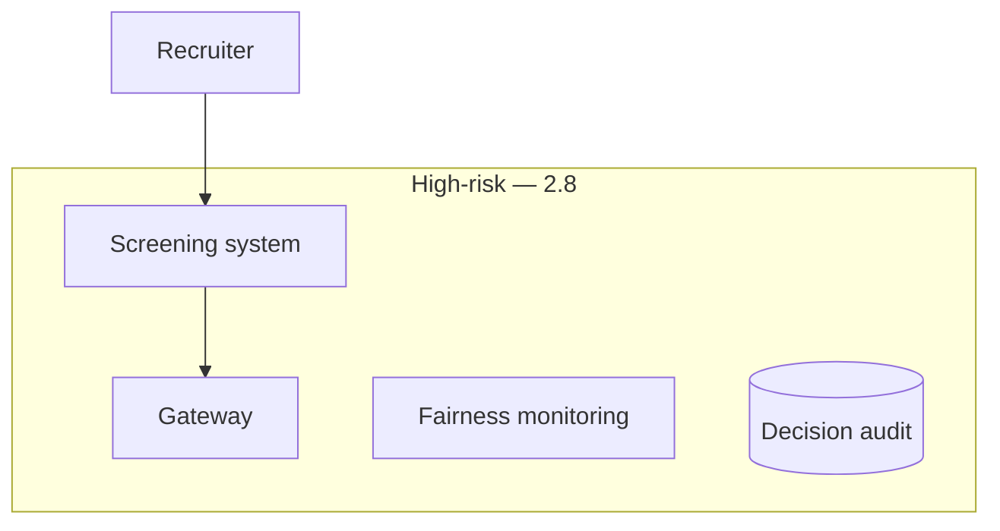

# Case Study CS44 — Recruiting Screening Support

| | |
|---|---|
| **Industry** | HR |
| **Company profile** | Meridian Health Partners — fictional employer, talent acquisition, anti-discrimination regulated |
| **System type** | Structured extraction + ranking assistance (anti-discrimination, human decision) |
| **Maturity level exercised** | 4 Architect |

## Business Problem

Recruiters screen high volumes of applications — extracting qualifications, matching to requirements — slow, and the anti-discrimination risk is acute (hiring decisions are legally protected against bias; biased screening is illegal). The goal: a system that extracts application data and organizes it against requirements for the recruiter, who makes the screening decision — with rigorous anti-discrimination controls and the human-decision requirement (no autonomous rejection). The defining challenges: anti-discrimination law (high-risk — 2.8) and the human-decision requirement (the classic high-risk-employment case). Target: faster screening, anti-discrimination-compliant, human decisions, no autonomous rejection.

## Stakeholders

| Stakeholder | Role | What they care about | Success measure |
|-------------|------|----------------------|-----------------|
| Recruiters | Users | Screening support | Screening time |
| Candidates | Affected | Fair, unbiased consideration | Fairness |
| Talent acquisition lead | Sponsor | Efficiency, fairness | Efficiency, fairness |
| Legal/Compliance | Gatekeeper | Anti-discrimination | Anti-discrimination compliance |

## Requirements

### Functional
- FR-1: Extract application data (qualifications — structured).
- FR-2: Organize against requirements (support, not decide/rank-to-reject).
- FR-3: Recruiter makes screening decisions (7.5 — human decides).
- FR-4: Anti-discrimination monitoring (across candidate groups — 2.8).

### Non-functional
- NFR-1 (Anti-discrimination): No bias; fairness monitored by group (2.8); human decisions; no autonomous rejection.
- NFR-2 (Auditability): Screening decisions auditable.
- NFR-3 (Accuracy): Accurate extraction.

### Constraints
- Anti-discrimination law (the defining constraint — high-risk — 2.8); human decision required (no autonomous rejection); auditability.

## Architecture

Extraction (3.4) + organization (support, no autonomous ranking-to-reject) + human decision (7.5) + fairness monitoring (2.8). Like CS22/CS36 — high-risk, the system supports, humans decide, fairness monitored. The no-autonomous-rejection is the anti-discrimination boundary.

## Sequence Diagram

## Deployment Diagram

## Threat Model

| Threat | Vector | Impact | Likelihood | Mitigation |
|--------|--------|--------|------------|------------|
| Discriminatory screening | Model/data bias | Illegal discrimination | Med-High | Fairness monitoring by group (2.8), no auto-rejection, human decision |
| Autonomous rejection | Scope creep | Illegal automated decision | Low | Support-only; recruiter decides (7.5) |
| Un-auditable decision | Missing audit | Compliance failure | Med | Decision auditing |
| Extraction bias | Biased extraction | Skewed organization | Med | Bias monitoring, human review |

## Cost Estimation

| Item | Assumption | Monthly |
|------|-----------|---------|
| Extraction | Application volume, batch | ~$15K |
| Fairness monitoring + audit | Per-application | ~$5K |
| **Total** | | **~$20K** |

Dominant: application volume. Optimization: batch (7.8).

## Scaling Strategy

Application-volume-driven (spiky with hiring cycles). Extraction scales (batch — 7.8); recruiter decisions capacity-bounded. Fairness monitoring on all.

## Monitoring Strategy

Anti-discrimination-first (2.8): fairness metrics by candidate group (the high-risk requirement), no-autonomous-rejection compliance, extraction accuracy, decision auditability. Fairness monitoring is the critical control.

## Lessons Learned

1. **No autonomous rejection** — recruiting is high-risk-employment (2.8); the system extracts and organizes but never rejects/ranks-to-reject autonomously (7.5). The no-autonomous-rejection is the anti-discrimination boundary.
2. **Fairness is monitored by group** — biased screening is illegal; the fairness monitoring by candidate group (2.8) is the critical control; the high-risk-tier obligations apply.
3. **Decisions are auditable** — screening decisions are auditable for anti-discrimination defense; the human decides, the decision is recorded.

---

**Related chapters:** [2.8 Responsible AI](../curriculum/part-2-artificial-intelligence/chapter-08-responsible-ai.md), [7.5 Human-in-the-Loop](../curriculum/part-7-enterprise-ai-architecture-patterns/chapter-05-human-in-the-loop-patterns.md), [3.4 Structured Outputs](../curriculum/part-3-core-building-blocks-of-genai/chapter-04-structured-outputs.md) · **Related patterns:** Human-in-the-Loop (7.5), Review Sampling (7.5) · **Similar case studies:** [CS22](cs22-admissions-document-processing.md), [CS36](cs36-caseworker-decision-support.md)
