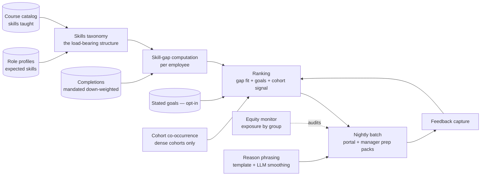
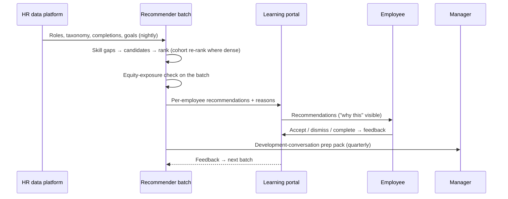
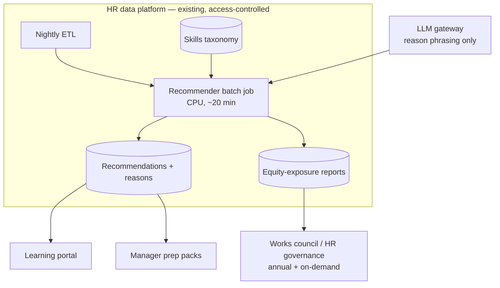

# Case Study CS45 — Learning & Development Recommender

| | |
|---|---|
| **Industry** | HR |
| **Company profile** | Meridian Health Partners (the hospital network from [CS01](cs01-clinical-documentation-assistant.md)) — ~28,000 employees across clinical and administrative roles, works-council-consulted HR systems |
| **System type** | Classical ML — content-based + lightweight collaborative recommender, small-data regime (LLM only for optional "why this course" phrasing) |
| **Maturity level exercised** | 3 Engineer → 4 Architect |

## Business Problem

Meridian's learning catalog holds ~4,200 items (compliance modules, clinical skills, leadership tracks, external courses), and completion outside mandatory training is 11% — employees can't find what's relevant, and the L&D team's manual advising reaches a fraction of staff. The goal: personalized recommendations in the learning portal and the quarterly development-conversation prep. But this is the **opposite regime from a marketplace recommender** ([CS54](cs54-product-recommendations.md)): 28K users (not 30M), interactions are sparse and lumpy (a nurse completes 6 items/year, half of them mandated), cold start is the *permanent condition* (new hires, new courses, whole roles with thin history), and two constraints outrank accuracy — **performance-appraisal data is off-limits as a feature** (works-council agreement), and recommendations must not become a gatekeeping mechanism that quietly routes some groups away from advancement-linked learning ([2.8](../curriculum/part-2-artificial-intelligence/chapter-08-responsible-ai.md)). The architecture lesson this case exists to teach: **when data is small, structure carries the load** — the skills taxonomy does what 30M users' behavior does at Loomora.

## Stakeholders

| Stakeholder | Role | What they care about | Success measure |
|-------------|------|----------------------|-----------------|
| Employees | Users | Relevant, non-creepy suggestions | Voluntary completion rate; recommendation acceptance |
| L&D team | Sponsor & content owners | Catalog utilization, skill-gap closure | Voluntary completions +50%; long-tail catalog usage |
| Works council | Gatekeeper (binding) | Feature scope, no performance-data use, no profiling | Signed data-use agreement honored; annual audit |
| Managers | Secondary users | Development-conversation prep | Prep-pack usage; conversation quality feedback |
| HR analytics | Operator | Maintainable at HR-team scale | Runs on the HR data platform; no ML-ops team required |

## Requirements

### Functional
- FR-1: **Content-based core**: employees and courses both mapped to the skills taxonomy (role profiles → expected skills; courses → skills taught); recommendations rank courses closing the gap between an employee's role-expected and demonstrated-by-completion skills — cold-start-proof by construction, because a new hire with zero history still has a role profile.
- FR-2: **Collaborative layer where density permits**: within large, well-populated cohorts (nursing bands, admin roles), completion co-occurrence ("colleagues in your role also completed…") re-ranks the content-based candidates — never generates candidates alone, because sparse CF hallucinates similarity from coincidence.
- FR-3: Explicit signals over inferred ones: employee-stated goals and interests (opt-in) weight the ranking; the system asks rather than infers — both for accuracy in a sparse regime and because inference from behavior is what the works-council agreement restricts.
- FR-4: Feedback capture: accepted / dismissed / completed / abandoned-at-%, feeding evaluation and re-ranking.
- FR-5 (optional LLM lane): a one-sentence "why this fits" phrasing per recommendation, generated from the *structured* reasons (skill gap, role expectation, cohort signal) — template-first with LLM smoothing, draft-visible, never inventing reasons ([7.5](../curriculum/part-7-enterprise-ai-architecture-patterns/chapter-05-human-in-the-loop-patterns.md)-adjacent transparency).

### Non-functional
- NFR-1 (Relevance): NDCG on held-out voluntary completions beats both random and popularity baselines — with popularity a genuinely hard baseline in a mandated-training environment, and the honest report says which segments it wins in ([2.7](../curriculum/part-2-artificial-intelligence/chapter-07-evaluating-ml-systems.md)).
- NFR-2 (Privacy — binding): No performance ratings, disciplinary data, or manager assessments in any feature; completion data used within the signed scope; feature list published to the works council annually.
- NFR-3 (Equity): Recommendation exposure of advancement-linked content monitored by demographic group; skew triggers review — the recommender must not become the quiet career gatekeeper ([2.8](../curriculum/part-2-artificial-intelligence/chapter-08-responsible-ai.md)'s disparity monitoring applied to *opportunity exposure*, not just decisions).
- NFR-4 (Operability): Nightly batch on the HR data platform; no online serving, no dedicated ML team — the design must survive being maintained by two HR analysts ([2.9](../curriculum/part-2-artificial-intelligence/chapter-09-classical-ml-system-design.md)'s boring-is-the-point, organizationally enforced).

### Constraints
- Sparse interactions (median 6 completions/year, half mandated — mandated completions carry near-zero preference signal and are down-weighted to almost nothing); skills taxonomy maintenance is the real dependency — stale course-to-skill mappings poison everything downstream; works-council agreement is a hard feature-scope boundary with annual audit; German-works-council-style consultation for any scope change.

## Architecture

Defining decisions: (1) **taxonomy-first, behavior-second** — the content-based skill-gap core is cold-start-proof and works-council-explainable ("you see this because your role expects skill X and you haven't completed anything teaching it" — every recommendation has that sentence *by construction*); (2) **CF as re-ranker only, gated by cohort density** — measured co-occurrence in dense cohorts adds real lift; ungated CF in a 28K-user sparse regime adds noise dressed as personalization; (3) **ask, don't infer** — stated goals outperform behavioral inference here *and* keep the feature scope inside the agreement; (4) **batch, not online** — recommendations refresh nightly; nothing about learning decisions needs request-time inference, and operability by two analysts is a hard requirement; (5) **equity exposure monitoring as a subsystem** — who gets *shown* advancement-linked learning is measured with the same seriousness Loomora measures long-tail exposure, because the failure mode (feedback loops entrenching historical patterns) is identical in structure and worse in consequence.

## Sequence Diagram

## Deployment Diagram

## Threat Model

| Threat | Vector | Impact | Likelihood | Mitigation |
|--------|--------|--------|------------|------------|
| Scope creep past the data agreement | "Just add manager ratings, it would help accuracy" | Works-council breach — program shutdown, trust damage | Med | Feature registry with agreement mapping; any feature addition is a consultation event, not a config change |
| Opportunity-exposure skew | Historical completion patterns steer advancement content along historical demographics | Systemic inequity, legal exposure | Med | Exposure monitoring by group; content-based core (role-driven, not history-driven) limits the loop; skew triggers human review |
| Taxonomy rot | Courses added without skill mapping; role profiles stale | Recommendations degrade invisibly — the model is fine, the structure rotted | High | Mapping completeness as a data-quality gate; unmapped courses excluded and reported; taxonomy review cadence owned by L&D |
| Sparse-CF noise | Co-occurrence in thin cohorts read as preference | Confidently irrelevant recommendations; trust loss | Med | Density gate on the CF layer; cohort-size floor; CF contribution capped in ranking |
| Reason-phrasing drift | LLM smoothing invents a reason not in the structured rationale | The one honest sentence becomes dishonest | Low | Template-first generation; phrasing validated against the structured reason fields; fallback to plain template |

## Cost Estimation

| Item | Assumption | Monthly |
|------|-----------|---------|
| Batch compute | 28K employees, nightly CPU job on existing platform | ~$600 |
| Storage + portal integration | Recommendations, feedback, reports | ~$700 |
| Reason phrasing (LLM) | ~90K short generations/month, cached heavily | ~$800 |
| Taxonomy tooling + governance reports | | ~$900 |
| **Total** | | **~$3K** |

Dominant cost is nowhere in this table: it is the **L&D team's taxonomy maintenance hours** — the human upkeep of the structure the whole system leans on. The honest TCO line ([6.10](../curriculum/part-6-enterprise-architecture/chapter-10-tco-business-case.md)) prices that labor in, because skipping it is how the system dies in year two.

## Scaling Strategy

Compute never becomes the constraint (28K × nightly is trivial). The scaling that matters: **catalog growth** (mapping completeness must keep pace — the gate makes rot visible), **taxonomy evolution** (role redefinitions re-baseline gaps; handled as versioned taxonomy releases with before/after impact reports), and **scope expansion** (adding career-path recommendations or external-course ingestion — each a works-council consultation and an equity-monitoring extension before it is an engineering task). The system scales by governance capacity, like [CS55](cs55-credit-risk-scoring-mrm.md) in miniature.

## Monitoring Strategy

**Pipeline plane**: batch success, mapping-completeness gate, feedback capture rates. **Model plane**: NDCG vs. popularity and random baselines on rolling held-out voluntary completions, per segment (the aggregate hides that some cohorts are pure cold start); CF-layer contribution and its density gate. **Adoption plane**: acceptance rate, voluntary completion trend, dismissal reasons, long-tail catalog utilization. **Equity plane**: advancement-content exposure ratios by group, quarterly, reported to HR governance alongside the annual works-council audit. Small-data honesty everywhere: metrics move slowly at 28K users, so dashboards show confidence intervals and the review cadence is monthly, not daily — reading noise as trend is the small-regime failure mode ([2.7](../curriculum/part-2-artificial-intelligence/chapter-07-evaluating-ml-systems.md)'s noise floor).

## Lessons Learned

1. **Structure substitutes for scale** — the skills taxonomy does at 28K users what collaborative behavior does at 30M: it generalizes. The corollary surprised the team: the highest-ROI "ML work" was taxonomy quality — mapping completeness gates and L&D review cadence moved relevance more than any ranking change. In small-data regimes, invest in the structure the model leans on ([2.9](../curriculum/part-2-artificial-intelligence/chapter-09-classical-ml-system-design.md)'s data-quality ceiling, structural edition).
2. **The constraint was a design gift** — excluding performance data (a works-council red line) forced the role-expectation framing, which turned out more explainable, more cold-start-robust, and less feedback-loop-prone than a behavior-inference design would have been. Sometimes the governance boundary points at the better architecture ([2.8](../curriculum/part-2-artificial-intelligence/chapter-08-responsible-ai.md)).
3. **Exposure is the fairness surface for recommenders** — nothing here "decides" anything, yet the system shapes careers by what it *shows*. Instrumenting advancement-content exposure by group from day one meant the first skew (leadership content under-shown to part-time staff — a completion-history artifact) was caught in a quarterly review, not a grievance. For recommendation systems, fairness monitoring means exposure monitoring ([2.8](../curriculum/part-2-artificial-intelligence/chapter-08-responsible-ai.md), [CS54](cs54-product-recommendations.md)'s ecosystem lesson with higher stakes).

---

**Related chapters:** [2.9 Classical ML System Design](../curriculum/part-2-artificial-intelligence/chapter-09-classical-ml-system-design.md), [2.7 Evaluating ML Systems](../curriculum/part-2-artificial-intelligence/chapter-07-evaluating-ml-systems.md), [2.8 Responsible AI](../curriculum/part-2-artificial-intelligence/chapter-08-responsible-ai.md), [4.14 Privacy](../curriculum/part-4-enterprise-genai-systems/chapter-14-privacy-compliance-governance.md) · **Related patterns:** content-based core with gated CF re-ranking, exposure-equity monitoring ([2.9](../curriculum/part-2-artificial-intelligence/chapter-09-classical-ml-system-design.md)/[2.8](../curriculum/part-2-artificial-intelligence/chapter-08-responsible-ai.md)) · **Similar case studies:** [CS54 Product Recommendations](cs54-product-recommendations.md) (the large-data contrast, deliberately), [CS20 Adaptive Tutoring System](cs20-adaptive-tutoring-system.md), [CS44 Recruiting Screening Support](cs44-recruiting-screening-support.md)
