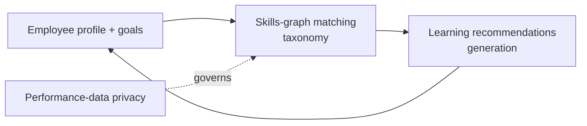
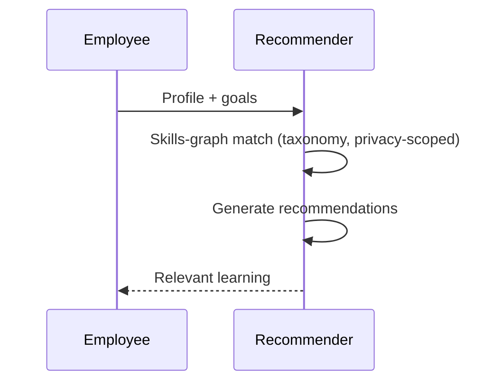
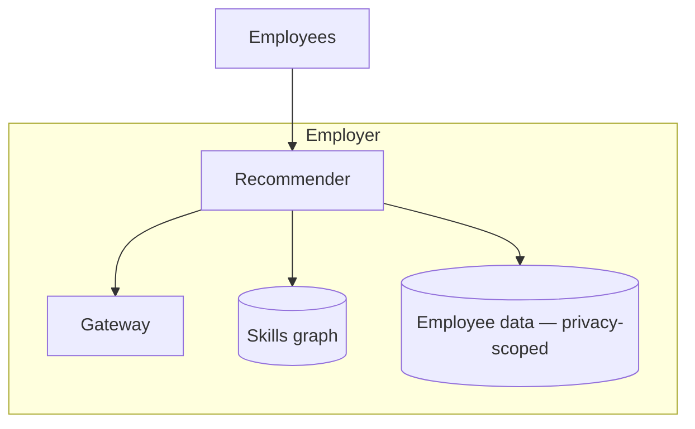

# Case Study CS45 — Learning & Development Recommender

| | |
|---|---|
| **Industry** | HR |
| **Company profile** | Meridian Health Partners — fictional employer, learning & development |
| **System type** | Skills-graph + generation (skills taxonomy, performance-data privacy) |
| **Maturity level exercised** | 3 Engineer → 4 Architect |

## Business Problem

Employees need relevant learning/development recommendations aligned to their role, skills, and career goals — but generic recommendations don't fit, and manual L&D advising doesn't scale. The goal: a recommender that suggests learning aligned to the employee's skills (via a skills taxonomy) and goals, respecting the privacy of performance data. The defining challenges: skills taxonomy (structured skills matching) and performance-data privacy (recommendations shouldn't expose or misuse sensitive performance data). Target: relevant L&D recommendations, skills-aligned, performance-data-private.

## Stakeholders

| Stakeholder | Role | What they care about | Success measure |
|-------------|------|----------------------|-----------------|
| Employees | Users | Relevant learning | Adoption, relevance |
| L&D team | Sponsor | Learning engagement, outcomes | Engagement, skill growth |
| Managers | Beneficiary | Team development | Development |
| Privacy | Gatekeeper | Performance-data privacy | Privacy compliance |

## Requirements

### Functional
- FR-1: Recommend learning aligned to skills + goals (skills-graph + generation).
- FR-2: Skills taxonomy matching (structured skills).
- FR-3: Respect performance-data privacy.

### Non-functional
- NFR-1 (Relevance): Skills-aligned, goal-relevant recommendations.
- NFR-2 (Privacy): Performance data handled privately (not exposed/misused — 4.14).
- NFR-3 (Skills taxonomy): Accurate skills matching.

### Constraints
- Skills taxonomy (structured matching); performance-data privacy (the defining constraint); relevance.

## Architecture

Skills-graph matching (structured taxonomy) + recommendation generation + performance-data privacy (4.14). The skills taxonomy and performance-data privacy are defining.

## Sequence Diagram

## Deployment Diagram

## Threat Model

| Threat | Vector | Impact | Likelihood | Mitigation |
|--------|--------|--------|------------|------------|
| Performance-data misuse | Data exposure | Privacy/trust | Med | Performance-data privacy (4.14), scoped use |
| Irrelevant recommendations | Poor matching | Low value | Med | Skills-graph matching, feedback |
| Skills-taxonomy error | Bad matching | Wrong recommendations | Med | Taxonomy accuracy |

## Cost Estimation

| Item | Assumption | Monthly |
|------|-----------|---------|
| Inference | Employee population, tiered | ~$10K |
| Skills graph + data | Taxonomy, profiles | ~$4K |
| **Total** | | **~$14K** |

Dominant: employee population. Optimization: batch recommendations, tiering (7.8).

## Scaling Strategy

Periodic (recommendation cycles) + on-demand. Recommender scales; skills-graph matching; privacy-scoped data. Cycle-driven load.

## Monitoring Strategy

Relevance + privacy: recommendation relevance (feedback), skill-growth outcomes, performance-data-privacy compliance. Relevance and privacy are key.

## Lessons Learned

1. **Skills taxonomy enables matching** — the structured skills graph enables relevant matching (skills-aligned recommendations); the taxonomy is the matching foundation.
2. **Performance data is private** — performance data is sensitive (4.14); recommendations use it privately (scoped, not exposed/misused); privacy is a trust factor.
3. **Feedback improves relevance** — recommendation feedback (accepted/completed) improves relevance over time (the flywheel — 7.7).

---

**Related chapters:** [4.14 Privacy](../curriculum/part-4-enterprise-genai-systems/chapter-14-privacy-compliance-governance.md), [7.7 Knowledge & Data Patterns](../curriculum/part-7-enterprise-ai-architecture-patterns/chapter-07-knowledge-data-patterns.md), [3.6 RAG](../curriculum/part-3-core-building-blocks-of-genai/chapter-06-rag-fundamentals.md) · **Related patterns:** Feedback-to-Dataset (7.7) · **Similar case studies:** [CS20](cs20-adaptive-tutoring-system.md), [CS12](cs12-conversational-shopping-assistant.md)
