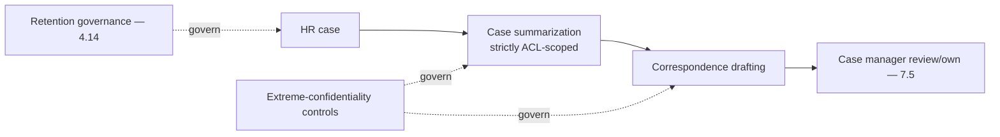
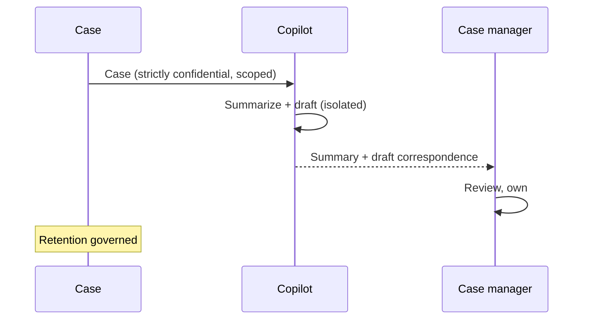
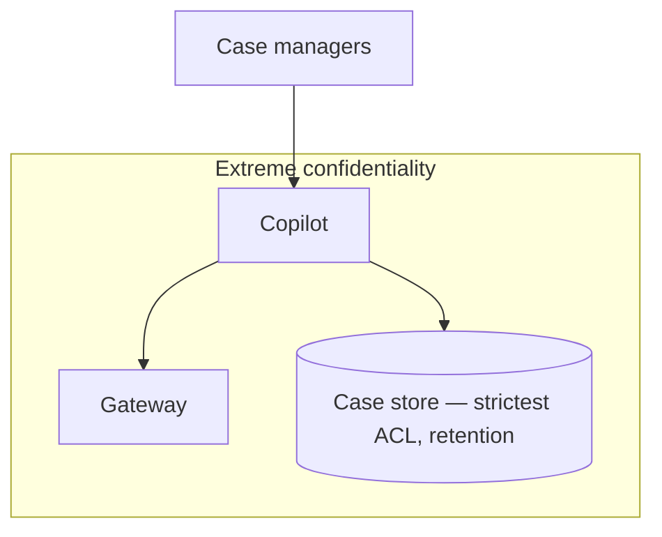

# Case Study CS46 — HR Case Management Copilot

| | |
|---|---|
| **Industry** | HR |
| **Company profile** | Meridian Health Partners — fictional employer, HR case management (ER/grievances) |
| **System type** | Summarization + drafting (extreme confidentiality, retention) |
| **Maturity level exercised** | 4 Architect |

## Business Problem

HR case management (employee relations, grievances, investigations) involves highly confidential cases requiring summarization, consistent handling, and correspondence — with extreme confidentiality (these are among the most sensitive employee records) and strict retention rules. The goal: a copilot that summarizes cases and drafts correspondence for HR case managers, with extreme confidentiality controls and retention governance. The defining challenges: extreme confidentiality (the most sensitive HR data) and retention rules. Target: faster case handling, consistent, extreme-confidentiality-protected, retention-governed.

## Stakeholders

| Stakeholder | Role | What they care about | Success measure |
|-------------|------|----------------------|-----------------|
| HR case managers | Users | Case support, confidentiality | Case-handling time |
| Employees (subjects) | Affected | Confidentiality, fair handling | Confidentiality, fairness |
| HR leadership | Sponsor | Consistency, efficiency | Consistency |
| Privacy/Legal | Gatekeeper | Extreme confidentiality, retention | Confidentiality/retention compliance |

## Requirements

### Functional
- FR-1: Summarize cases (confidential, ACL-scoped to case managers).
- FR-2: Draft correspondence (case manager reviews/owns — 7.5).
- FR-3: Consistent case handling.

### Non-functional
- NFR-1 (Confidentiality): Extreme confidentiality (strictest ACL, isolation); no cross-case leakage.
- NFR-2 (Retention): Strict retention rules (retention governance — 4.14).
- NFR-3 (Consistency): Consistent handling.

### Constraints
- Extreme confidentiality (the defining constraint); retention rules; consistency.

## Architecture

Summarization + drafting (strictly ACL-scoped) + case-manager review (7.5) + extreme-confidentiality controls + retention governance (4.14). The extreme confidentiality (strictest isolation) and retention are defining.

## Sequence Diagram

## Deployment Diagram

## Threat Model

| Threat | Vector | Impact | Likelihood | Mitigation |
|--------|--------|--------|------------|------------|
| Confidentiality breach | ACL/cross-case leak | Severe privacy/legal | Med | Strictest ACL, per-case isolation, no cross-case retrieval |
| Retention violation | Over-retention | Legal/compliance | Med | Retention governance, deletion (4.14/7.7) |
| Data exposure to model | Handling | Confidentiality breach | Med | In-boundary/governed handling, redaction where possible |
| Trace exposure | Logging | Confidentiality | Med | Strictly governed traces (4.10/4.14) |

## Cost Estimation

| Item | Assumption | Monthly |
|------|-----------|---------|
| Inference | Case volume (low, high-value) | ~$8K |
| Case store + governance | Confidential store, retention | ~$4K |
| **Total** | | **~$12K** |

Low volume, high sensitivity. Optimization: minimal (confidentiality over cost).

## Scaling Strategy

Low volume (case-manager-bound). Strict per-case isolation. In-boundary/sovereign deployment if required (5.11). Case managers are the bottleneck.

## Monitoring Strategy

Confidentiality-first: confidentiality-breach detection (zero tolerance — strictest ACL, cross-case leak monitoring), retention compliance, consistency. Confidentiality and retention are the critical monitors.

## Lessons Learned

1. **Extreme confidentiality demands strictest isolation** — HR case data is among the most sensitive employee records; strictest ACL, per-case isolation, no cross-case retrieval, governed traces.
2. **Retention is strictly governed** — retention rules (4.14/7.7) with deletion; over-retention of sensitive case data is a legal risk.
3. **The case manager owns the correspondence** — the copilot summarizes/drafts, the case manager reviews and owns (7.5); the sensitive handling stays human.

---

**Related chapters:** [4.14 Privacy/Compliance](../curriculum/part-4-enterprise-genai-systems/chapter-14-privacy-compliance-governance.md), [6.5 Security Architecture](../curriculum/part-6-enterprise-architecture/chapter-05-security-architecture-zero-trust.md), [7.7 Knowledge & Data Patterns](../curriculum/part-7-enterprise-ai-architecture-patterns/chapter-07-knowledge-data-patterns.md) · **Related patterns:** Draft-Not-Send (7.5), Tenant Isolation (7.7), Forgetting/Deletion (7.7) · **Similar case studies:** [CS37](cs37-public-records-request-processing.md), [CS01](cs01-clinical-documentation-assistant.md)
